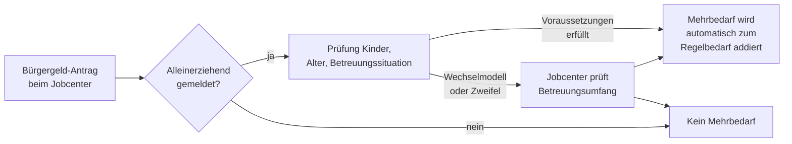

## Hintergrund

Der **Mehrbedarf für Alleinerziehende** nach § 21 Abs. 3 SGB II erkennt an, dass Elternteile, die allein für ihre Kinder sorgen, strukturell höhere Lebenshaltungskosten tragen als Paare: Haushalt und Kinderbetreuung können nicht aufgeteilt werden, Krankheiten oder Betreuungsausfälle treffen eine Person, und der Zeitaufwand für Erziehungsarbeit begrenzt die Erwerbsmöglichkeiten.

Die Regelung existiert seit dem Inkrafttreten von SGB II am 1. Januar 2005. Eine inhaltsgleiche Parallelvorschrift findet sich in § 30 Abs. 3 SGB XII für Bezieher von Sozialhilfe (Hilfe zum Lebensunterhalt, Grundsicherung im Alter und bei Erwerbsminderung).

## Berechnung

Die Höhe des Mehrbedarfs richtet sich nach Anzahl und Alter der Kinder. Bezugsgröße ist stets der Regelbedarf der **Regelbedarfsstufe 1** (alleinstehende Erwachsene, 2025: 563 €):

| Konstellation | Satz | Monatlicher Mehrbedarf (2025) |
| --- | ---: | ---: |
| 1 Kind unter 7 Jahren | 36 % | 202,68 € |
| 2 oder 3 Kinder, alle unter 16 Jahren | 36 % | 202,68 € |
| 1 Kind, 7–17 Jahre | 12 % | 67,56 € |
| 4 Kinder (beliebiges Alter) | 4 × 12 % = 48 % | 270,24 € |
| 5 oder mehr Kinder | max. 60 % | 337,80 € |

Die 36-%-Variante gilt also für Familien mit kleineren Kindern — die Phase, in der der Betreuungsaufwand besonders hoch und die Erwerbsmöglichkeiten besonders eingeschränkt sind.

**Gesamtdeckel:** § 21 Abs. 8 SGB II begrenzt alle Mehrbedarfe zusammen auf 100 % des maßgebenden Regelbedarfs. Der Alleinerziehenden-Mehrbedarf kann daher mit anderen Mehrbedarfen (z. B. für Schwangerschaft nach § 21 Abs. 2 oder für kostenaufwändige Ernährung nach § 21 Abs. 5) kombiniert werden, solange der Gesamtbetrag 563 € nicht übersteigt.

## Voraussetzung: „Allein für Pflege und Erziehung sorgen"

Der Mehrbedarf setzt voraus, dass die leistungsberechtigte Person **faktisch allein** die Fürsorge für das Kind trägt. Das ist rechtlich und praktisch nicht trivial:

- Alleiniges **Sorgerecht** ist *keine* Voraussetzung — auch bei gemeinsamem Sorgerecht kann der Mehrbedarf bestehen, wenn der andere Elternteil tatsächlich nicht oder kaum im Haushalt beteiligt ist.
- Umgekehrt entfällt oder mindert sich der Mehrbedarf, wenn das Kind in einem **Wechselmodell** (annähernd gleichwertige Betreuung durch beide Elternteile) lebt — das Jobcenter prüft dann den tatsächlichen Betreuungsumfang.
- Bei **betreuten Wohneinrichtungen** (z. B. Mutter-Kind-Einrichtungen) besteht der Mehrbedarf weiterhin, wenn die Betreuungsaufgabe beim Elternteil verbleibt.

In der Praxis gewähren Jobcenter den Mehrbedarf oft ohne vertiefte Prüfung, wenn nur ein Elternteil im Haushalt wohnt. Streitig wird es vor allem bei Wechselmodell-Konstellationen; hierzu gibt es eine umfangreiche Sozialgerichtspraxis.

## Antragsweg

Der Mehrbedarf wird **nicht separat beantragt**, sondern ist Teil des Bürgergeld-Antrags. Im Formular (Anlage KI für Kinder) sind Angaben zur Betreuungssituation zu machen. Eine Änderungsmitteilung ist erforderlich, wenn sich die Kinderanzahl, das Alter eines Kindes oder die Betreuungssituation wesentlich ändert.

Wichtig: Mit dem siebten Geburtstag des jüngsten Kindes sinkt der Mehrbedarf automatisch von 36 % auf 12 %. Das Jobcenter sollte dies von sich aus anpassen — in der Praxis empfiehlt sich jedoch eine Rückmeldung, damit die Bescheide korrekt bleiben.

## Verhältnis zu anderen Leistungen

- **Bürgergeld-Regelbedarf (§ 20 SGB II)**: Der Mehrbedarf wird zum Regelbedarf der Stufe 1 (563 €) addiert. Das ergibt bei 36 % einen Gesamtbedarf von 765,68 €/Monat — vor Unterkunftskosten und weiteren Mehrbedarfen.
- **Kinderzuschlag (KIZ)**: Wer mit Erwerbseinkommen und KIZ aus der Bürgergeld-Bedürftigkeit herauskommt, erhält den Alleinerziehenden-Mehrbedarf *nicht* — er gilt nur im SGB-II-Leistungsbezug. Für diese Gruppe gibt es keinen direkten Ausgleich, was ein bekanntes Systemgap ist.
- **Unterhaltszahlungen**: Unterhalt, den das Kind erhält, wird als Einkommen des Kindes angerechnet und mindert den Bedarf des Kindes — nicht den Mehrbedarf der alleinerziehenden Person selbst. Der Mehrbedarf bleibt also erhalten, auch wenn Unterhalt fließt.
- **Unterhaltsvorschuss**: Zahlt das Jugendamt Unterhaltsvorschuss (weil der andere Elternteil nicht zahlt), wird dieser ebenfalls als Einkommen des Kindes angerechnet — der Mehrbedarf der Mutter/des Vaters bleibt bestehen.
- **Wohngeld**: Bürgergeld-Beziehende erhalten kein Wohngeld; ihre Unterkunftskosten werden über § 22 SGB II gedeckt. Der Mehrbedarf ergänzt dabei den Regelbedarf, nicht die Unterkunftskosten.
- **SGB XII (Grundsicherung im Alter)**: Für ältere Alleinerziehende (selten, aber vorstellbar bei Pflegekindern) gilt § 30 Abs. 3 SGB XII mit identischen Prozentsätzen.

## Reichweite und Nichtinanspruchnahme

Der Mehrbedarf für Alleinerziehende ist im Vergleich zu anderen Sozialleistungen weniger von Nichtinanspruchnahme betroffen — da er automatisch im Rahmen des Bürgergeld-Antrags geprüft wird, können Berechtigte ihn nicht „vergessen". Jedoch:

- Alleinerziehende, die **knapp oberhalb der Bürgergeld-Grenze** liegen und daher kein Bürgergeld beantragen, erhalten auch keinen Mehrbedarf — obwohl ihre Mehrkosten strukturell dieselben sind.
- Im SGB-XII-Bereich (Grundsicherung im Alter) liegt die Inanspruchnahme niedriger; Studien des DIW schätzen, dass bis zu 60 % der anspruchsberechtigten älteren Menschen keine Grundsicherung beziehen — und damit auch den darin enthaltenen Alleinerziehenden-Mehrbedarf.
