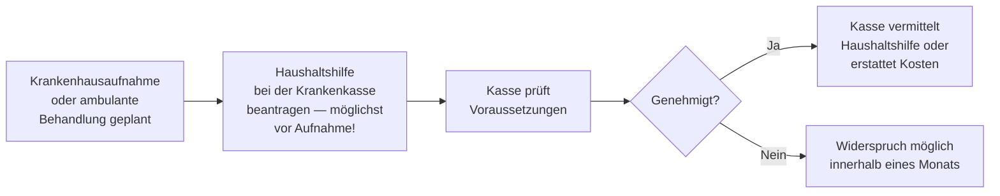

## Hintergrund

Die Haushaltshilfe nach **§ 38 SGB V** ist seit dem Gesundheitsreformgesetz 1989 Teil des GKV-Leistungskatalogs. Sie greift in einer oft unterschätzten Situation: Wer wegen Krankheit ins Krankenhaus muss oder eine aufwendige ambulante Behandlung erhält, kann seinen Haushalt nicht mehr führen — und gefährdet damit die Versorgung kleiner Kinder zu Hause. Die Haushaltshilfe soll diese Lücke schließen und verhindern, dass ein Krankenhausaufenthalt das familiäre Gefüge destabilisiert.

Trotz des klaren gesetzlichen Anspruchs gehört diese Leistung zu den **am seltensten in Anspruch genommenen** GKV-Pflichtleistungen — hauptsächlich weil Versicherte, Arztpraxen und Krankenhäuser sie schlicht nicht kennen.

## Was wird geleistet?

Die Krankenkasse stellt eine Haushaltshilfe zur Verfügung oder erstattet deren Kosten, wenn der Haushalt nicht weitergeführt werden kann. Die Hilfe kann folgende Aufgaben umfassen:

- Einkaufen, Kochen, Geschirrspülen
- Reinigen der Wohnung, Wäsche waschen
- Betreuung und Beaufsichtigung der Kinder im Haushalt
- Einfache Besorgungen

Die Leistung erfolgt als **Sachleistung** (die Kasse organisiert und bezahlt die Fachkraft direkt) oder — wenn keine geeignete Kraft vermittelt werden kann — als **Kostenerstattung** für selbst organisierte Hilfe.

## Wer hat Anspruch?

| Voraussetzung | Details |
| --- | --- |
| **GKV-Mitgliedschaft** | Pflicht- oder freiwillig gesetzlich Versicherte |
| **Medizinischer Anlass** | Stationärer Krankenhausaufenthalt **oder** ambulante Behandlung, die die Haushaltsführung unmöglich macht |
| **Kind im Haushalt** | Kind unter **12 Jahren** (oder behindertes Kind ohne Altersgrenze), das der Betreuung bedarf |
| **Keine Ersatzperson im Haushalt** | Keine andere im Haushalt lebende Person, die die Versorgung übernehmen kann |

**Achtung:** Die letzte Bedingung ist entscheidend. Lebt eine weitere erwachsene Person (Partner, erwachsenes Kind) im Haushalt, besteht grundsätzlich kein Anspruch — auch wenn diese Person berufstätig ist. Die Krankenkasse prüft dies im Einzelfall. Privat Krankenversicherte haben keinen Anspruch nach SGB V; manche PKV-Tarife sehen eigene Regelungen vor.

## Eigenbeteiligung

Versicherte zahlen eine Zuzahlung von **10 % der Kosten pro Kalendertag**, mindestens **5 €** und höchstens **10 €** (§ 38 Abs. 5 SGB V). Wer die jährliche Belastungsgrenze (2 % des Bruttoeinkommens, bei chronisch Kranken 1 %) bereits erreicht hat, ist von der Zuzahlung befreit.

## Antragsweg

**Praktischer Hinweis:** Der Antrag sollte möglichst **frühzeitig** — idealerweise noch vor oder gleichzeitig mit der Aufnahme — gestellt werden. Viele Krankenkassen können über ihre Servicezentren oder telefonisch innerhalb weniger Stunden eine Haushaltshilfe organisieren. Bei ungeplanten Notfallaufnahmen ist auch ein nachträglicher Antrag möglich; die Leistung wird dann ab dem Aufnahmetag gewährt.

## Abgrenzung zu ähnlichen Leistungen

| Leistung | Rechtsgrundlage | Anlass |
| --- | --- | --- |
| Haushaltshilfe bei Krankheit | § 38 SGB V | Stationärer oder ambulanter Behandlungsaufenthalt |
| Haushaltshilfe bei Schwangerschaft | § 24h SGB V | Schwangerschaft, Entbindung oder Fehlgeburt |
| Haushaltshilfe bei Vorsorge-/Reha-Kur | §§ 23 Abs. 4, 40 SGB V | Medizinische Vorsorgeleistung oder Rehabilitation der Mutter/des Vaters |
| Pflegegeld und Pflegesachleistung | §§ 36–37 SGB XI | Bei anerkannter Pflegebedürftigkeit — andere Voraussetzungen |

## Nichtinanspruchnahme

Die Haushaltshilfe nach § 38 SGB V wird deutlich seltener genutzt als die Nutzungsdaten erwarten ließen. Typische Gründe:

- **Unkenntnis**: Krankenhäuser und Praxen informieren meist nicht aktiv über den Anspruch.
- **Zeitdruck bei Notfallaufnahmen**: Im Akutfall fehlt die Zeit und Kapazität für Anträge.
- **Falsche Annahme der Ersetzbarkeit**: Viele glauben, Nachbarn oder Verwandte "müssen eben helfen", ohne zu wissen, dass ein gesetzlicher Anspruch besteht.
- **Scheu vor Bürokratie**: Tatsächlich genügt in vielen Fällen ein Telefonanruf bei der Krankenkasse.

Wer mit kleinen Kindern zu Hause stationär aufgenommen wird oder eine mehrwöchige ambulante Behandlung (z. B. Chemotherapie) beginnt, sollte **sofort die eigene Krankenkasse anrufen** und nach Haushaltshilfe fragen.
