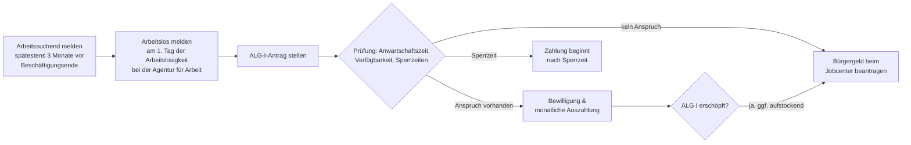

## Geschichte

Das **Arbeitslosengeld I** (ALG I) ist die Kernleistung der deutschen Arbeitslosenversicherung, die im Sozialgesetzbuch Drittes Buch (SGB III) geregelt ist. Die institutionellen Wurzeln reichen bis in die Weimarer Republik zurück: Das *Gesetz über Arbeitsvermittlung und Arbeitslosenversicherung (AVAVG)* von **1927** begründete erstmals eine beitragsfinanzierte, obligatorische Arbeitslosenversicherung in Deutschland.

Wichtige Meilensteine:

- **1927** – AVAVG: Einführung der Pflicht-Arbeitslosenversicherung
- **1969** – Arbeitsförderungsgesetz (AFG): Ausbau zu einem aktiven Förderinstrument mit stärkerem Fokus auf Beratung und Weiterbildung
- **1998** – SGB III löst das AFG ab; modernes Leistungsrecht mit vereinheitlichtem Anspruchssystem
- **2005** – **Hartz-IV-Reform**: Aufspaltung in ALG I (SGB III, beitragsfinanziert, befristet) und ALG II (SGB II, steuerfinanziert, unbegrenzt). Die bisherige Arbeitslosenhilfe wurde mit der Sozialhilfe zum ALG II zusammengelegt — die größte sozialpolitische Zäsur der Nachkriegszeit.
- **2023** – Bürgergeld-Gesetz: Das ALG II wird zum Bürgergeld umbenannt; das ALG I bleibt strukturell unverändert.

## Anspruchsvoraussetzungen

Anspruch auf Arbeitslosengeld I hat, wer kumulativ alle Bedingungen aus § 136–138 SGB III erfüllt:

1. **Arbeitslosigkeit** (§ 138 SGB III): Keine versicherungspflichtige Beschäftigung oder Beschäftigung von weniger als 15 Stunden/Woche
2. **Persönliche Arbeitslosmeldung** bei der zuständigen Agentur für Arbeit
3. **Verfügbarkeit und Eigenbemühungen**: Aktive Jobsuche und Bereitschaft, jede zumutbare Arbeit anzunehmen
4. **Anwartschaftszeit** (§ 137 SGB III): Mindestens **12 Monate** versicherungspflichtige Beschäftigung innerhalb der letzten **30 Monate** vor der Arbeitslosmeldung (Rahmenfrist)

Die Anwartschaftszeit ist die entscheidende Zugangshürde. Selbstständige, Beamte und Personen mit kurzen oder geringfügigen Beschäftigungen haben in der Regel keinen Anspruch auf ALG I und werden direkt an das Bürgergeld (SGB II) verwiesen.

## Berechnung

Die Leistungshöhe ergibt sich aus dem **Bemessungsentgelt** (§ 150–153 SGB III) — dem durchschnittlichen beitragspflichtigen Bruttoentgelt aus dem Bemessungszeitraum (in der Regel die letzten 12 Monate vor der Arbeitslosmeldung).

| Leistungssatz | Personengruppe | Prozentwert |
| --- | --- | ---: |
| **Erhöhter Satz** | Kind im Haushalt (§ 149 Nr. 1 SGB III) | 67 % |
| **Allgemeiner Satz** | kein Kind | 60 % |

Das **pauschalierte Nettoentgelt** (§ 153 SGB III) wird nicht anhand des tatsächlichen Nettolohns ermittelt, sondern durch Abzug einer gesetzlich festgelegten Pauschale für Lohnsteuer und Sozialversicherungsbeiträge (21 %) vom Bruttoentgelt.

**Beispielrechnung 2025:**

| Position | Betrag |
| --- | ---: |
| Ø Bruttoentgelt der letzten 12 Monate | 3.500 €/Monat |
| Pauschaler SV-Abzug (21 %) | − 735 € |
| Pauschaler Steuerabzug (Steuerklasse I, ca. 13 %) | − 455 € |
| Pauschaliertes Nettoentgelt | ≈ 2.310 € |
| ALG I (allgemeiner Satz, 60 %) | **≈ 1.386 €/Monat** |
| ALG I (erhöhter Satz, 67 %) | **≈ 1.548 €/Monat** |

Die Obergrenze ergibt sich aus der Beitragsbemessungsgrenze der Arbeitslosenversicherung (2025: **96.600 €/Jahr** in den alten Bundesländern / **89.400 €/Jahr** in den neuen Bundesländern).

## Bezugsdauer

Die Bezugsdauer hängt von den zurückgelegten Versicherungszeiten und dem Lebensalter bei Eintritt der Arbeitslosigkeit ab (§ 147 SGB III):

| Versicherungszeit (letzte 5 Jahre) | Mindestalter | Bezugsdauer |
| ---: | --- | ---: |
| 12 Monate | — | 6 Monate |
| 16 Monate | — | 8 Monate |
| 20 Monate | — | 10 Monate |
| 24 Monate | — | 12 Monate |
| 30 Monate | 50 Jahre | 15 Monate |
| 36 Monate | 55 Jahre | 18 Monate |
| 48 Monate | 58 Jahre | 24 Monate |

Die verlängerten Bezugszeiten ab 50 Jahren sind sozialpolitisch umstritten: Einerseits tragen sie dem schwierigeren Wiedereinstieg Älterer Rechnung; andererseits wird diskutiert, ob sie die Frühverrentung begünstigen.

## Sperrzeiten

Bei eigenem Verschulden an der Arbeitslosigkeit oder Ablehnung zumutbarer Arbeit drohen **Sperrzeiten** nach § 159 SGB III, in denen kein ALG I gezahlt wird:

| Sperrzeit-Grund | Dauer |
| --- | ---: |
| Eigene Kündigung ohne wichtigen Grund | 12 Wochen |
| Einvernehmliche Aufhebung des Arbeitsverhältnisses | 12 Wochen |
| Ablehnung einer zumutbaren Arbeitsstelle | 3 Wochen |
| Abbruch einer Weiterbildungsmaßnahme | 3 Wochen |
| Unzureichende Eigenbemühungen | 2 Wochen |

Die Sperrzeit verkürzt auch die **Gesamtbezugsdauer**: Eine 12-wöchige Sperrzeit vermindert die Anspruchsdauer um ein Viertel. Bei wiederholter Sperrzeit kann der Anspruch vollständig erlöschen.

Ein „wichtiger Grund" (§ 159 Abs. 1 S. 2 SGB III) kann eine Sperrzeit ausschließen — etwa bei einer Kündigung wegen eines Umzugs zum Partner oder bei gesundheitlichen Gründen. Betroffene sollten diesen Sachverhalt der Agentur für Arbeit frühzeitig darlegen.

## Antragsweg

**Wichtige Fristen:**
- **Arbeitssuchend melden** (§ 38 SGB III): spätestens **3 Monate** vor Ende der Beschäftigung; bei späterer Meldung droht eine Sperrzeit von 1 Woche
- **Arbeitslos melden**: am **ersten Tag** der Arbeitslosigkeit — nicht rückwirkend
- ALG I kann für bis zu **4 Jahre** rückwirkend beansprucht werden (§ 147 Abs. 2 SGB III)

## Verhältnis zu anderen Leistungen

- **Bürgergeld (SGB II)**: ALG I ist gegenüber dem Bürgergeld vorrangig. Reicht das ALG I nicht zum Lebensunterhalt aus, kann aufstockendes Bürgergeld beantragt werden. Nach Erschöpfung des ALG I wird die Hilfebedürftigkeit vollständig durch das Bürgergeld gesichert.
- **Krankengeld** (§ 47b SGB V): Erkrankt ein ALG-I-Beziehender und wird arbeitsunfähig, zahlt die Krankenkasse Krankengeld in Höhe des ALG I. Der ALG-I-Anspruch ruht und verlängert sich entsprechend — die Arbeitslosigkeit „friert ein".
- **Kurzarbeitergeld**: Wird bei Kurzarbeit gezahlt, bevor Arbeitslosigkeit eintritt; verzögert den Übergang in das ALG I.
- **Elterngeld**: Beziehen Eltern während der Elternzeit ALG I (z. B. weil der Job nach der Elternzeit endet), gilt das ALG I als Bemessungsgrundlage für eine nachfolgende Elterngeldperiode — mit deutlich niedrigerem Elterngeld als bei regulärem Arbeitseinkommen.
- **Insolvenzgeld**: Sichert die letzten drei Lohnmonate vor Insolvenz des Arbeitgebers; schließt lückenlos an, bevor ALG I greift.
