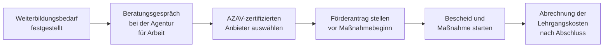

## Hintergrund

Das 2019 in Kraft getretene **Qualifizierungschancengesetz** hat § 82 SGB III grundlegend umgebaut: Aus einer Randvorschrift für Ältere und Geringqualifizierte wurde ein breites Instrument für alle Beschäftigten. Die zentrale Botschaft des Gesetzgebers lautet: Wer sich jetzt qualifiziert, bevor sein Job durch Digitalisierung oder Dekarbonisierung wegfällt, soll dabei staatliche Unterstützung erhalten. Mit dem **Gesetz zur Stärkung der Aus- und Weiterbildungsförderung** (kurz: Weiterbildungsgesetz) vom April 2023 wurde die Förderung nochmals ausgebaut — unter anderem wurde das neue Instrument **Qualifizierungsgeld** (§ 82a SGB III) eingeführt, das gezielt für Betriebe gilt, die bereits im Transformationsdruck stehen.

## Was wird gefördert?

Es gibt zwei eigenständige Förderkomponenten:

| Komponente | Inhalt |
| --- | --- |
| **Lehrgangskosten** | Übernahme der Kursgebühren durch die Agentur für Arbeit, Höhe nach Betriebsgröße gestaffelt |
| **Arbeitsentgeltzuschuss** | Zuschuss an den Arbeitgeber für das Entgelt, das während der Weiterbildungszeit weitergezahlt wird |

Die Weiterbildung muss außerhalb des Betriebs stattfinden (betriebliche Umschulung zählt nicht), und der Träger muss nach AZAV (Akkreditierungs- und Zulassungsverordnung Arbeitsförderung) zugelassen sein.

## Für wen gilt die Förderung?

Die Förderung setzt einen **Eintrittstatbestand** voraus — mindestens einer der folgenden Punkte muss erfüllt sein:

1. Die Qualifikation des Beschäftigten droht durch **Strukturwandel** (Digitalisierung, Ökologisierung, Automatisierung) wegzufallen.
2. Der Berufsabschluss liegt **mehr als vier Jahre** zurück und die erworbenen Kenntnisse sind nicht mehr dem Stand der Technik entsprechend.
3. Der Beschäftigte arbeitet in einem anerkannten **Engpassberuf** (z. B. Pflege, IT, Handwerk).
4. Der Beschäftigte hat **keinen Berufsabschluss**.
5. Der Betrieb beschäftigt **nicht mehr als 10 Mitarbeiter** (Kleinbetrieb).

## Förderhöhen (Stand 2023)

Die Zuschusshöhe zu den **Lehrgangskosten** richtet sich nach Betriebsgröße und Personengruppe:

| Betriebsgröße | Regelfall | Beschäftigte ohne Abschluss oder mit besonderem Strukturwandel-Risiko |
| --- | --- | --- |
| Klein (< 10 MA) | 100 % | 100 % |
| Mittel (10–249 MA) | 50 % | 80 % |
| Groß (≥ 250 MA) | 25 % | 60 % |

Der **Arbeitsentgeltzuschuss** (an den Arbeitgeber für fortlaufende Lohnzahlung) beträgt:

| Betriebsgröße | Zuschuss zum Bruttoarbeitsentgelt |
| --- | --- |
| Klein (< 10 MA) | 75 % |
| Mittel (10–249 MA) | 50 % |
| Groß (≥ 250 MA) | 25 % |

Bei Beschäftigten, die das **45. Lebensjahr vollendet** haben oder schwerbehindert sind, erhöht sich der Arbeitsentgeltzuschuss um jeweils **10 Prozentpunkte** (maximal 75 %).

## Abgrenzung zum Qualifizierungsgeld (§ 82a SGB III)

Das seit 2023 mögliche **Qualifizierungsgeld** ist kein Zuschuss, sondern eine lohnersatzähnliche Leistung — ähnlich dem Kurzarbeitergeld. Es kommt in Betracht, wenn:

- der **gesamte Betrieb oder eine Betriebsabteilung** vom Strukturwandel betroffen ist,
- eine Betriebsvereinbarung oder ein Tarifvertrag die Qualifizierungsmaßnahmen regelt, und
- mindestens **10 % der Beschäftigten** an der Weiterbildung teilnehmen.

Der Arbeitgeber zahlt in diesem Fall während der Qualifizierung nur noch die **Differenz** zwischen dem Qualifizierungsgeld und dem bisherigen Nettolohn — die BA übernimmt den Hauptteil.

## Antragsweg

**Wichtig:** Der Antrag muss **vor Beginn** der Weiterbildungsmaßnahme gestellt werden — eine nachträgliche Förderung ist ausgeschlossen. Beschäftigte können sich direkt an die Agentur für Arbeit wenden; in vielen Betrieben übernimmt dies die Personalabteilung.

## Praktische Hinweise

- **Bildungsgutschein und § 82 sind verschieden**: Beschäftigte erhalten keinen Bildungsgutschein (der ist für Arbeitslose gedacht), sondern eine direkte Kostenübernahme über den Betrieb.
- Die Agentur für Arbeit bietet für Betriebe kostenlose **Betriebsberatungen** an — gerade für KMU lohnt sich das, weil die vollen 100 % Lehrgangskosten viel Spielraum lassen.
- Die Statistik der BA weist § 82 als Teil der aktiven Arbeitsmarktpolitik aus; die Inanspruchnahme ist seit 2019 stark gestiegen, liegt aber noch weit hinter dem Förderpotenzial.
- Kurskosten für kurze interne Schulungen oder Pflichtunterweisungen (z. B. Arbeitssicherheit) sind **nicht förderfähig** — es muss sich um abschluss- oder anpassungsqualifizierende Maßnahmen handeln.
