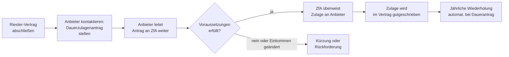

## Hintergrund

Die **Riester-Grundzulage** nach § 84 EStG ist der staatliche Zuschuss, der jährlich direkt in einen zertifizierten Altersvorsorgevertrag (Riester-Vertrag) eingezahlt wird. Sie ist das Herzstück der staatlichen Förderung der privaten Altersvorsorge, die mit dem **Altersvermögensgesetz (AVmG) 2001** eingeführt wurde — benannt nach dem damaligen Bundesarbeitsminister Walter Riester.

Die Riester-Rente entstand als Reaktion auf die geplante Senkung des gesetzlichen Rentenniveaus: Um die entstehende Versorgungslücke zu schließen, sollten Arbeitnehmer mit staatlicher Hilfe zusätzlich privat vorsorgen. Die Grundzulage ist der direkte staatliche Beitrag dazu.

**Entwicklung der Grundzulage:**

| Zeitraum | Grundzulage |
| --- | ---: |
| 2002–2005 | 38 € |
| 2006–2007 | 76 € |
| 2008–2017 | 154 € |
| ab 2018 | **175 €** |

## Förderberechtigte

### Unmittelbar Förderberechtigte (§ 79 EStG)

Die Grundzulage können direkt beanspruchen:

- **Pflichtversicherte Arbeitnehmer** in der gesetzlichen Rentenversicherung
- **Beamte, Richter und Soldaten** (erhalten keine Einzahlungen in die gesetzliche RV, sind aber durch die Beamtenversorgung ebenfalls pflichtabgesichert)
- Empfänger von **Arbeitslosengeld I oder II** (heute: Bürgergeld)
- Personen in **Elternzeit** oder mit **Elterngeld**-Bezug
- Empfänger von **Krankengeld, Übergangsgeld** und ähnlichen Entgeltersatzleistungen
- Pflichtversicherte **Selbstständige** (z. B. Handwerker, die pflichtversichert sind)
- Vollständig erwerbsgeminderte Personen unter 65 Jahren

**Nicht** unmittelbar förderberechtigt sind: freiwillig gesetzlich Rentenversicherte, nicht pflichtversicherte Selbstständige und Personen, die ausschließlich in einem berufsständischen Versorgungswerk versichert sind.

### Mittelbar Förderberechtigte (§ 79 Satz 2 EStG)

Ein nicht selbst förderberechtigter Ehegatte kann die Zulage erhalten, wenn:
1. Er selbst einen Riester-Vertrag abschließt
2. Der andere Ehegatte unmittelbar förderberechtigt ist und seinen Eigenbeitrag (Mindesteigenbeitrag) leistet

Der mittelbar Förderberechtigte zahlt lediglich den Sockelbetrag von **60 € pro Jahr** als Mindesteigenbeitrag — unabhängig vom eigenen Einkommen.

## Höhe und Mindesteigenbeitrag

Die volle Grundzulage von 175 €/Jahr wird nur ausgezahlt, wenn der **Mindesteigenbeitrag** erbracht wurde.

### Berechnung des Mindesteigenbeitrags

Der Mindesteigenbeitrag berechnet sich wie folgt:

```
Mindesteigenbeitrag = max(4 % × Vorjahresbruttoeinkommensgrenzbetrag − alle Zulagen, 60 €)
```

Das heißt: 4 % des rentenversicherungspflichtigen Vorjahreseinkommens **minus** die Grundzulage (175 €) **minus** alle Kinderzulagen ergibt den notwendigen Eigenbeitrag. Mindestens 60 € pro Jahr müssen aus eigener Tasche kommen.

**Praxisbeispiel — Single ohne Kinder, 40.000 € Bruttojahreseinkommen:**

```
4 % × 40.000 € = 1.600 €
− Grundzulage 175 €
= Eigenbeitrag: 1.425 €/Jahr (118,75 €/Monat)
```

**Praxisbeispiel — Ehepaar mit 2 Kindern (vor 2008 geboren), Alleinverdiener 35.000 €:**

```
4 % × 35.000 € = 1.400 €
− Grundzulage (Verdiener) 175 €
− 2 × Kinderzulage (185 € × 2) 370 €
= Eigenbeitrag: 855 €/Jahr
+ Mindesteigenbeitrag Ehegatte (mittelbar): 60 €
```

### Kürzung bei unzureichendem Eigenbeitrag

Wird der Mindesteigenbeitrag **nicht vollständig** erbracht, wird die Zulage proportional gekürzt:

```
Tatsächliche Zulage = Maximalzulage × (geleisteter Eigenbeitrag / notwendiger Eigenbeitrag)
```

Wer also nur die Hälfte des notwendigen Eigenbeitrags einzahlt, erhält auch nur die halbe Grundzulage. Die eingezahlten Zulagen zählen dabei zum Vertragsguthaben.

### Sockelbetrag

Der absolute Mindestbetrag beträgt **60 € pro Jahr** (§ 86 Abs. 1 S. 4 EStG). Selbst wenn 4 % des Einkommens weniger als 60 € ergäben (z. B. bei sehr geringem Einkommen), müssen mindestens 60 € eigener Beitrag geleistet werden, um die volle Zulage zu erhalten.

## Verhältnis zum Sonderausgabenabzug (§ 10a EStG)

Neben der direkten Zulage können Riester-Beiträge auch als **Sonderausgaben** steuerlich abgesetzt werden. Das Finanzamt führt automatisch die **Günstigerprüfung** durch:

- **Zulagenweg**: 175 € Grundzulage fließen direkt in den Vertrag
- **Steuerlicher Weg**: Beiträge bis max. 2.100 €/Jahr können als Sonderausgaben abgesetzt werden (§ 10a EStG). Das Finanzamt rechnet: Ist der Steuervorteil durch den Abzug höher als die Zulage allein, wird die Differenz als Steuererstattung ausgezahlt.

**Beispiel — Grenzsteuersatz 30 %, 1.600 € Gesamtbeitrag (Eigenbeitrag + Zulage):**
- Steuerersparnis durch Abzug: 1.600 € × 30 % = 480 €
- Bereits erhaltene Zulage: 175 €
- Zusätzliche Erstattung: 480 − 175 = **305 €** (Finanzamt zahlt diesen Betrag nach Steuererklärung)

Bei niedrigeren Einkommen (Grenzsteuersatz unter ca. 10 %) lohnt der Sonderausgabenabzug nicht — dann ist die Zulage allein vorteilhafter.

## Antragsweg



**Dauerzulagenantrag**: Der Zulagenantrag muss **nicht jedes Jahr neu** gestellt werden. Mit einem einmaligen **Dauerzulagenantrag** beim Anbieter wird die Zulage automatisch für alle Folgejahre beantragt. Der Anbieter ist verpflichtet, dem Bundeszentralamt für Steuern (BZSt) jährlich die notwendigen Daten zu übermitteln.

**Wichtig**: Bei Einkommensänderungen muss der Anbieter informiert werden, damit der Mindesteigenbeitrag korrekt berechnet wird. Wird zu wenig eingezahlt, wird die Zulage rückwirkend gekürzt und ggf. zurückgefordert.

**Erstantrag**: Der Zulagenantrag kann noch bis zu **2 Jahre nach Ablauf des Beitragsjahres** gestellt werden (§ 89 Abs. 1 EStG). Wer 2023 vergessen hat, Beiträge zu melden, kann dies noch bis Ende 2025 nachholen.

## Schädliche Verwendung

Die Riester-Förderung ist an eine bestimmte Verwendung gebunden. **Schädliche Verwendung** (§ 93 EStG) liegt vor, wenn der Vertrag:

- **Vorzeitig gekündigt** und das Kapital ausgezahlt wird
- Für einen **nicht geförderten Zweck** verwendet wird (z. B. nicht als lebenslange Rente)
- **Ins Ausland** transferiert wird (außerhalb EU/EWR)

Bei schädlicher Verwendung müssen **alle erhaltenen Zulagen und Steuervorteile** zurückgezahlt werden. Das Vertragsguthaben wird entsprechend gemindert. Die Rückzahlung erfolgt an das Finanzamt über den Anbieter.

**Ausnahme: Wohnriester** (§ 92a EStG) — das Kapital kann steuerneutral für den Kauf oder Bau einer selbstgenutzten Immobilie entnommen werden; dies gilt nicht als schädliche Verwendung.

## Abgrenzung zu verwandten Leistungen

| Leistung | Verhältnis |
| --- | --- |
| **§ 85 EStG – Kinderzulage** | Zusatzzulage pro Kind (185 € / 300 € für Kinder ab 2008) — ergänzt die Grundzulage |
| **§ 10a EStG – Sonderausgabenabzug** | Steuerlicher Abzug der Riester-Beiträge; das Finanzamt prüft automatisch, ob Zulage oder Steuerabzug günstiger ist |
| **§ 3 BEEG – Elterngeld** | Elterngeld zählt als zulagenbegünstigtes Einkommen — auch während Elternzeit besteht Förderberechtigung |
| **Betriebliche Altersversorgung (§ 3 Nr. 63 EStG)** | Konkurrierendes Fördermodell mit anderen steuerlichen Anreizen; beide können gleichzeitig genutzt werden |

## Praktische Hinweise

**Riester lohnt sich vor allem für:**
- Arbeitnehmer mit mittlerem Einkommen und Kindern (die Kinderzulage erhöht die staatliche Förderquote erheblich)
- Geringverdiener, für die der Steuersatz für den Sonderausgabenabzug zu niedrig ist — die Zulage kommt trotzdem vollständig
- Beamte, die keine Möglichkeit haben, die betriebliche Altersversorgung zu nutzen

**Kritik an der Riester-Rente:**
Seit Jahren gibt es erhebliche Kritik: Hohe Verwaltungskosten vieler Anbieter fressen einen Teil der Förderung auf. Die Zahl der Riester-Verträge ist seit 2017 rückläufig — nach BMF-Statistik (Stand 2023) hielten rund 15,4 Millionen Menschen einen Riester-Vertrag, ein Rückgang gegenüber dem Höchststand von 16,6 Millionen (2017). Das Bundesfinanzministerium hat eine Reform diskutiert, aber noch nicht umgesetzt.

**Rentenbesteuerung:** Riester-Renten werden in der **Auszahlungsphase voll besteuert** (nachgelagerte Besteuerung). Da Rentner in der Regel einen niedrigeren Steuersatz als Erwerbstätige haben, bleibt die staatliche Förderung trotzdem vorteilhaft — dieser Effekt sollte aber bei der persönlichen Kalkulation berücksichtigt werden.

**Keine Beiträge = keine Zulage:** Wer in einem Jahr keine Beiträge in den Vertrag einzahlt (z. B. wegen finanzieller Engpässe), erhält für dieses Jahr keine Grundzulage. Der Vertrag ruht, die bisherigen Ansparguthaben bleiben erhalten.
