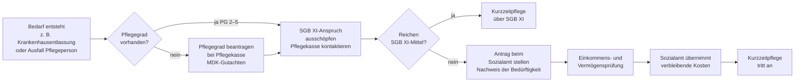

## Hintergrund

**§ 64h SGB XII** regelt die Kurzzeitpflege im Rahmen der **Hilfe zur Pflege** — dem Sozialhilfesystem für pflegebedürftige Menschen ohne ausreichende eigene Mittel. Sie ergänzt die vergleichbare Leistung der Pflegeversicherung (§ 42 SGB XI) dort, wo Letztere nicht greift oder nicht ausreicht.

Die Hilfe zur Pflege nach §§ 61–66a SGB XII ist das soziale Sicherungsnetz unterhalb der Pflegeversicherung. Sie tritt ein für:
- Menschen ohne eigenen Pflegeversicherungsanspruch (z. B. Personen, die nicht sozialversicherungspflichtig beschäftigt waren und sich nicht freiwillig versichert haben)
- Menschen, deren Pflegeversicherungsleistungen den tatsächlichen Bedarf nicht vollständig decken — insbesondere wenn der SGB XI-Budgetrahmen erschöpft ist

Der **Nachrang der Sozialhilfe** (§ 2 SGB XII) gilt auch hier: Zuerst werden alle vorrangigen Leistungen — insbesondere aus SGB XI — ausgeschöpft. SGB XII füllt nur die verbleibende Lücke.

## Verhältnis zu § 42 SGB XI (Pflegeversicherung)

Kurzzeitpflege gibt es in zwei parallelen Systemen mit unterschiedlichen Trägern und Finanzierungslogiken:

| Merkmal | § 42 SGB XI | § 64h SGB XII |
| --- | --- | --- |
| Träger | Pflegekasse | Sozialamt (Träger der Sozialhilfe) |
| Anspruchsvoraussetzung | Pflegeversicherungsmitgliedschaft, PG 2–5 | Pflegebedarf + Bedürftigkeit nach SGB XII |
| Leistungshöhe (Obergrenze) | 1.774 €/Jahr + ggf. 1.612 € aus Verhinderungspflege | Tatsächlicher Bedarf, keine feste Budgetobergrenze |
| Einkommens-/Vermögensprüfung | Nein | Ja |
| Dauer | Maximal 8 Wochen/Jahr | Nach Bedarf |
| Nachrangprinzip | Nein (eigene Versicherungsleistung) | Ja (SGB XI geht vor) |

**Typische Situation:** Eine pflegebedürftige Person hat Pflegegrad 3 und ist in der sozialen Pflegeversicherung. Nach einem Krankenhausaufenthalt wird Kurzzeitpflege für sechs Wochen benötigt. Die Pflegekasse übernimmt bis zum SGB XI-Budget. Die Kosten für Unterkunft und Verpflegung sowie eventuell übersteigenden Pflegeaufwand trägt die Person selbst — wenn das nicht möglich ist, greift das Sozialamt nach § 64h SGB XII.

## Anspruchsvoraussetzungen

### Pflegebedürftigkeit

Anspruch besteht für Pflegebedürftige der **Pflegegrade 2, 3, 4 oder 5**. Pflegegrad 1 begründet keinen Anspruch, da er nur erhebliche Beeinträchtigungen der Selbstständigkeit abbildet, die keine vollstationäre Unterbringung erfordern.

### Grund für die Kurzzeitpflege

Die häusliche Pflege muss **vorübergehend nicht möglich, noch nicht möglich oder nicht im erforderlichen Umfang möglich** sein. Zusätzlich muss die **teilstationäre Pflege** (Tages- oder Nachtpflege nach § 64g SGB XII) nicht ausreichen. Klassische Anlässe:

- Krankenhausentlassung bei noch fehlender häuslicher Pflegestruktur
- Erkrankung oder Ausfall der pflegenden Angehörigen
- Urlaub der Pflegeperson
- Einrichtungsphase vor dauerhaftem Umzug ins Pflegeheim

### Bedürftigkeit nach SGB XII

Entscheidend für den SGB XII-Anspruch ist, dass die pflegebedürftige Person (und ggf. ihre Angehörigen nach den Unterhaltspflichtregeln) die Kosten nicht selbst tragen kann. Das Sozialamt prüft:

- **Einkommen**: Nur Einkommen, das den Grundbedarf übersteigt, ist einzusetzen
- **Vermögen**: Schonvermögen (u. a. ein angemessenes Hausgrundstück, Bestattungsvorsorge, kleine Ersparnisse bis ca. 5.000 €) bleibt geschützt; der Rest ist einzusetzen

Ein Anspruch auf SGB XII-Kurzzeitpflege kann auch entstehen, wenn der SGB XI-Budgetrahmen zwar ausreicht, aber Unterkunft und Verpflegung als Eigenanteil die eigenen Mittel übersteigen.

## Kosten und Eigenanteil

Die Kurzzeitpflege in einer vollstationären Pflegeeinrichtung erzeugt drei Kostenpositionen:

1. **Pflegebedingte Aufwendungen**: Werden von der Pflegekasse (SGB XI) übernommen; den Rest deckt das Sozialamt
2. **Unterkunft und Verpflegung**: Eigenanteil, den die pflegebedürftige Person selbst tragen muss — das Sozialamt übernimmt diesen nur bei nachgewiesener Bedürftigkeit
3. **Investitionskosten**: Werden in manchen Bundesländern teilweise öffentlich gefördert; ansonsten ebenfalls Eigenanteil

Das Sozialamt übernimmt grundsätzlich nur, was nach Ausschöpfung aller vorrangigen Leistungen (SGB XI, ggf. Unterhaltspflichten) noch ungedeckt bleibt.

## Antragsweg

**Antragstellung:** Der Antrag ist beim **örtlich zuständigen Sozialamt** (Träger der Sozialhilfe) zu stellen. Die zuständige Stelle richtet sich nach dem gewöhnlichen Aufenthaltsort der pflegebedürftigen Person.

**Eilfälle:** Bei akutem Bedarf kann die Kurzzeitpflege begonnen werden, bevor der Antrag abschließend bearbeitet ist. Das Sozialamt ist dann verpflichtet, rückwirkend zu entscheiden. Eine frühzeitige Kontaktaufnahme und formlose Anzeige des Bedarfs schützt den Anspruch.

**Sozialdienst:** In der Praxis koordiniert oft der **Sozialdienst des Krankenhauses** die Übergabe von der Akutbehandlung in die Kurzzeitpflege — einschließlich der Einleitung des SGB XII-Verfahrens.

## Abgrenzung zu anderen Leistungen

- **§ 42 SGB XI (Kurzzeitpflege, Pflegeversicherung):** Vorrangig. Erst nach Ausschöpfung des SGB XI-Budgets tritt § 64h SGB XII ein.
- **§ 64g SGB XII (Teilstationäre Pflege):** Tages- und Nachtpflege. Kurzzeitpflege nach § 64h ist erst zulässig, wenn teilstationäre Pflege nicht ausreicht.
- **§ 64b SGB XII (Pflegegeld, Sozialhilfe):** Parallelleistung für häusliche Pflege — scheidet aus, wenn vollstationäre Kurzzeitpflege in Anspruch genommen wird.
- **§ 64 SGB XII (Vollstationäre Pflege):** Dauerhafte stationäre Pflege; § 64h ist nur die kurzzeitige Variante. Nach wiederholter oder länger anhaltender Notwendigkeit ist zu prüfen, ob dauerhafter stationärer Bedarf besteht.
- **§ 39c SGB V (Krankenkasse):** Kurzzeitpflege bei nicht festgestelltem Pflegegrad oder Pflegegrad 1, wenn medizinische Gründe vorliegen. Greift vor dem SGB XII-Anspruch.

## Praktische Besonderheiten

**Keine Budgetobergrenze im Gesetz:** Anders als § 42 SGB XI kennt § 64h SGB XII keine starre Mengenbegrenzung (8 Wochen oder 1.774 €). Der Anspruch richtet sich nach dem tatsächlichen Bedarf — was längere Kurzzeitpflegezeiten möglich macht, wenn sie medizinisch und sozial notwendig sind.

**Wohnortprinzip:** Das SGB XII-Recht ist föderaler gegliedert als das SGB XI. Die konkreten Kostensätze, die das Sozialamt anerkennt, unterscheiden sich nach Bundesland und Einrichtungsverträgen. In manchen Regionen bestehen Vereinbarungen zwischen Sozialämtern und Einrichtungen über Tagespflegesätze.

**Unterhaltspflicht von Angehörigen:** Seit 2020 (Angehörigen-Entlastungsgesetz) werden Kinder von Sozialhilfeempfängern erst ab einem Jahreseinkommen von **100.000 €** für Sozialhilfekosten herangezogen. Unterhalb dieser Grenze ist das Einkommen der Kinder tabu — was die praktische Bedeutung des § 64h SGB XII deutlich erhöht hat.

**Verknüpfung mit Pflegewohngeld:** In einigen Bundesländern (z. B. NRW) gibt es ein Pflegewohngeld, das Investitionskostenanteile für Sozialhilfeempfänger in Pflegeeinrichtungen subventioniert. Dieses kann auch bei Kurzzeitpflege nach § 64h SGB XII relevant sein.
