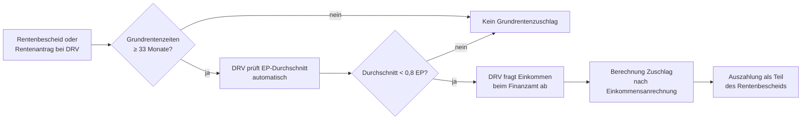

## Hintergrund

Die **Grundrente** war eines der meistdiskutierten Sozialpolitikprojekte der Großen Koalition 2018–2021. Ausgangspunkt war die Beobachtung, dass Millionen Menschen nach einem langen Erwerbsleben trotzdem eine Rente beziehen, die kaum über dem Niveau der Grundsicherung im Alter liegt – obwohl sie jahrzehntelang Beiträge gezahlt haben. Der Volkswirtschaftliche Begriff dafür: *rentenpolitische Entwertung langer, aber niedrig entlohnter Erwerbsbiografien*.

Der **Grundrentenzuschlag** (§ 76g SGB VI) wurde mit dem [Grundrentengesetz](https://www.bgbl.de/xaver/bgbl/start.xav?start=//*%5B@attr_id=%27bgbl120s1879.pdf%27%5D) vom 12. August 2020 eingeführt und trat am **1. Januar 2021** in Kraft. Er wertet niedrige Entgeltpunkte für Versicherungszeiten mit geringem Einkommen automatisch auf, ohne dass die Betroffenen einen gesonderten Antrag stellen müssen.

Politisch umstritten war die Grundrente vor allem wegen der **Einkommensanrechnung**: Die ursprüngliche SPD-Forderung sah keinen Einkommenstest vor; die CDU/CSU bestand auf einer Bedürftigkeitsprüfung. Der Kompromiss — eine automatische Einkommensanrechnung über den Datenaustausch mit den Finanzämtern — ist bis heute einzigartig im deutschen Sozialrecht und wurde extra mit dem [Datenaustauschgesetz](https://www.gesetze-im-internet.de/grundrentendatenaustauschgesetz/) abgesichert.

## Anspruchsvoraussetzungen

Der Grundrentenzuschlag setzt drei Bedingungen kumulativ voraus (§ 76g Abs. 1 SGB VI):

1. **Mindestens 33 Grundrentenzeiten** (Kalendermonate): Dazu zählen Pflichtbeitragszeiten aus Beschäftigung, selbstständiger Tätigkeit, Kindererziehung (bis 3 Jahre je Kind), Pflege sowie gleichgestellte Zeiten wie Wehrdienst.

2. **Unterdurchschnittliches Einkommen während der Grundrentenzeiten**: Der Durchschnittswert der Entgeltpunkte aus den Grundrentenzeiten muss **unter 0,8 Entgeltpunkten** pro Kalendermonat liegen (entspricht 80 % des Durchschnittslohns).

3. **Aktuell laufende Rente aus der gesetzlichen Rentenversicherung**: Der Zuschlag wird beim Rentenbescheid berechnet und nur zusammen mit einer Rente ausgezahlt — kein eigenständiger Anspruch.

**Achtung:** Zeiten, in denen die Entgeltpunkte bereits über 0,8 lagen, werden bei der Berechnung des Durchschnitts mitgezählt, zählen aber *nicht* als Grundrentenzeiten im Sinne der 33-Jahres-Frist. Phasen hohen Einkommens schaden also dem Anspruch nicht direkt, können ihn aber statistisch verzerren.

## Berechnung

Die Berechnung des Zuschlags erfolgt in drei Schritten (§ 76g Abs. 4 SGB VI):

**Schritt 1 – Verdopplung der Entgeltpunkte:**
Für jeden Kalendermonat mit Grundrentenbewertungszeiten werden die Entgeltpunkte verdoppelt — jedoch auf maximal **0,8 Entgeltpunkte** gedeckelt.

| Ursprüngliche EP/Monat | Nach Verdopplung | Deckelung bei 0,8 | Zuschlag (Differenz) |
| ---: | ---: | ---: | ---: |
| 0,2 | 0,4 | keine | 0,2 EP |
| 0,3 | 0,6 | keine | 0,3 EP |
| 0,4 | 0,8 | keine | 0,4 EP |
| 0,5 | 1,0 → 0,8 | ja | 0,3 EP |
| 0,7 | 1,4 → 0,8 | ja | 0,1 EP |

**Schritt 2 – Multiplikator:**
Die so ermittelten Gesamt-Zuschlag-EP werden mit dem aktuellen **Rentenwert** (2025: 39,32 €/Monat je Entgeltpunkt) multipliziert und durch 12 geteilt (da EP jährlich ausgedrückt werden). Das ergibt den monatlichen Brutto-Grundrentenzuschlag vor Einkommensanrechnung.

**Schritt 3 – Skalierung zwischen 33 und 35 Jahren:**
Wer weniger als 35, aber mindestens 33 Grundrentenzeiten hat, erhält den Zuschlag anteilig (lineare Hochrechnung auf 35 Jahre).

**Maximaler Zuschlag 2025 (Faustregel):** Ein Versicherter mit 35 Jahren Grundrentenzeiten und durchgehend 0,4 EP/Monat (= 40 % des Durchschnittslohns, also ca. Halbzeit-Minijob oder Teilzeit) erhält einen Zuschlag von rechnerisch ca. **86–90 € brutto/Monat** vor Einkommensanrechnung.

## Einkommensanrechnung

Anders als beim Bürgergeld gibt es beim Grundrentenzuschlag **keine volle Bedürftigkeitsprüfung** — aber eine einkommensabhängige Kürzung oberhalb von Freibeträgen (§ 97a SGB VI):

| Familienstand | Freibetrag | Kürzungssatz oberhalb |
| --- | ---: | ---: |
| Alleinstehend | 1.250 €/Monat | 60 % des übersteigenden Einkommens |
| Ehepaare / eingetr. Lebenspartner | 1.950 €/Monat | 60 % des übersteigenden Einkommens |

Als Einkommen gilt dabei das **zu versteuernde Einkommen** nach dem Einkommensteuergesetz im vorvergangenen Kalenderjahr (d. h. mit zwei Jahren Verzögerung). Kapitalerträge werden zur Hälfte angerechnet; Werbungskosten und Sonderausgaben können mindernd wirken.

**Praktisches Beispiel (alleinstehend, 2025):**

| Monatliches Einkommen | Kürzung | Verbleibender Zuschlag |
| ---: | ---: | ---: |
| bis 1.250 € | 0 € | 100 % |
| 1.500 € | 150 € (60 % × 250 €) | z. B. 90 € → 0 € (wenn Zuschlag ≤ 150 €) |
| 1.600 € | 210 € | vollständig aufgezehrt bei Zuschlag ≤ 210 € |

## Antragsweg

Der Grundrentenzuschlag muss **nicht separat beantragt** werden. Die Deutsche Rentenversicherung (DRV) prüft den Anspruch bei jedem Rentenbescheid automatisch. Für den Einkommensabgleich übermittelt die DRV jährlich die Rentenkontonummern an die Bundeszentralamt für Steuern (BZSt), das die steuerlichen Daten an die DRV zurückmeldet.

Diese Automatik hat zwei Kehrseiten:
- **Nachträgliche Korrekturen:** Ändert sich das Einkommen rückwirkend (Steuerberichtigung), kann der Zuschlag im Folgejahr angepasst — auch rückwirkend zurückgefordert — werden.
- **Keine Auskunft vorab:** Da die DRV den Zuschlag erst mit dem Rentenbescheid berechnet, können Versicherte ihren Anspruch vor Renteneintritt nur grob schätzen; eine verbindliche Vorabauskunft gibt es nicht.

## Verhältnis zu anderen Leistungen

- **Grundsicherung im Alter (§§ 41 ff. SGB XII)**: Der Grundrentenzuschlag zählt als Einkommen bei der Grundsicherung. Damit wird er für jene, die trotz Grundrente noch Grundsicherung beziehen, weitgehend auf diese angerechnet — ein vieldiskutierter Konstruktionsfehler des Gesetzes, der die sozialpolitische Wirkung für die ärmsten Rentner schmälert.
- **Wohngeld**: Der Zuschlag erhöht das anrechenbare Einkommen und kann den Wohngeldanspruch verringern.
- **Witwen-/Witwerrente**: Bei Hinterbliebenenrenten wird der Grundrentenzuschlag des Verstorbenen nicht in die Hinterbliebenenrente übertragen.
- **Auslandsrenten**: Der Zuschlag wird auch an Rentner ausgezahlt, die ihren Wohnsitz ins Ausland verlegt haben, sofern ein Sozialversicherungsabkommen besteht.

## Reichweite und Kritik

Die Bundesregierung schätzte bei Einführung, dass rund **1,3 Millionen** Rentnerinnen und Rentner von der Grundrente profitieren würden; tatsächlich waren die Zahlen in den ersten Jahren niedriger (ca. 1,1 Mio.), was teils an der zeitversetzten Einkommensanrechnung lag.

**Sozialpolitische Einordnung:**

- Der Grundrentenzuschlag ist keine echte *Mindest*rente, sondern ein *Aufwertungsmechanismus* — wer nie gearbeitet hat, erhält ihn nicht. Wer zwar lange, aber stets überdurchschnittlich verdient hat, erhält ihn ebenfalls nicht.
- Die Anrechnung auf die Grundsicherung (SGB XII) untergräbt das Ziel der Altersarmutsprävention für die bedürftigste Gruppe: Wer unter der Grundsicherungsschwelle bleibt, sieht netto kaum etwas vom Zuschlag.
- Das automatische Verfahren ohne Antragspflicht ist ein sozialpolitisches Novum und gilt als Modell für künftige Leistungen.
