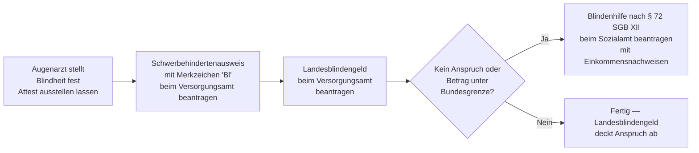

## Hintergrund

Die Blindenhilfe nach **§ 72 SGB XII** ist eine Leistung der Sozialhilfe und bildet das bundesrechtliche Fundament der Unterstützung für blinde Menschen in Deutschland. Sie geht auf das Bundessozialhilfegesetz (BSHG) zurück, das bereits in den 1960er Jahren eine entsprechende Regelung enthielt, und wurde mit dem SGB XII ab 2005 fortgeführt.

In der Praxis ist § 72 SGB XII **subsidiär**: Alle 16 Bundesländer haben per eigenem Landesgesetz ein **Landesblindengeld** eingeführt, das in der Regel einkommensunabhängig und höher dotiert ist. Die Bundesnorm greift nur, wenn kein vergleichbarer Anspruch aus einem anderen Leistungsgesetz besteht — oder wenn das Landesblindengeld ausnahmsweise unter dem Bundesbetrag liegt.

## Wer gilt als „blind" im Sozialrecht?

Das Gesetz verwendet eine präzise medizinisch-rechtliche Definition, die über die umgangssprachliche Blindheit hinausgeht:

Als blind gilt, wessen **Sehschärfe auf dem besseren Auge** — auch mit Sehhilfe — nicht mehr als **1/50 (0,02)** beträgt, oder wessen **Gesichtsfeld auf weniger als 5°** eingeschränkt ist. Gleichgestellt sind vergleichbare Funktionsstörungen des Sehapparats.

Die Feststellung erfolgt durch ein **augenärztliches Attest**. In der Praxis wird die Blindheit meist über den **Schwerbehindertenausweis mit Merkzeichen „Bl"** (GdB 100) dokumentiert, der beim Versorgungsamt beantragt wird.

## Was wird geleistet?

Die Leistung ist ein monatliches **Blindengeld in Geld**, das pauschal zur Abdeckung der blindheitsbedingten Mehraufwendungen dient — also Kosten, die typischerweise durch die Blindheit entstehen:

- Vorlesedienste, Vorlese-Apps und -geräte
- Erhöhter Begleitbedarf im Alltag und bei Behördengängen
- Spezielle Hilfsmittel und blindengerechte Ausstattung
- Höherer Zeitaufwand für Alltagsverrichtungen

Der Betrag wird durch Verordnung regelmäßig angepasst. Er liegt für **Erwachsene** bei rund **770–820 € monatlich** (Stand 2024/2025), für **Kinder und Jugendliche unter 18 Jahren** bei der **Hälfte** dieses Betrags.

## Verhältnis zum Landesblindengeld — die entscheidende Weiche

Das **Landesblindengeld** geht dem § 72 SGB XII vor. Wer es bezieht, hat in der Regel keinen ergänzenden Bundesanspruch. Die Länder unterscheiden sich erheblich:

| Bundesland | Monatl. Blindengeld (ca. 2024) | Einkommensabhängig? |
| --- | ---: | :---: |
| Bayern | ~ 1.302 € | Nein |
| Nordrhein-Westfalen | ~ 771 € | Nein |
| Niedersachsen | ~ 513 € | Nein |
| Baden-Württemberg | ~ 695 € | Nein |
| Berlin | ~ 695 € | Nein |
| Hamburg | ~ 660 € | Nein |

*Hinweis: Beträge nach jeweiligem Landesgesetz; regelmäßige Anpassungen — bitte beim zuständigen Versorgungsamt prüfen.*

Liegt das Landesblindengeld **unter** dem Bundesbetrag nach § 72 SGB XII (derzeit in einzelnen Ländern möglich), kann die Differenz beim Sozialamt beantragt werden. Bei gänzlich fehlendem Landesblindengeld-Anspruch (z. B. bei Personen, die erst kürzlich nach Deutschland zugezogen sind) gilt § 72 SGB XII als eigenständiger Anspruch.

## Einkommens- und Vermögensabhängigkeit

Anders als das Landesblindengeld ist die Blindenhilfe nach § 72 SGB XII **einkommens- und vermögensgeprüft** (§ 19 SGB XII). Einkommen oberhalb der Sozialhilfegrenzen und verwertbares Vermögen werden angerechnet. Das unterscheidet sie grundlegend vom Landesblindengeld, das bundesweit einkommensunabhängig gewährt wird.

## Antragsweg

Der Antrag auf Blindenhilfe nach § 72 SGB XII wird beim **Sozialamt** (Sozial- oder Wohlfahrtsamt) des zuständigen Landkreises oder der kreisfreien Stadt gestellt. Einzureichen sind:

- Ärztliches Attest über die Blindheit
- Nachweis über den Schwerbehindertenausweis (Merkzeichen „Bl")
- Einkommens- und Vermögensnachweise (Kontoauszüge, Rentenbescheid etc.)
- Nachweis über bestehende oder fehlende Landesblindengeld-Ansprüche

## Abgrenzung zu ähnlichen Leistungen

| Leistung | Rechtsgrundlage | Besonderheit |
| --- | --- | --- |
| Landesblindengeld | Landesrecht (z. B. BayBlindG) | Einkommensunabhängig; geht § 72 SGB XII vor |
| Blindengeld aus Unfallversicherung | § 35 SGB VII | Bei Blindheit infolge eines Arbeitsunfalls |
| Pflegeleistungen | SGB XI | Ergänzend, bei anerkannter Pflegebedürftigkeit |
| Blindenpauschbetrag | § 33b Abs. 3 EStG | Steuerlicher Freibetrag von 7.400 €/Jahr |
| Eingliederungshilfe | §§ 90 ff. SGB IX | Für Teilhabe am Leben — z. B. Assistenz, Hilfsmittel |

## Nichtinanspruchnahme

§ 72 SGB XII ist vielen blinden Menschen nicht bekannt, weil das Landesblindengeld den Alltag dominiert. Typische Situationen, in denen der Bundesanspruch dennoch relevant wird:

- **Zuzug aus dem Ausland**: Wer noch keinen Landesblindengeld-Anspruch aufgebaut hat, kann überbrückend § 72 SGB XII nutzen.
- **Lücke zwischen Landes- und Bundesbetrag**: In Bundesländern mit niedrigerem Landesblindengeld kann die Differenz beim Sozialamt beantragt werden.
- **Vergessener Blindenpauschbetrag**: Der steuerliche Pauschbetrag nach § 33b EStG (7.400 €/Jahr) wird nicht beim Sozialamt, sondern in der Steuererklärung geltend gemacht — und von vielen schlicht nicht eingetragen.

Anlaufstellen für Beratung sind das kommunale **Sozialamt**, das **Versorgungsamt** sowie Selbsthilfeorganisationen wie der **Deutsche Blinden- und Sehbehindertenverband (DBSV)** oder regionale Blinden- und Sehbehindertenvereine.
