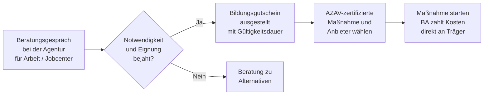

## Hintergrund

Der **Bildungsgutschein** ist das zentrale Förderinstrument der Bundesagentur für Arbeit und der Jobcenter für berufliche Weiterbildungen. Er wurde mit dem SGB III eingeführt und ist seitdem das Hauptwerkzeug, um Arbeitslosen und von Arbeitslosigkeit bedrohten Personen den Zugang zu anerkannten Weiterbildungsmaßnahmen zu ermöglichen.

Das Konzept ist bewusst einfach: Wer die Voraussetzungen erfüllt, erhält vom Beratungsgespräch einen Gutschein — und kann damit **selbst** einen zugelassenen Bildungsträger auswählen. Die BA zahlt die Kursgebühren direkt an den Träger. Ab **1. Januar 2025** wurde die Zuständigkeit für die Finanzierung von Bildungsgutscheinen auch für Jobcenter-Kundinnen und -Kunden vollständig auf die Agenturen für Arbeit übertragen.

## Wer bekommt einen Bildungsgutschein?

Anspruch besteht, wenn **Notwendigkeit und Eignung** im Beratungsgespräch bejaht werden. Es gibt keine starre Checkliste — die Agentur entscheidet nach pflichtgemäßem Ermessen. Typische Konstellationen:

- Arbeitslose, die für die Eingliederung in den Arbeitsmarkt eine Zusatzqualifikation benötigen
- Arbeitnehmerinnen und Arbeitnehmer, die von Entlassung bedroht sind (§ 82 SGB III kombinierbar)
- Bürgergeld-Beziehende, bei denen eine Weiterbildung die Beschäftigungsfähigkeit verbessert

Die konkrete Bildungsmaßnahme und der Bildungsträger müssen **AZAV-zertifiziert** sein (Akkreditierungs- und Zulassungsverordnung Arbeitsförderung). Nicht zertifizierte Kurse werden nicht anerkannt.

## Was wird gefördert?

| Kostenart | Übernahme durch BA |
| --- | --- |
| Lehrgangsgebühren (inkl. Lernmittel, Prüfungsgebühren) | 100 % |
| Auswärtige Unterbringung und Verpflegung | Ja, bei unzumutbarer Pendeldistanz |
| Kinderbetreuungskosten | Ja, ergänzend |
| **Weiterbildungsgeld** (seit 2023) | 150 €/Monat zusätzlich bei abschlussorientierten Maßnahmen |

Das **Weiterbildungsgeld** von 150 € monatlich ist eine Neuerung des **Weiterbildungsgesetzes 2023**: Es gilt als Anreizzahlung und ist nicht auf ALG I oder Bürgergeld anrechenbar.

## Statistische Nutzung

Die BA erfasst offiziell **keine** Zahl ausgegebener Bildungsgutscheine, weil ein Gutschein nur den Förderanspruch bescheinigt — nicht seine tatsächliche Einlösung. Statistisch ausgewiesen werden daher **Eintritte in Maßnahmen zur beruflichen Weiterbildung (FbW)**:

- 2024 zählte die BA im Durchschnitt rund **167.000 Teilnehmende** an geförderten Weiterbildungen — der einzige aktiv-arbeitsmarktpolitische Bereich, in dem die Teilnehmerzahl 2024 leicht gestiegen ist.
- Rund **80 % des Weiterbildungsbereichs** entfallen auf Maßnahmen, die über den Bildungsgutschein finanziert werden.

## Antragsweg

Der Gutschein enthält die **Gültigkeitsdauer** (in der Regel 3 Monate), eine ggf. räumliche Einschränkung und das Bildungsziel. Er kann verlängert werden, wenn sich die Maßnahmensuche schwieriger gestaltet als erwartet.

## Abgrenzung

| Instrument | Zielgruppe | Besonderheit |
| --- | --- | --- |
| **Bildungsgutschein** (§ 81 SGB III) | Arbeitslose und von Arbeitslosigkeit Bedrohte | Freie Trägerwahl, AZAV-zertifiziert |
| **Weiterbildungsförderung Beschäftigte** (§ 82 SGB III) | Beschäftigte im Betrieb | Zuschuss an Arbeitgeber, nicht als Gutschein |
| **Qualifizierungsgeld** (§ 82a SGB III) | Betriebe mit Strukturwandel | Lohnersatz ähnlich Kurzarbeitergeld |
| **Aktivierungs- und Vermittlungsgutschein (AVGS)** | Arbeitslose | Für Vermittlungsmaßnahmen, nicht Weiterbildung |
