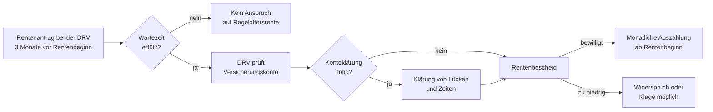

## Geschichte

Die **Regelaltersrente** hat ihren Ursprung im 1889 von Otto von Bismarck eingeführten *Gesetz betreffend die Invaliditäts- und Altersversicherung* — einer der ersten staatlichen Rentensysteme weltweit. Das damalige Rentenalter lag bei 70 Jahren, die Lebenserwartung der Arbeiterschaft kaum darüber hinaus. Die Geschichte der Rentenversicherung ist seither eine Abfolge tiefgreifender Reformen:

- **1889** – Einführung der Invaliditäts- und Altersversicherung; Rentenalter 70 Jahre
- **1916** – Absenkung des Rentenalters auf 65 Jahre im Ersten Weltkrieg
- **1957** – **Dynamisierung**: Die Große Rentenreform koppelt Renten erstmals an die Lohnentwicklung statt an fest eingezahlte Beträge (*Rente nach Arbeitsverdienst*). Grundlage des heutigen Systems.
- **1972** – Flexible Altersgrenze und Einbeziehung von Selbstständigen; Einführung der Rente nach Mindesteinkommen
- **1992** – Strukturreform: Einführung des Rentenartfaktors; erste Weichenstellung Richtung demographische Nachhaltigkeit; Rentenbeginn auf 63–65 verschoben
- **2001** – Riester-Reform: Ergänzung durch kapitalgedeckte private Vorsorge (*Riester-Rente*); Absenkung des gesetzlichen Rentenniveaus als Ziel
- **2004** – Einführung des **Nachhaltigkeitsfaktors** (§ 68 SGB VI): Der Rentenwert wird automatisch gedämpft, wenn das Verhältnis von Rentnern zu Beitragszahlern ungünstiger wird.
- **2012/2014** – **Rente mit 67**: Stufenweise Anhebung der Regelaltersgrenze von 65 auf 67 Jahre (§ 235 SGB VI) für die Jahrgänge ab 1947.
- **2014** – *Rentenpaket I*: Einführung der Rente ab 63 für besonders langjährig Versicherte (45 Jahre) und der Mütterrente I (Aufwertung Kindererziehungszeiten)
- **2019** – *Rentenpaket II*: Einführung der Grundrente (Mindestpunkte für langjährige Geringverdiener ab 2021)
- **2024** – *Rentenpaket II* (Halteliniengesetz): Festschreibung des Rentenniveaus auf mindestens 48 % bis 2040; Einführung des Generationenkapitals (staatlicher Fonds als Demografiepuffer)

## Regelaltersgrenze

Die Regelaltersgrenze richtet sich nach dem Geburtsjahrgang. Für alle ab **1964 Geborenen** gilt 67 Jahre. Für frühere Jahrgänge gilt eine Übergangsregelung nach § 235 SGB VI:

| Geburtsjahr | Regelaltersgrenze |
| ---: | --- |
| vor 1947 | 65 Jahre 0 Monate |
| 1947 | 65 Jahre 1 Monat |
| 1948 | 65 Jahre 2 Monate |
| 1949 | 65 Jahre 3 Monate |
| 1950 | 65 Jahre 4 Monate |
| 1951 | 65 Jahre 5 Monate |
| 1952 | 65 Jahre 6 Monate |
| 1953 | 65 Jahre 7 Monate |
| 1954 | 65 Jahre 8 Monate |
| 1955 | 65 Jahre 9 Monate |
| 1956 | 65 Jahre 10 Monate |
| 1957 | 65 Jahre 11 Monate |
| 1958 | 66 Jahre 0 Monate |
| 1959 | 66 Jahre 2 Monate |
| 1960 | 66 Jahre 4 Monate |
| 1961 | 66 Jahre 6 Monate |
| 1962 | 66 Jahre 8 Monate |
| 1963 | 66 Jahre 10 Monate |
| ab 1964 | **67 Jahre 0 Monate** |

Ab Erreichen der Regelaltersgrenze kann man auch weiterarbeiten. Jeder Monat über die Regelaltersgrenze hinaus erhöht den **Zugangsfaktor** um 0,005 (das entspricht +0,6 % Rentenerhöhung pro Monat).

## Berechnung

Die Monatsrente ergibt sich aus der **Rentenformel**:

```
Monatsrente = EP × ZF × RAF × aRW
```

| Faktor | Bedeutung | Typischer Wert |
| --- | --- | ---: |
| **EP** | Summe aller persönlichen Entgeltpunkte | 30–50 (nach 40 Beitragsjahren) |
| **ZF** | Zugangsfaktor (Abschlag/Zuschlag je nach Rentenbeginn) | 1,000 |
| **RAF** | Rentenartfaktor (1,0 für Altersrenten) | 1,000 |
| **aRW** | Aktueller Rentenwert (politisch festgesetzt, jährlich angepasst) | 40,17 € (ab Juli 2025) |

**Entgeltpunkte** sind der zentrale Baustein: In jedem Jahr entspricht das *durchschnittliche Arbeitsentgelt aller Versicherten* genau 1,0 Entgeltpunkt. Wer in einem Jahr das Durchschnittsentgelt verdient, sammelt also 1,0 EP. Wer 50 % davon verdient: 0,5 EP. Wer doppelt so viel: höchstens 2,0 EP (Beitragsbemessungsgrenze).

**Praxisbeispiel**: 40 Beitragsjahre mit durchschnittlichem Einkommen → 40 EP × 1,0 × 1,0 × 40,17 € = **1.606,80 €/Monat** brutto. (Stand: Juli 2025, ohne Berücksichtigung von Rentensteuer und Krankenversicherungsbeitrag.)

**Aktueller Rentenwert** — historische Entwicklung:

| Datum | Aktueller Rentenwert |
| --- | ---: |
| Juli 2023 | 36,02 € (West) / 35,52 € (Ost) |
| Juli 2024 | 37,60 € (Ost-West-Angleichung abgeschlossen) |
| Juli 2025 | 40,17 € |

Die **Ost-West-Angleichung** des Rentenwertes wurde nach mehr als 30 Jahren ab Juli 2024 abgeschlossen. Zuvor galten für die neuen Bundesländer niedrigere Rentenwerte, die aber durch einen höheren Entgeltpunkte-Umrechnungsfaktor ausgeglichen wurden — ein historisch komplexes Zwischensystem.

## Wartezeiten

Anspruch auf Regelaltersrente besteht erst nach Erfüllung der **allgemeinen Wartezeit** von **5 Jahren (60 Monate)** (§ 50 SGB VI).

Auf die Wartezeit anrechenbare Zeiten:

| Art | Erläuterung |
| --- | --- |
| Pflichtbeitragszeiten | Beschäftigung, Selbstständigkeit mit Pflichtversicherung |
| Freiwillige Beitragszeiten | Nachkauf von Beiträgen (§ 197 SGB VI) |
| **Kindererziehungszeiten** | 2,5 Jahre je Kind (Geburten vor 1992: 2 Jahre), als Pflichtbeitragszeit gewertet |
| Anrechnungszeiten | Schule/Hochschule ab 17 J., Arbeitslosigkeit, Krankheit — zählen *nur* zur Wartezeit, bringen keine EP |
| Ersatzzeiten | Kriegsdienst, Kriegsgefangenschaft u. ä. |
| Zurechnungszeit | Bei Erwerbsminderung: fiktive Verlängerung bis zur Regelaltersgrenze |

Für die meisten Versicherten ist die 5-Jahres-Wartezeit kein Hindernis. Kritisch kann sie für Personen mit sehr lückenhafter Erwerbsbiografie (z. B. dauerhaft im Ausland ohne Sozialversicherungspflicht in Deutschland) sein.

## Antragsweg



Der Antrag auf Regelaltersrente muss **aktiv gestellt** werden — er läuft nicht automatisch an. Die DRV empfiehlt, den Antrag **3 Monate vor dem gewünschten Rentenbeginn** einzureichen. Ein Antrag innerhalb von 3 Monaten nach Erreichen der Regelaltersgrenze kann Rentenbeginn auf das Erreichen der Grenze festsetzen; ab dem 4. Monat gilt der Eingangstag des Antrags.

Der Antrag kann gestellt werden:
- Online über das [DRV-Serviceportal](https://www.deutsche-rentenversicherung.de)
- Schriftlich per Post
- Persönlich in den Beratungsstellen der Deutschen Rentenversicherung oder der Gemeinsamen Servicestellen für Rehabilitation

**Tipp Kontenklärung**: Die DRV schickt ab dem 55. Lebensjahr jährliche Renteninformationen. Vor dem Rentenantrag lohnt sich eine Kontenklärung (§ 149 SGB VI), um sicherzustellen, dass alle Beitragszeiten, Kindererziehungszeiten und Anrechnungszeiten vollständig im Versicherungskonto eingetragen sind.

## Verhältnis zu anderen Leistungen

- **Grundsicherung im Alter (§§ 41–46b SGB XII)**: Wessen Regelaltersrente für den Lebensunterhalt nicht ausreicht, kann ergänzend Grundsicherung im Alter beantragen. Diese schließt die Lücke zwischen Rente und Existenzminimum. Allerdings liegt die Nichtinanspruchnahmequote hoch — Schätzungen zufolge verzichten bis zu 60 % der Anspruchsberechtigten auf den Antrag (u. a. DIW Wochenbericht 49/2019).
- **Grundrente (§ 76g SGB VI)**: Seit 2021 erhalten langjährig Versicherte mit unterdurchschnittlichem Einkommen einen Grundrentenzuschlag auf ihre Entgeltpunkte — die DRV berechnet und zahlt diesen automatisch, ohne gesonderten Antrag.
- **Erwerbsminderungsrente (§§ 43, 240 SGB VI)**: Wer vor der Regelaltersgrenze dauerhaft erwerbsgemindert ist, erhält stattdessen Erwerbsminderungsrente. Mit Erreichen der Regelaltersgrenze wird diese automatisch in Regelaltersrente umgewandelt.
- **Rente ab 63 (§ 236b SGB VI)**: Besonders langjährig Versicherte mit 45 Beitragsjahren können bereits ab 63 Jahren abschlagsfrei in Rente gehen — dies ist eine eigenständige Rentenart, kein vorzeitiger Beginn der Regelaltersrente.
- **Betriebliche Altersversorgung (bAV)**: Betriebsrenten werden unabhängig von der gesetzlichen Rente gezahlt; wer Grundsicherung bezieht, muss einen Teil der bAV anrechnen lassen (Freibetrag: 218 € monatlich, § 82 SGB XII).
- **Witwenrente / Witwerrente (§§ 46, 242a SGB VI)**: Stirbt der Ehepartner, kann die Witwe/der Witwer neben der eigenen Altersrente eine Hinterbliebenenrente erhalten — diese wird jedoch auf die eigene Rente angerechnet (§ 97 SGB VI), wenn die Summe einen Freibetrag übersteigt.
- **Kranken- und Pflegeversicherungsbeiträge**: Rentner zahlen den halben Beitragssatz zur gesetzlichen Krankenversicherung (ca. 8,15 % auf die Rente); die andere Hälfte trägt die DRV. Hinzu kommt der volle Pflegeversicherungsbeitrag (kinderlos: 4,0 %, mit Kindern: gestaffelt nach Kinderanzahl).

## Transparenz: Renteninformation lesen

Alle gesetzlich Rentenversicherten ab 27 Jahren mit mindestens 5 Jahren Versicherungszeit erhalten jährlich eine **Renteninformation** (§ 109 SGB VI). Sie enthält:

1. Die bisher erworbene Rentenanwartschaft (als Hochrechnung)
2. Eine Projektion der Rente bei unverändertem Verlauf bis zur Regelaltersgrenze
3. Eine Projektion unter Annahme einer 0-%-Lohnwachstums-Variante (konservativste Schätzung)

Die Renteninformation ist kein Bescheid — sie ist eine unverbindliche Schätzung. Fehler im Versicherungskonto (vergessene Ausbildungszeiten, Kindererziehungszeiten des Vaters, lückenhafte Arbeitgeber-Meldungen) können darin unbemerkt stecken. Eine aktive **Kontenklärung** beim zuständigen Rentenversicherungsträger ist daher ratsam, besonders ab dem 50. Lebensjahr.
