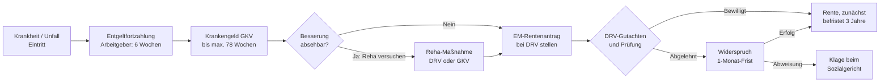

## Geschichte

Das deutsche Rentenrecht kannte bis Ende 2000 zwei getrennte Renten bei eingeschränkter Arbeitsfähigkeit:

- **Rente wegen Berufsunfähigkeit (BU)**: Wer seinen zuletzt ausgeübten Beruf nicht mehr mindestens 6 Stunden täglich ausüben konnte *und* nicht auf eine vergleichbare Tätigkeit verwiesen werden durfte, erhielt die halbe Rente. Der sog. **Berufsschutz** verhinderte Verweisungen auf deutlich schlechter entlohnte oder qualitativ weit entfernte Berufe.
- **Rente wegen Erwerbsunfähigkeit (EU)**: Wer auf dem allgemeinen Arbeitsmarkt weniger als 2 Stunden täglich arbeitsfähig war, erhielt die volle Rente.

Mit dem **Gesetz zur Reform der Renten wegen verminderter Erwerbsfähigkeit** (in Kraft ab 1. Januar 2001) wurde dieses System grundlegend umgestaltet:

1. Die BU-Rente und ihr Berufsschutz wurden abgeschafft. Seitdem kann jeder Versicherte auf *jede beliebige* Tätigkeit des allgemeinen Arbeitsmarkts verwiesen werden, unabhängig von Ausbildung oder bisherigem Beruf.
2. Stattdessen trat das heutige Zwei-Stufen-Modell: **teilweise** (3 bis unter 6 Stunden/Tag) und **volle Erwerbsminderung** (unter 3 Stunden/Tag).

Wichtige Meilensteine seit 2001:

| Jahr | Änderung |
| --- | --- |
| **2001** | Ablösung BU/EU durch das neue EM-Renten-System |
| **2014** | Zurechnungszeit verlängert auf das 62. Lebensjahr |
| **2019** | *Rentenpaket I*: Zurechnungszeit auf 65 Jahre und 8 Monate verlängert — deutliche Rentenerhöhung für neu bewilligte EM-Renten |
| **2024** | *Rentenpaket II*: Schrittweise weitere Verlängerung der Zurechnungszeit in Richtung 67 Jahre |

Gesellschaftlich ist die EM-Rente ein dauerhaftes Streitfeld: Die **Ablehnungsquote** bei Erstanträgen liegt historisch bei 35–45 %; ein erheblicher Teil wird erst im Widerspruchs- oder Klageverfahren durchgesetzt.

## Medizinische Voraussetzungen

§ 43 SGB VI definiert zwei Stufen der Erwerbsminderung, gemessen an der täglich zumutbar erreichbaren Arbeitszeit **auf dem allgemeinen Arbeitsmarkt**:

| Stufe | Tägliche Arbeitsfähigkeit | Rentenartfaktor |
| --- | --- | ---: |
| Volle Erwerbsminderung | unter 3 Stunden | 1,0 |
| Teilweise Erwerbsminderung | 3 bis unter 6 Stunden | 0,5 |
| Kein Anspruch | 6 Stunden und mehr | — |

**Allgemeiner Arbeitsmarkt — kein Berufsschutz:** Das Leistungsvermögen wird abstrakt beurteilt. Wer seinen erlernten Beruf zwar nicht mehr ausüben kann, aber irgendeine leichte körperliche Tätigkeit noch mindestens 6 Stunden verrichtet, hat keinen Anspruch. Die DRV muss dabei keinen konkreten freien Arbeitsplatz nachweisen — die Verweisung erfolgt auf eine abstrakt definierte Tätigkeit.

**Ausnahme — Arbeitsmarktklausel (§ 43 Abs. 3 SGB VI):** Wer nur *teilweise* erwerbsgemindert (3–6 Stunden) ist, aber als **arbeitslos gemeldet** keinen Teilzeitjob findet, erhält die Rente trotzdem in **voller Höhe**. Diese Klausel trägt dem Umstand Rechnung, dass Teilzeitarbeitsplätze im Niedriglohnbereich schwer zugänglich sind.

**Dauerhaftigkeit:** Die Erwerbsminderung muss voraussichtlich auf Dauer vorliegen oder mindestens sechs Monate andauern. EM-Renten werden typischerweise zunächst auf **drei Jahre befristet** bewilligt (§ 102 SGB VI). Eine Verlängerung ist möglich; nach neun Jahren Bezug kann die Rente in eine Dauerrente umgewandelt werden.

## Versicherungsrechtliche Voraussetzungen

Neben der medizinischen Minderung müssen zwei versicherungsrechtliche Bedingungen erfüllt sein (§ 43 Abs. 1 und 2 SGB VI):

### 1. Allgemeine Wartezeit: 5 Jahre

Mindestens **60 Beitragsmonate** müssen zurückgelegt sein. Anzurechnen sind Pflichtbeitragszeiten (Erwerbstätigkeit, Kindererziehungszeiten, Pflegezeiten), freiwillige Beitragszeiten sowie anerkannte Auslandszeiten aus EU/EWR-Staaten.

### 2. Drei Pflichtbeitragsjahre in den letzten fünf Jahren

In den **letzten 5 Jahren vor Eintritt der Erwerbsminderung** müssen mindestens **36 Monate Pflichtbeiträge** vorliegen. Freiwillige Beiträge zählen hier *nicht*.

**Ausnahme:** Bei Erwerbsminderung infolge eines Arbeitsunfalls, Wegeunfalls oder bestimmter gesetzlich definierter Erkrankungen entfällt die 3-Jahres-Bedingung. Auch für Versicherte, die vor dem 17. Lebensjahr erwerbsgemindert werden, gelten erleichterte Regelungen.

## Berechnung

Die EM-Rente ergibt sich aus der allgemeinen Rentenformel:

```
Monatsrente = Entgeltpunkte × Zugangsfaktor × Rentenartfaktor × aktueller Rentenwert
```

| Faktor | Wert (2025) | Erläuterung |
| --- | --- | --- |
| Entgeltpunkte | individuell | Tatsächliche Beitragsjahre + Zurechnungszeit |
| Zugangsfaktor | 0,892–1,0 | Abzug für frühzeitigen Bezug, max. −10,8 % |
| Rentenartfaktor | 1,0 / 0,5 | Volle bzw. teilweise EM |
| Aktueller Rentenwert | 39,32 € (West/Ost ab 2025 angeglichen) | Jährlich angepasst |

### Zurechnungszeit (§ 59 SGB VI)

Das wichtigste Schutzinstrument zugunsten jüngerer Rentenempfänger: Beim Rentenbeginn wird so gerechnet, als hätte der Versicherte bis zum **Referenzalter** (aktuell 67 Jahre) weiter mit durchschnittlichem Einkommen gearbeitet. Diese fiktiven Entgeltpunkte werden der tatsächlichen Rentenbiografie hinzugerechnet.

**Beispiel:** Eine 38-Jährige mit 13 Beitragsjahren erhält dank Zurechnungszeit Entgeltpunkte für weitere 29 Jahre (bis 67). Ohne diese Regelung würde die Rente kaum das Existenzminimum erreichen.

### Zugangsfaktor und dauerhafte Abzüge

Pro Monat Rentenbeginn vor dem Referenzalter 67 werden **0,3 %** abgezogen, maximal **10,8 %** (= 36 Monate × 0,3 %). Dieser Abzug ist **dauerhaft** — er bleibt auch nach Wechsel in die Regelaltersrente mit 67 erhalten. Da EM-Renten typischerweise weit vor dem 67. Lebensjahr beginnen, nehmen die meisten Betroffenen den vollen Abzug von 10,8 % in Kauf.

## Antragsweg



**Reha vor Rente (§ 9 SGB VI):** Die DRV ist verpflichtet, vor einer Rentenbewilligung alle Rehabilitationsmöglichkeiten auszuschöpfen. In der Praxis bedeutet dies, dass ein Rentenantrag häufig zunächst in einen Reha-Antrag umgedeutet wird. Erst wenn Reha nicht zielführend ist, wird die Rente bewilligt.

**Antragsfristen:** Die Rente wird frühestens ab dem Antragsmonat gezahlt — rückwirkende Leistungen sind nicht möglich. Wer mit dem Antrag wartet bis das Krankengeld ausläuft, verliert in dieser Zeit möglicherweise Rentenleistungen. Der Antrag sollte daher idealerweise gestellt werden, sobald absehbar ist, dass die volle Arbeitsfähigkeit nicht wiederkehrt.

**Befristungspflege:** Bei befristeten Renten endet die Zahlung automatisch. Betroffene müssen rechtzeitig vor Fristablauf einen Verlängerungsantrag stellen, andernfalls entsteht eine Zahlungslücke.

## Verhältnis zu anderen Leistungen

- **Krankengeld (§§ 44 ff. SGB V):** Kommt zeitlich vor der EM-Rente; Bezugsdauer max. 78 Wochen pro Erkrankung. Zwischen Krankengeldentzug und Rentenbewilligung entsteht oft eine **Übergangslücke**. § 145 SGB III (Nahtlosigkeit) soll ALG-I-Bezug in diesem Zeitraum sichern — ist aber vielen Betroffenen nicht bekannt.
- **Arbeitslosengeld I (§§ 136 ff. SGB III):** Wer trotz Erkrankung dem Arbeitsmarkt noch zur Verfügung steht (insbesondere bei teilweiser EM), kann ALG I beziehen. Bei gleichzeitigem laufendem EM-Rentenantrag werden bei späterer Rentenbewilligung überlappende Zahlungen verrechnet.
- **Grundsicherung bei Erwerbsminderung (§§ 41 ff. SGB XII):** Wer dauerhaft voll erwerbsgemindert ist und dessen EM-Rente das Existenzminimum nicht deckt, kann ergänzend Grundsicherung beantragen. Diese wird beim Sozialamt beantragt — nicht bei der DRV. Viele EM-Rentner sind auf diese Aufstockung angewiesen, beantragen sie aber nicht (Nichtinanspruchnahme).
- **Bürgergeld (SGB II):** Dauerhaft voll Erwerbsgeminderte scheiden aus dem SGB-II-System aus, da Bürgergeld Erwerbsfähigkeit (mindestens 3 Stunden täglich, § 8 SGB II) voraussetzt. Nur vorübergehend oder teilweise Erwerbsgeminderte können unter SGB II fallen.
- **Unfallrente (§ 56 SGB VII):** Bei Arbeitsunfall oder Berufskrankheit greift die gesetzliche Unfallversicherung. Die UV-Verletztenrente wird anteilig auf die gesetzliche EM-Rente angerechnet, soweit die Summe einen Grenzbetrag überschreitet.
- **Private Berufsunfähigkeitsversicherung:** Privatversicherungsleistungen werden nicht auf die gesetzliche EM-Rente angerechnet. Die private BU knüpft jedoch an den „letzten ausgeübten Beruf" an (Berufsschutz bleibt dort erhalten) — die Bewilligungsschwelle kann daher anders liegen als bei der gesetzlichen Rente.
- **Beamtenversorgung / Ruhegehalt:** Beamte sind nicht in der gesetzlichen Rentenversicherung, sondern erhalten bei Dienstunfähigkeit **Ruhegehalt** nach dem Beamtenversorgungsgesetz (BeamtVG). Relevant für Personen, die im Laufe ihres Berufslebens zwischen Beamtenstatus und sozialversicherungspflichtiger Beschäftigung wechselten.
- **Übergang zur Altersrente:** Mit Erreichen des Regelrentenalters (67) wird die EM-Rente automatisch in die Regelaltersrente umgewandelt. Zugangsfaktorabzüge, die aus dem frühen EM-Rentenbeginn resultieren, bleiben dauerhaft bestehen.

## Nichtinanspruchnahme und typische Hürden

- **Hohe Ablehnungsquote beim Erstantrag** (~35–45 %): DRV-Gutachter bewerten die Restarbeitsfähigkeit oft strenger, als behandelnde Ärzte es beurteilen. Gut dokumentierte Befundberichte und Atteste sind entscheidend — Betroffene sollten diese aktiv bei ihren Ärzten einfordern.
- **Übergangslücken:** Zwischen Krankengeldentzug und Rentenbewilligung entstehen Phasen ohne Einkommen, wenn ALG I nicht beantragt wurde oder ebenfalls ausläuft. Diese Lücken treffen besonders vulnerable Personen hart.
- **Unbekannte Grundsicherungspflicht:** Viele EM-Rentner mit niedrigen Renten wissen nicht, dass sie beim Sozialamt ergänzende Grundsicherung beantragen können. Da dies ein separater Antrag bei einer anderen Behörde ist, liegt hier eine systematische Dunkelziffer.
- **Arbeitsmarktklausel (§ 43 Abs. 3 SGB VI):** Teilweise Erwerbsgeminderte, die faktisch keinen Teilzeitjob finden, erhalten die volle Rente — aber nur, wenn sie als arbeitslos gemeldet sind. Diese Bedingung ist vielen Betroffenen unbekannt.
- **Befristungskontrollen:** Bei befristeten Renten endet die Zahlung still, wenn kein Verlängerungsantrag gestellt wird. Auch hier entstehen vermeidbare Zahlungslücken.
