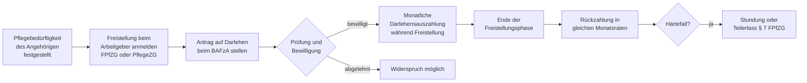

## Kontext: Familienpflegezeitgesetz

Das **Familienpflegezeitgesetz (FPfZG)** ermöglicht Beschäftigten, ihre Arbeitszeit für bis zu 24 Monate auf mindestens 15 Wochenstunden zu reduzieren, um einen nahen Angehörigen in häuslicher Umgebung zu pflegen (§ 2 FPfZG). Um den damit verbundenen Einkommensverlust abzufedern, können Beschäftigte ein **zinsloses staatliches Darlehen** nach § 3 FPfZG beantragen.

Das Darlehen ergänzt die Freistellung — es entsteht kein automatischer Anspruch und muss gesondert beim zuständigen Bundesamt gestellt werden.

## Geschichte

- **2011/2012** – Erstes Familienpflegezeitgesetz: Einführung der freiwilligen Familienpflegezeit auf rein betrieblicher Basis mit staatlichem Darlehen als Anreizinstrument. Wegen des fehlenden Rechtsanspruchs blieb die Inanspruchnahme bundesweit gering.
- **2015** – *Gesetz zur besseren Vereinbarkeit von Familie, Pflege und Beruf* (in Kraft ab 1. Januar 2015): Schafft einen **Rechtsanspruch** auf Familienpflegezeit (Zustimmung des Arbeitgebers nicht mehr erforderlich) und weitet das Darlehen auf alle pflegebedingten Freistellungsformen aus: kurzzeitige Arbeitsverhinderung (§ 2 PflegeZG), Pflegezeit (§ 3 PflegeZG) und Familienpflegezeit (§ 2 FPfZG).

## Anspruchsvoraussetzungen

Das Darlehen können Beschäftigte beantragen, die eine der folgenden Freistellungen in Anspruch nehmen:

| Freistellungsart | Rechtsgrundlage | Maximale Dauer |
| --- | --- | ---: |
| Kurzzeitige Arbeitsverhinderung | § 2 PflegeZG | 10 Arbeitstage |
| Pflegezeit (vollständige Freistellung) | § 3 PflegeZG | 6 Monate |
| Familienpflegezeit (Arbeitszeitreduzierung auf min. 15 h/Woche) | § 2 FPfZG | 24 Monate |

Voraussetzung in allen Fällen: Der zu pflegende Angehörige ist **pflegebedürftig** im Sinne des SGB XI (Pflegegrad 1–5) oder schwer erkrankt, und die Pflege erfolgt in **häuslicher Umgebung**.

Als **nahe Angehörige** gelten nach § 7 Abs. 3 PflegeZG: Ehegattinnen und Ehegatten, eingetragene Lebenspartnerinnen und -partner, Eltern, Schwiegereltern, Stiefeltern, Geschwister, Kinder, Adoptiv- und Pflegekinder sowie Schwägerinnen und Schwäger.

**Kein Anspruch** besteht für Beamtinnen und Beamte (eigene Regelungen über Pflegeurlaub) sowie für Selbstständige.

## Berechnung

Die monatliche Darlehenshöhe berechnet sich nach § 3 Abs. 1 FPfZG:

```
Darlehen = ½ × (pauschalisiertes Nettoentgelt vor Freistellung
               − pauschalisiertes Nettoentgelt während Freistellung)
```

Das **pauschalisierte Nettoentgelt** wird nicht aus dem tatsächlichen Auszahlungsbetrag abgeleitet, sondern nach einem einheitlichen Verfahren berechnet (pauschaler Steuersatz, pauschaler Sozialversicherungsabzug), um steuerliche Sonderfaktoren wie Freibeträge oder Steuerklassenkombinationen herauszuhalten.

**Rechenbeispiel (50 % Arbeitszeitreduzierung):**

| Position | Betrag |
| --- | ---: |
| Bruttolohn vor Familienpflegezeit | 3.500 €/Monat |
| Pauschalisiertes Netto vor Freistellung | ca. 2.300 € |
| Bruttolohn während Familienpflegezeit (50 % Stelle) | 1.750 €/Monat |
| Pauschalisiertes Netto während Freistellung | ca. 1.300 € |
| Nettoentgelt-Differenz | 1.000 € |
| **Monatliches Darlehen (50 % der Differenz)** | **500 €** |

Das Darlehen wird monatlich vom **Bundesamt für Familie und zivilgesellschaftliche Aufgaben (BAFzA)** ausgezahlt, das dem Bundesministerium für Familie, Senioren, Frauen und Jugend (BMFSFJ) nachgeordnet ist.

## Rückzahlung

Die Rückzahlung beginnt nach Ende der Freistellungsphase und läuft in gleichmäßigen monatlichen Raten über denselben Zeitraum wie die Freistellungsphase. Bei einer 18-monatigen Familienpflegezeit werden also 18 Monatsraten gezahlt.

```
Monatliche Rückzahlungsrate = Gesamtdarlehen ÷ Anzahl der Freistellungsmonate
```

Das Darlehen ist **zinslos**. Es fallen keine Kosten an, solange die Zahlungen pünktlich eingehen. Vorzeitige Rückzahlung ist jederzeit möglich und ohne Vorfälligkeitsentschädigung.

**Sonderfälle:**

- **Stundung (§ 7 Abs. 1 FPfZG):** Kann beantragt werden, wenn nach Ende der Freistellung die wirtschaftliche Situation eine Rückzahlung vorübergehend nicht erlaubt.
- **Teilerlass (§ 7 Abs. 2 FPfZG):** In besonderen Härtefällen, insbesondere wenn die Pflegebedürftigkeit des Angehörigen fortbesteht und eine erneute Freistellung die Rückzahlung unmöglich macht, kann ein Teil des Darlehens erlassen werden.

## Antragsweg



**Erforderliche Unterlagen:**

- Pflegegrad-Bescheid der Pflegekasse (oder ärztlicher Nachweis bei schwerer Erkrankung)
- Bestätigung des Arbeitgebers über Art und Dauer der vereinbarten Freistellung
- Aktuelle Entgeltbescheinigung (letzter Monat vor Freistellung)

Der Antrag ist beim **BAFzA** in Köln zu stellen; das Amt stellt Antragsformulare und einen Online-Berechnungsrechner bereit.

## Verhältnis zu anderen Leistungen

- **Pflegegeld / Pflegesachleistungen (SGB XI):** Beide können parallel bezogen werden. Das Pflegegeld wird an den Pflegebedürftigen gezahlt; das Darlehen kompensiert den Einkommensausfall der pflegenden Person.
- **Pflegezeitgesetz (PflegeZG) und FPfZG kombinieren:** Beide Gesetze können sequenziell kombiniert werden: bis zu 6 Monate vollständige Pflegezeit (§ 3 PflegeZG) + bis zu 24 Monate Familienpflegezeit (§ 2 FPfZG) = insgesamt bis zu 30 Monate pflegebedingter Freistellung mit Darlehensanspruch (§ 9 Abs. 1 FPfZG). Zwischen den Phasen darf keine Unterbrechung von mehr als drei Monaten liegen.
- **Bürgergeld (SGB II):** Das Darlehen gilt während der Auszahlungsphase als Einkommen und wird auf den Bürgergeld-Anspruch angerechnet. Für Bürgergeld-Berechtigte ergibt sich damit kein wesentlicher finanzieller Vorteil.
- **Steuerliche Behandlung:** Das Darlehen ist keine steuerpflichtige Einnahme, da es zurückzuzahlen ist. Die Rückzahlungsraten sind ebenfalls steuerlich nicht absetzbar.
- **Elterngeld:** Elternzeit und Familienpflegezeit können grundsätzlich nicht gleichzeitig in Anspruch genommen werden.

## Praktische Bedeutung

Das Darlehen wird trotz des seit 2015 bestehenden gesetzlichen Rechtsanspruchs bundesweit nur **sehr selten** in Anspruch genommen. Wesentliche Gründe:

- **Rückzahlungspflicht:** Das Darlehen muss vollständig zurückgezahlt werden. Im Unterschied zum Elterngeld (Zuschuss, kein Darlehen) ist es für viele Familien keine attraktive Option — zumal die Rückzahlung unmittelbar nach der Pflegephase beginnt, wenn die finanzielle Belastung oft noch anhält.
- **Einkommensausgleich nur zur Hälfte:** Das Darlehen deckt nur 50 % des Einkommensausfalls ab. In Kombination mit dem hälftigen Lohn während der Arbeitszeitreduzierung ergibt sich zwar eine gewisse Abfederung, aber kein vollständiger Ersatz.
- **Geringe Bekanntheit:** Viele Beschäftigte und auch Arbeitgeber kennen das Instrument nicht.
- **Komplexität des Verfahrens:** Der mehrstufige Antrags- und Rückzahlungsprozess wirkt abschreckend, insbesondere in der ohnehin belastenden Pflegesituation.
