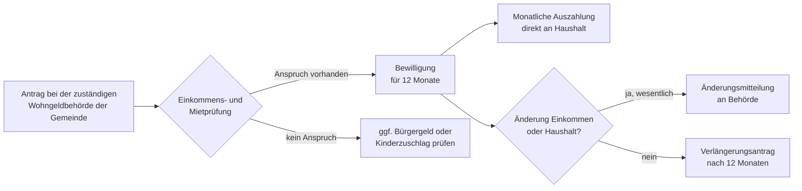

## Geschichte

Das **Wohngeld** ist eine der ältesten Sozialleistungen der Bundesrepublik: Es wurde 1965 durch das *Wohngeldgesetz* eingeführt, um einkommensschwachen Haushalten die Tragbarkeit ihrer Wohnkosten zu sichern. Die zugrundeliegende Idee — Wohnen als existenzielles Gut staatlich zu stützen, ohne den Wohnungsmarkt direkt zu steuern — ist seitdem unverändert.

Wichtige Meilensteine:

- **1965** – Einführung des Wohngeldes durch das erste Wohngeldgesetz (WoGG)
- **2001** – Wohngeldreform: Vereinheitlichung von Mietzuschuss und Lastenzuschuss; Einführung der bundeseinheitlichen Mietenstufen
- **2009** – Erhöhung nach langer Stagnation; Mietenstufen-Systematik wird modernisiert
- **2016** – Wohngeldreformgesetz: Stufenweise Erhöhung und regelmäßige Fortschreibung der Höchstbeträge verankert
- **2020** – Erneute Erhöhung und Einführung einer Klimakomponente (Heizkostenzuschuss)
- **2023** – **Wohngeld-Plus-Gesetz**: Die weitreichendste Reform seit Jahrzehnten. Leistungsbeträge werden mehr als verdoppelt, der Empfängerkreis durch eine neue Wohnkostenkomponte und Heizkostenkomponente ausgeweitet. Die Zahl der Empfängerhaushalte steigt von ca. 600.000 auf über 1,8 Millionen.

Das Wohngeld-Plus-Gesetz ist der unmittelbaren Energiepreiskrise 2022/23 geschuldet: Bundesregierung und Bundesrat einigten sich auf eine dauerhafte Erhöhung statt eines einmaligen Heizkostenzuschusses, um die gestiegenen Wohnkosten strukturell abzufedern.

## Berechnung

Die Wohngeldhöhe wird nach § 19 WoGG mit einer [gesetzlich festgelegten Formel](https://www.gesetze-im-internet.de/wogg/__19.html) berechnet. Sie berücksichtigt drei Faktoren:

1. **Haushaltsgröße** (Anzahl der zum Haushalt zählenden Haushaltsmitglieder, *n*)
2. **Bereinigtes Gesamteinkommen** (*Y*, Jahreseinkommen nach Abzug von Freibeträgen)
3. **Berücksichtigungsfähige Miete/Belastung** (*M*, gedeckelt durch [Miethöchstbeträge nach § 12 WoGG](https://www.gesetze-im-internet.de/wogg/__12.html))

Die monatliche Wohngeldsumme *W* ergibt sich vereinfacht aus:

```
W = M − (a + b × M + c × Y)
```

wobei die Koeffizienten *a*, *b*, *c* je nach Haushaltsgröße variieren. Ein höheres Einkommen oder eine niedrigere Miete senken den Zuschuss; eine größere Haushaltsgröße erhöht ihn.

**Praktisch entscheidend** ist, dass das anrechenbare Einkommen *Y* nicht der Bruttolohn ist, sondern nach Abzügen (u. a. für Sozialversicherungsbeiträge, Steuern, behinderungsbedingte Kosten) deutlich darunterliegen kann — daher lohnt eine Antragstellung auch bei einem auf den ersten Blick zu hohen Einkommen.

## Mietenstufen

Deutschland ist in **sieben Mietenstufen (I–VII)** eingeteilt, die das örtliche Mietniveau abbilden. Die zuständige Wohngeldbehörde ermittelt die Mietenstufe des Wohnorts; große Städte liegen häufig in den oberen Stufen.

| Mietenstufe | Beispiele | Miethöchstbetrag (1-Pers.-Haushalt, 2025) |
| ---: | --- | ---: |
| I | ländliche Kreise, strukturschwache Regionen | 404 € |
| II | kleine Mittelstädte | 436 € |
| III | Mittelstädte, Stadtrandlagen | 468 € |
| IV | größere Städte, Ballungsrandlagen | 507 € |
| V | Großstädte (z. B. Frankfurt, Stuttgart) | 570 € |
| VI | München Umland, Hamburg Randlagen | 633 € |
| VII | München, Frankfurt Innenstadt | 697 € |

*Hinweis: Die genauen Beträge werden durch die Wohngeldverordnung (WoGV) festgesetzt und können leicht abweichen. Die Tabelle gilt exemplarisch für 2025.*

## Antragsweg



Der Bewilligungszeitraum beträgt in der Regel **12 Monate**. Danach muss ein Folgeantrag gestellt werden — der Anspruch verlängert sich nicht automatisch. Wohngeld wirkt **nicht rückwirkend**: Es wird erst ab dem Monat der Antragstellung gezahlt, frühestens aber für den Monat, in dem der Antrag eingeht.

Zuständig ist die Wohngeldbehörde der Gemeinde oder des Landkreises; in vielen Bundesländern ist dies das Sozial- oder Ordnungsamt. In einigen Bundesländern (z. B. Bayern, NRW) gibt es Online-Antragsstrecken.

## Nichtinanspruchnahme

Wohngeld ist eine der Sozialleistungen mit besonders niedrigen Inanspruchnahme-Raten. Schätzungen des BMWSB und unabhängiger Forschungsinstitute gehen davon aus, dass trotz der Ausweitung durch das Wohngeld-Plus-Gesetz nur rund **50–60 %** der anspruchsberechtigten Haushalte tatsächlich Wohngeld beantragen. Häufige Gründe:

- Unkenntnis: Viele Haushalte wissen nicht, dass sie trotz Erwerbsarbeit oder Rente Anspruch haben können
- Komplexität: Der Einkommenstest erfordert Berechnungen, die ohne Beratung schwer nachzuvollziehen sind
- Stigma: Assoziationen mit Sozialhilfe halten manche Berechtigte davon ab, einen Antrag zu stellen
- Bürokratieaufwand: Belegnachweise (Mietvertrag, Einkommensnachweise aller Haushaltsmitglieder) schrecken ab

## Verhältnis zu anderen Leistungen

- **Bürgergeld (SGB II)**: Bürgergeld-Beziehende erhalten grundsätzlich *kein* Wohngeld — die Unterkunftskosten werden stattdessen direkt über SGB II übernommen (§ 7 Abs. 1 WoGG). Umgekehrt prüfen Jobcenter, ob der Bedarf durch Wohngeld + ggf. Kinderzuschlag vollständig gedeckt werden kann; wenn ja, kann der Bürgergeld-Antrag abgelehnt werden.
- **Kinderzuschlag (KIZ)**: Seit dem *Starke-Familien-Gesetz* 2019 ausdrücklich kombinierbar. Das Paket aus KIZ + Wohngeld ist für erwerbstätige Familien häufig günstiger als Bürgergeld, weil Freibeträge erhalten bleiben.
- **Grundsicherung im Alter (SGB XII)**: Bezieher von Grundsicherung erhalten ebenfalls kein Wohngeld; Unterkunftskosten werden über SGB XII abgedeckt. Ältere Haushalte knapp oberhalb der Grundsicherungsgrenze können hingegen Wohngeldanspruch haben.
- **BAföG / Berufsausbildungsbeihilfe (BAB)**: Haushalte, die ausschließlich aus BAföG-Geförderten bestehen, sind von Wohngeld ausgeschlossen (§ 20 WoGG). In gemischten Haushalten kann Wohngeld anteilig gewährt werden.
- **Heizkostenzuschuss (2022)**: Der einmalige staatliche Heizkostenzuschuss 2022 war eine Sonderleistung für Wohngeldempfänger und BAföG-Beziehende inmitten der Energiepreiskrise; er ist seit dem Wohngeld-Plus-Gesetz in die reguläre Wohngeldsumme integriert.
