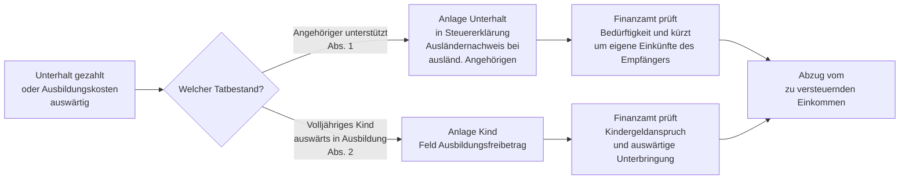

## Hintergrund

§ 33a EStG ist eine **speziellere Schwester von § 33 EStG** und regelt drei klar abgegrenzte Sonderfälle der außergewöhnlichen Belastung: Unterhaltsaufwendungen für bedürftige Angehörige, den Ausbildungsfreibetrag für auswärtig untergebrachte Kinder und die zeitanteilige Kürzung. Im Unterschied zu § 33 EStG gibt es **keine zumutbare Eigenbelastung** — der Betrag wird in voller Höhe bis zum gesetzlichen Höchstbetrag abgezogen.

## Abgrenzung zu § 33 EStG

| Merkmal | § 33 EStG (allgemein) | § 33a EStG (besondere Fälle) |
| --- | --- | --- |
| Zumutbare Eigenbelastung | Ja (1–7 % des GdE) | Nein |
| Höchstbetrag | Kein fester Betrag | Feste Obergrenzen |
| Nachweispflicht | Einzelnachweise | Einzelnachweise |
| Wahlrecht zwischen beiden | Nein — § 33a ist vorrangig | Für Unterhalt / Ausbildung gilt § 33a zwingend |

Das Nebeneinander von § 33 und § 33a ist ausgeschlossen: Wer Unterhalt oder Ausbildungskosten als außergewöhnliche Belastung geltend macht, ist an § 33a gebunden.

## Tatbestand 1: Unterhalt für bedürftige Angehörige (§ 33a Abs. 1 EStG)

### Voraussetzungen auf Empfängerseite

Der Empfänger muss **gesetzlich unterhaltsberechtigt** sein oder die Sozialleistungsbehörde muss Leistungen wegen der erhaltenen Unterhaltszahlungen versagen. Gesetzlich unterhaltsberechtigt nach BGB sind insbesondere:

- Eltern und Großeltern (§ 1601 BGB)
- Volljährige Kinder, für die kein Kindergeld/Kinderfreibetrag mehr besteht (z. B. nach Abschluss der Erstausbildung)
- Geschwister in Notlage (§ 1601 ff. BGB — in der Praxis selten)
- Geschiedene Ehegatten mit Unterhaltsanspruch
- Elternteile, die ein gemeinsames Kind betreuen (§ 1615l BGB)

Die unterstützte Person muss zudem **bedürftig** sein: Eigene Einkünfte und Bezüge oberhalb von **624 €/Jahr** kürzen den Höchstbetrag um den übersteigenden Betrag. Bei Einkünften von z. B. 2.000 € im Jahr wird der Abzug um 1.376 € (= 2.000 − 624) gemindert.

### Höchstbetrag und Entwicklung

Der Höchstbetrag entspricht dem **steuerlichen Grundfreibetrag** (§ 32a Abs. 1 S. 2 Nr. 1 EStG). Er steigt mit dem Grundfreibetrag:

| Jahr | Höchstbetrag |
| --- | ---: |
| 2022 | 10.347 € |
| 2023 | 10.908 € |
| 2024 | 11.604 € |
| 2025 | 12.096 € |

Werden mehrere Personen unterstützt, gilt der Höchstbetrag **pro Person**. Zahlen mehrere Unterhaltspflichtige gemeinsam, wird der Abzug aufgeteilt.

### Ausländische Angehörige

Angehörige außerhalb der EU/des EWR können nur mit einem **länderspezifischen Kürzungsfaktor** (0,25; 0,50; 0,75 oder 1,0) berücksichtigt werden, der die niedrigeren Lebenshaltungskosten im Wohnsitzland widerspiegelt. Das BMF veröffentlicht jährlich eine Ländergruppeneinteilung; in Ländergruppe 4 (z. B. Westeuropa, USA) gilt der volle Betrag. Für Angehörige in Schwellenländern (Ländergruppe 2) beträgt der anzusetzende Höchstbetrag nur die Hälfte.

### Besonderheit: Anrechnung von Sozialleistungen

Erhält der Empfänger selbst Leistungen wie Bürgergeld, Grundsicherung oder BAföG, können diese auf die eigenen Einkünfte angerechnet werden — was den möglichen Unterhaltsabzug des Zahlers vermindert oder beseitigt. Der Abzug nach § 33a Abs. 1 hat daher vor allem praktische Relevanz, wenn der Empfänger **keine** oder nur geringe Sozialleistungen erhält und der Steuerpflichtige freiwillig oder gesetzlich Unterhalt zahlt.

## Tatbestand 2: Ausbildungsfreibetrag (§ 33a Abs. 2 EStG)

### Voraussetzungen

1. Das Kind ist **volljährig** und befindet sich in einer **Berufsausbildung**
2. Für das Kind besteht Anspruch auf **Kindergeld oder Kinderfreibetrag**
3. Das Kind wohnt **nicht** im elterlichen Haushalt (auswärtige Unterbringung)

### Höhe

Ab dem Veranlagungszeitraum **2023** beträgt der Ausbildungsfreibetrag **1.200 € pro Jahr** (zuvor: 924 €). Er wird zeitanteilig gewährt — für jeden Monat, in dem die Voraussetzungen nicht vorliegen, wird 1/12 abgezogen.

Bei gemeinsamer Veranlagung der Eltern steht der Freibetrag beiden je zur Hälfte zu, kann auf Antrag aber auch einem Elternteil vollständig zugewiesen werden (z. B. wenn ein Elternteil gar kein Einkommen hat).

### Verhältnis zu anderen Leistungen

Der Ausbildungsfreibetrag nach § 33a Abs. 2 kann **neben** dem Kinderfreibetrag (§ 32 EStG) geltend gemacht werden. Er deckt den **Mehrbedarf durch auswärtige Unterbringung** ab — also z. B. Miete, Heimfahrten, höhere Lebenshaltungskosten außerhalb des Elternhauses.

Kosten, die über den Freibetrag hinausgehen, können **nicht** zusätzlich nach § 33 EStG geltend gemacht werden — der abschließende Charakter des § 33a schließt dies aus.

## Zeitanteilige Kürzung (§ 33a Abs. 3 EStG)

Für jeden Monat, in dem die Anspruchsvoraussetzungen nicht erfüllt sind, wird der Höchstbetrag um 1/12 gekürzt. Praktische Beispiele:

- Kind zieht erst im **September** aus dem Elternhaus aus: Ausbildungsfreibetrag beträgt 4/12 von 1.200 € = **400 €**
- Unterhaltsverpflichtung entsteht erst im **Juli**: Höchstbetrag beträgt 6/12 des Grundfreibetrags

## Antragsweg und Praxis

**Nachweise** für den Unterhaltsabzug (§ 33a Abs. 1):
- Zahlungsnachweise (Überweisungsbelege, Kontoauszüge)
- Bei ausländischen Angehörigen: Bescheinigung über die Bedürftigkeit (oft von Botschaft oder ausländischer Behörde) sowie Nachweis über das Verwandtschaftsverhältnis
- Eigene Einkünfte des Empfängers sind auf Verlangen nachzuweisen

## Steuerliche Wirkung

Wie alle außergewöhnlichen Belastungen wirkt § 33a als **Abzug von der Bemessungsgrundlage** (nicht von der Steuerschuld). Die Ersparnis hängt vom individuellen Grenzsteuersatz ab:

| Abzugsbetrag | Grenzsteuersatz 25 % | Grenzsteuersatz 42 % |
| ---: | ---: | ---: |
| 1.200 € (Ausbildungsfreibetrag) | ca. 300 € | ca. 504 € |
| 5.000 € (Unterhalt) | ca. 1.250 € | ca. 2.100 € |
| 11.604 € (voller Unterhalt-Höchstbetrag 2024) | ca. 2.901 € | ca. 4.874 € |

## Hinweise für die Praxis

**Doppelte Haushaltsführung vs. Ausbildungsfreibetrag:** Wohnt das Kind am Ausbildungsort und behält seinen Hauptwohnsitz bei den Eltern, ist § 33a Abs. 2 anwendbar — nicht die Regelungen zur doppelten Haushaltsführung (die für Arbeitnehmer gilt, nicht für Auszubildende).

**BAföG und Ausbildungsfreibetrag:** Erhält das Kind BAföG, zählt dieses **nicht** zu den eigenen Einkünften, die den Ausbildungsfreibetrag kürzen. Der Freibetrag bleibt in voller Höhe abziehbar.

**Unterhalt für Eltern in Deutschland:** Viele Steuerpflichtige wissen nicht, dass sie Unterhalt, den sie ihren in Deutschland lebenden, bedürftigen Eltern zahlen, steuerlich absetzen können — bis zum vollen Grundfreibetrag. Voraussetzung ist die nachgewiesene gesetzliche Unterhaltspflicht und Bedürftigkeit.

**Kein Wahlrecht gegenüber § 33 EStG:** Anders als manchmal angenommen, kann für Unterhalt an gesetzlich Unterhaltsberechtigte **nicht** auf § 33 EStG ausgewichen werden, um die günstigere Berechnung (z. B. wegen besonders hoher tatsächlicher Kosten) zu nutzen. § 33a geht vor.
