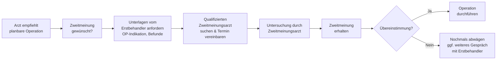

## Hintergrund

Das Recht auf eine ärztliche **Zweitmeinung** wurde 2015 mit dem **GKV-Versorgungsstärkungsgesetz (GKV-VSG)** in § 27b SGB V eingeführt. Auslöser war eine breite sozialpolitische Debatte über unnötige Operationen in Deutschland: Statistiken zeigen erhebliche regionale Unterschiede in Operationshäufigkeiten, die medizinisch nicht erklärbar sind — ein Hinweis darauf, dass nicht jeder Eingriff zwingend notwendig ist.

Der Gesetzgeber reagierte mit einem klaren Signal: GKV-Versicherte sollen vor risikobehafteten planbaren Eingriffen eine unabhängige zweite Meinung einholen können — **kostenlos** und ohne Risiko für das Verhältnis zum Behandler.

## Welche Eingriffe sind erfasst?

Nicht jeder Operationsvorschlag löst das Zweitmeinungsrecht aus. Der **Gemeinsame Bundesausschuss (G-BA)** legt im Rahmen der **Zweitmeinungs-Richtlinie** fest, welche Eingriffe erfasst sind. Entscheidend ist: Der Eingriff muss **mengenmäßig relevant, planbar und mit nicht unerheblichen Risiken** verbunden sein. Aktuell umfasste die Richtlinie folgende Eingriffe:

| Eingriff | Hintergrund |
| --- | --- |
| **Hysterektomie** (Gebärmutterentfernung) | Sehr hohe Operationsrate in Deutschland; oft werden benigne Erkrankungen wie Myome auch konservativ behandelbar |
| **Tonsillektomie / Tonsillotomie** (Mandeloperation) | Häufige Kinderkrankheit; Studien zeigen großes Potenzial für konservative Alternativen |
| **Schulteroperationen** (Rotatorenmanschette) | Hohe regionale Varianz; physiotherapeutische Alternativen oft unterschätzt |
| **Kniegelenkoperationen** (Meniskus) | Häufig operiert, aber nicht immer zwingend erforderlich |
| **Wirbelsäulenoperationen** | Hohe Komplikationsrisiken; konservative Therapie oft viable Alternative |

Die Liste wird vom G-BA fortlaufend überprüft und kann erweitert werden. Aktuelle Fassung der Richtlinie findet sich auf der Website des G-BA.

## Wer darf die Zweitmeinung erbringen?

Die Zweitmeinung darf nicht von jedem Facharzt erteilt werden. Der G-BA legt für jeden Eingriff fest, welche **Qualifikationsanforderungen** der zweitmeinungsgebende Arzt erfüllen muss:

- Zulassung als **Vertragsarzt** oder ermächtigter Arzt
- Relevante **Facharztqualifikation** (z. B. Gynäkologie bei Hysterektomie, Orthopädie bei Schulteroperationen)
- **Keine wirtschaftliche Abhängigkeit** vom Eingriff — der Zweitmeinungsarzt darf selbst nicht operieren wollen
- **Keine organisatorische Verbindung** zur Einrichtung, die die Operation empfohlen hat

Eine Suche nach qualifizierten Zweitmeinungsärzten ist über das Arztsuche-Portal der **Kassenärztlichen Bundesvereinigung (KBV)** möglich.

## Ablauf

**Praktisch wichtig**: Der Erstbehandler ist gesetzlich verpflichtet, die notwendigen Unterlagen (Befunde, Diagnosen, Operationsindikation) herauszugeben, damit der Zweitmeinungsarzt eine fundierte Einschätzung vornehmen kann.

## Kosten

Die Kosten der Zweitmeinung werden **vollständig von der GKV übernommen** — ohne Zuzahlung für den Versicherten. Hierunter fallen:

- Arzthonorar des Zweitmeinungsarztes (abgerechnet nach EBM)
- Ggf. ergänzende Diagnostik, die für die Zweitmeinung notwendig ist
- **Nicht** umfasst: Reisekosten zum Zweitmeinungsarzt (außer bei Ausnahmen nach § 60 SGB V)

## Zahlen und Befunde

Die wissenschaftliche Debatte über unnötige Operationen in Deutschland ist gut belegt:

- Laut **AOK-Report** wurde in bestimmten Regionen bis zu **dreimal** so häufig eine Hysterektomie durchgeführt wie in anderen — ohne epidemiologische Erklärung
- Das **Wissenschaftliche Institut der AOK (WIdO)** schätzte, dass bei mehreren Eingriffstypen 20–40 % der Operationen vermeidbar wären
- Eine Auswertung des **Bertelsmann-Gesundheitsmonitors** zeigt: Patienten, die eine Zweitmeinung einholen, entscheiden sich in rund **30 % der Fälle** gegen die ursprünglich empfohlene Operation

## Abgrenzung und Praxishinweise

Das Zweitmeinungsrecht gilt **nur für die in der G-BA-Richtlinie aufgeführten Eingriffe**. Für andere Operationen können Versicherte zwar informell eine zweite Meinung einholen, diese wird aber nicht automatisch von der GKV erstattet. Manche Kassen erstatten auf Antrag auch Zweitmeinungen außerhalb der Richtlinie als Satzungsleistung — eine Nachfrage bei der eigenen Kasse lohnt sich.

**Wichtig für die Terminvergabe**: Zwischen dem ärztlichen Gespräch über den Eingriff und der eigentlichen Operation sollte ausreichend Zeit eingeplant werden. Für die in der Richtlinie genannten Eingriffe haben Versicherte das Recht, vor dem Eingriff eine Zweitmeinung einzuholen — eine zu kurzfristige Terminierung durch den Erstbehandler ist nicht zulässig, wenn kein medizinischer Notfall vorliegt.
