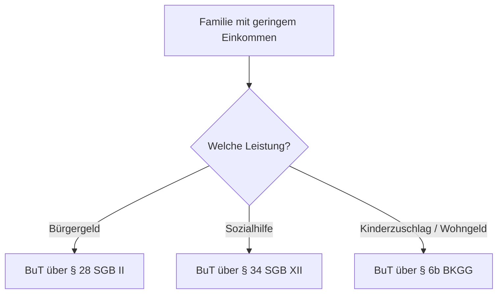

## Hintergrund

Die **Leistungen für Bildung und Teilhabe (BuT)** nach § 6b BKGG sichern Kindern aus einkommensschwachen Familien die Teilnahme am schulischen und sozialen Leben. § 6b ist der Zugangsweg für Familien, die **Kinderzuschlag oder Wohngeld** beziehen — also knapp oberhalb der Bürgergeld-Grenze liegen. Inhaltlich sind die Leistungen identisch mit denen für Bürgergeld-Beziehende (§ 28 SGB II) und Sozialhilfeempfänger (§ 34 SGB XII).

## Die Leistungen des Bildungspakets

| Leistung | Höhe (2025) |
|---|---|
| Persönlicher Schulbedarf | 195 € / Jahr (130 € + 65 €) |
| Schülerbeförderung | tatsächliche Kosten |
| Lernförderung (Nachhilfe) | tatsächliche Kosten |
| Gemeinschaftliche Mittagsverpflegung | tatsächliche Kosten |
| Soziale & kulturelle Teilhabe | 15 € / Monat |
| Klassenfahrten & Ausflüge | tatsächliche Kosten |

Der **persönliche Schulbedarf** (Hefte, Stifte, Schulranzen) wird in zwei Raten ausgezahlt: 130 € zum ersten und 65 € zum zweiten Schulhalbjahr.

## Zugang über Kinderzuschlag und Wohngeld

Wer Kinderzuschlag (bis zu 297 € je Kind monatlich, Stand 2025) oder Wohngeld bezieht, hat **automatisch** Anspruch auf BuT — ein zusätzlicher Anreiz, diese vorrangigen Leistungen zu beantragen, statt ins Bürgergeld zu rutschen.

## Kritik: niedrige Inanspruchnahme

Trotz Anspruch nutzen viele berechtigte Familien das Bildungspaket nicht — wegen Bürokratie, fehlender Information und Antragshürden. Die soziale und kulturelle Teilhabe (15 €/Monat) gilt als zu niedrig, um Vereins- oder Musikschulbeiträge vollständig zu decken.
