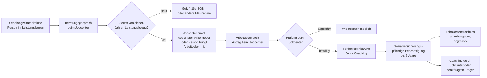

## Hintergrund

**§ 16i SGB II** schuf zum 1. Januar 2019 ein neues Förderinstrument, das in der Arbeitsmarktpolitik als **sozialer Arbeitsmarkt** bekannt wurde. Grundlage ist das *Teilhabechancengesetz* (Gesetz zur Stärkung der Chancen für Qualifizierung und für mehr Schutz in der Grundsicherung), das der Bundestag im Dezember 2018 verabschiedete.

Die Ausgangslage: Im langjährigen Durchschnitt galten in Deutschland rund **800.000 bis 1 Mio. Personen als sehr langzeitarbeitslos** — sie hatten Bürgergeld oder ALG II seit Jahren bezogen, ohne nachhaltig in Beschäftigung zu gelangen. Für einen Teil dieser Personengruppe hatten herkömmliche Eingliederungsmaßnahmen (Bewerbungstrainings, kurzfristige Qualifizierungen) kaum Wirkung. § 16i adressiert diese Gruppe mit einem Instrument, das über die übliche Förderdauer weit hinausgeht: bis zu **fünf Jahre** sozialversicherungspflichtige Beschäftigung mit intensivem Coaching.

Das Instrument unterscheidet sich konzeptionell vom klassischen Lohnkostenzuschuss dadurch, dass **Teilhabe** — nicht nur schnelle Wiedereingliederung — als eigenständiges Förderziel anerkannt wird. Für Personen, die seit Jahren aus dem regulären Erwerbsleben ausgeschieden sind, hat die Teilnahme am Arbeitsleben auch ohne unmittelbaren Übergang in ungeförderte Beschäftigung einen Eigenwert: Tagesstruktur, soziale Einbindung, Kompetenzerhalt.

## Zielgruppe und Voraussetzungen

§ 16i SGB II richtet sich an Personen, die im Vergleich zu den Kurzzeitarbeitslosen oder den regulären Langzeitarbeitslosen (§ 16e) deutlich arbeitsmarktferner sind:

### Leistungsrechtliche Voraussetzung

Die betreffende Person muss in den **letzten sieben Kalenderjahren** mindestens **sechs Jahre lang** Bürgergeld (bis 2022: ALG II) bezogen haben. Kurze Unterbrechungen durch gering entlohnte oder geringfügige Beschäftigung werden dabei berücksichtigt — wer sechs von sieben Jahren im Leistungsbezug war, bleibt im Grundsatz zugangsberechtigt.

### Alter und Nationalität

Es gibt keine Altersuntergrenze oder -obergrenze. Auch Personen, die erst kurz in Deutschland leben, können zugangsberechtigt sein, sofern sie SGB-II-berechtigt sind und die Vorversicherungszeit erfüllt haben.

### Keine Mindestarbeitslosigkeitsdauer

Anders als § 16e SGB II (zwei aufeinanderfolgende Jahre Arbeitslosigkeit) stellt § 16i nicht auf ununterbrochene Arbeitslosigkeit ab, sondern auf den kumulierten Leistungsbezug in einem Siebenjahreszeitraum. Damit sind auch Personen erfasst, die mehrfach kurze Beschäftigungen hatten, ohne nachhaltig Fuß zu fassen.

## Förderbedingungen

§ 16i SGB II ist ein **Arbeitgeberprogramm**: Das Jobcenter schließt mit dem Arbeitgeber eine Fördervereinbarung; der Arbeitgeber stellt die geförderte Person regulär sozialversicherungspflichtig an und erhält vom Jobcenter einen degressiv gestaffelten Lohnkostenzuschuss.

| Förderjahr | Lohnkostenzuschuss |
| ---: | ---: |
| Jahr 1 | 100 % |
| Jahr 2 | 90 % |
| Jahr 3 | 80 % |
| Jahr 4 | 70 % |
| Jahr 5 | 60 % |

Bezugsgröße ist der tatsächlich gezahlte Lohn bis zur Höhe des **Mindestlohns** zuzüglich der auf diesen Lohn entfallenden Sozialversicherungsbeiträge des Arbeitgebers. Zahlt der Arbeitgeber mehr als den Mindestlohn, trägt er den übersteigenden Anteil selbst.

**Beschäftigungsform:** Erlaubt sind sozialversicherungspflichtige Beschäftigungsverhältnisse bei Arbeitgebern aus dem öffentlichen Sektor, der gemeinnützigen Zivilgesellschaft und dem privaten Wirtschaftssektor. Minijobs und Selbstständigkeit sind ausgeschlossen.

**Mindestlohn und Tariflohnbindung:** Der gezahlte Lohn muss mindestens dem gesetzlichen Mindestlohn entsprechen. Bei tarifgebundenen Arbeitgebern muss der geltende Tariflohn gezahlt werden.

**Wiederholung:** Hat eine geförderte Person ein § 16i-Beschäftigungsverhältnis abgebrochen, kann nach einer Wartezeit erneut gefördert werden — die Förderdauer beginnt dann neu.

## Coaching und ganzheitliche Betreuung

Ein zentrales Element, das § 16i von anderen Lohnkostenzuschüssen unterscheidet, ist die **verpflichtende ganzheitliche beschäftigungsbegleitende Betreuung**. Das Jobcenter hat sicherzustellen, dass die geförderte Person während des gesamten Beschäftigungsverhältnisses durch einen Ansprechpartner (Coach) begleitet wird.

Inhalte dieser Begleitung können sein:
- Beratung bei Schwierigkeiten im Arbeitsverhältnis (Konflikte, Fehlzeiten, Überforderung)
- Unterstützung bei parallelen Problemlagen (Schulden, Wohnen, gesundheitliche Einschränkungen)
- Vorbereitung auf den Übergang in ungeförderte Beschäftigung
- Koordination mit anderen Unterstützungsangeboten (Schuldnerberatung, Suchtberatung, Wohnhilfen)

In der Praxis variiert die Intensität des Coachings erheblich: Manche Jobcenter setzen spezialisierte Coaches ein, andere nutzen vorhandenes Personal oder beauftragen externe Träger.

## Antragsweg

Das Förderverfahren nach § 16i ist **zweiseitig**: Arbeitgeber und leistungsberechtigte Person wirken zusammen, aber der formelle Antrag liegt beim Arbeitgeber.

**Jobcenter als aktiver Vermittler:** Viele Teilnehmende gelangen über eine aktive Ansprache durch das Jobcenter in das Programm — sie hätten sich aus eigener Initiative oft nicht beworben. Die Jobcenter bauen teils eigene Netzwerke von § 16i-affinen Arbeitgebern auf, insbesondere in sozialen Einrichtungen, kommunalen Betrieben und Vereinen.

**Arbeitgebergewinnung:** Ein strukturelles Problem ist die begrenzte Nachfrage seitens privater Arbeitgeber. Gemeinnützige und öffentliche Träger machen einen deutlich höheren Anteil der § 16i-Beschäftigungsverhältnisse aus als im allgemeinen Arbeitsmarkt üblich. Wirtschaftsverbände haben auf die Verwaltungskosten des Verfahrens hingewiesen.

## Verhältnis zu anderen Leistungen

- **§ 16e SGB II (Eingliederung von Langzeitarbeitslosen):** Der engste Verwandte im Instrumentenkasten. § 16e richtet sich an Personen mit mindestens zwei Jahren Arbeitslosigkeit, bietet einen Lohnkostenzuschuss für bis zu zwei Jahre (75 % im ersten, 50 % im zweiten Jahr) und kein verpflichtendes Coaching. § 16i geht deutlich weiter in Zielgruppenspezifität, Dauer und Betreuungsintensität. Beide Instrumente wurden gleichzeitig durch das Teilhabechancengesetz eingeführt.
- **Arbeitsgelegenheiten nach § 16d SGB II (Ein-Euro-Jobs):** AGH sind Fördermaßnahmen ohne reguläres Beschäftigungsverhältnis, addieren keine Rentenanwartschaften und sind kein Arbeitsverhältnis im rechtlichen Sinne. § 16i schafft dagegen ein echtes sozialversicherungspflichtiges Arbeitsverhältnis. Für Personen, die über § 16i erreichbar sind, ist § 16i in der Regel das deutlich stärkere Instrument.
- **Bürgergeld (SGB II):** Der Lohn aus der § 16i-geförderten Beschäftigung wird auf das Bürgergeld angerechnet — allerdings greift der reguläre Erwerbstätigenfreibetrag (§ 11b SGB II). In den meisten Fällen übersteigt der Nettolohn jedoch die Bürgergeld-Leistungen, sodass die Person aus dem SGB-II-Bezug ausscheidet. Das ist ein Programmziel.
- **Rentenversicherung:** Da § 16i ein sozialversicherungspflichtiges Beschäftigungsverhältnis begründet, sammeln Teilnehmende **Rentenanwartschaften**. Für Personen, die jahrelang im Bürgergeld waren und daher kaum Anwartschaften gesammelt haben, ist dies ein wichtiger Nebeneffekt — ein Förderjahr nach § 16i zählt für die Rente wie ein reguläres Beschäftigungsjahr.
- **Übergangsgeld bei Reha:** Wenn parallel eine berufliche Rehabilitationsmaßnahme bewilligt wird, tritt das Übergangsgeld an die Stelle des Lohns; die § 16i-Förderung ruht in dieser Zeit.
- **Wohngeld:** Wer durch die § 16i-Beschäftigung aus dem Bürgergeld-Bezug ausscheidet, aber noch wenig verdient, kann Wohngeld beantragen. Da Bürgergeld und Wohngeld sich gegenseitig ausschließen, müssen Betroffene beim Übergang aktiv werden (Wohngeldantrag beim kommunalen Amt stellen).

## Wirkung und Nichtinanspruchnahme

Die ersten Evaluationen durch das **Institut für Arbeitsmarkt- und Berufsforschung (IAB)** und das BMAS zeigen ein positives Bild: Rund **200.000 Personen** hatten bis Ende 2023 eine § 16i-geförderte Beschäftigung aufgenommen. Die **Stabilisierungsquote** — also der Anteil, der die Beschäftigung auch nach Ende der Förderung fortweitert — liegt deutlich über dem Vergleichswert für andere Maßnahmen bei sehr arbeitsmarktfernen Personen.

Allerdings gibt es strukturelle Hürden:

- **Arbeitgebernachfrage ist der Engpassfaktor:** Nicht die Anzahl der potenziell Berechtigten begrenzt das Programm, sondern die Bereitschaft von Arbeitgebern, § 16i-Stellen zu schaffen. Private Arbeitgeber scheuen den Verwaltungsaufwand und die Unsicherheit über Leistungsfähigkeit der Personen. Das Gros der Stellen entfällt auf kommunale Träger, Wohlfahrtsverbände und soziale Einrichtungen.
- **Geografische Ungleichheit:** In strukturschwachen Regionen mit wenig gemeinwohlorientierten Arbeitgebern ist das Stellenangebot begrenzt. Jobcenter in Ostdeutschland und ländlichen Regionen haben teils Schwierigkeiten, geeignete Arbeitgeber zu finden.
- **Stigma:** Sowohl Arbeitgeber als auch potenzielle Teilnehmende berichten von Hemmungen. Arbeitgeber befürchten Probleme mit Integration; Langzeitarbeitslose haben teils resigniert und nehmen Angebote nicht wahr.
- **Coaching-Qualität:** Die gesetzlich vorgeschriebene ganzheitliche Betreuung ist in der Praxis sehr uneinheitlich. Wo sie gut funktioniert, steigen Stabilisierungsraten erheblich; wo das Jobcenter mangels Kapazität nur sporadisch betreut, zeigt das Programm deutlich weniger Wirkung.
- **Unkenntnis bei Betroffenen:** Viele sehr langzeitarbeitslose Personen kennen das Programm nicht. Die proaktive Ansprache durch das Jobcenter ist essentiell — aber nicht alle Jobcenter betreiben diesen aktiven Outreach systematisch.

Der Bundesrechnungshof hat in einem Bericht von 2022 auf die **unzureichende Steuerung und Qualitätskontrolle** durch das BMAS und die Bundesagentur hingewiesen. Die dezentrale Umsetzung in über 400 Jobcentern führt zu erheblichen regionalen Unterschieden in Qualität und Reichweite des Programms.
