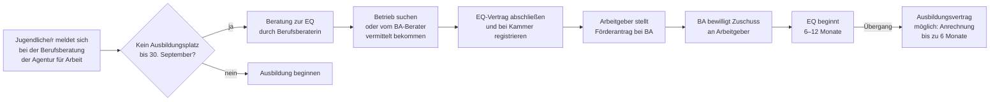

## Hintergrund

Die **Einstiegsqualifizierung (EQ)** nach § 54a SGB III ist ein betriebliches Langzeitpraktikum von sechs bis zwölf Monaten, das jungen Menschen den Einstieg in eine vollwertige Berufsausbildung erleichtern soll. Sie richtet sich in erster Linie an Bewerberinnen und Bewerber, die trotz intensiver Suche keinen Ausbildungsplatz gefunden haben — oder deren schulische bzw. persönliche Voraussetzungen eine direkte Aufnahme einer Ausbildung erschweren.

Das Programm wurde mit dem **Fachkräftesicherungsgesetz** zum 1. Oktober 2004 eingeführt und ist seitdem fester Bestandteil des deutschen dualen Ausbildungssystems. Es löste damals freiwillige Unternehmensvereinbarungen ab, mit denen Arbeitgeber im Rahmen des nationalen Ausbildungspakts zusätzliche Praktika geschaffen hatten. Träger der Förderung sind die Agenturen für Arbeit und — für junge Menschen im Bürgergeld-Bezug — die Jobcenter.

Laut BIBB-Datenreport werden jährlich rund **20.000–25.000 neue EQ-Verhältnisse** begonnen; der Bestand ist in den vergangenen Jahren angesichts des sich verknappenden Ausbildungsmarkts leicht rückläufig, während gleichzeitig das Instrument für Jugendliche mit Fluchthintergrund an Bedeutung gewonnen hat.

## Wer hat Anspruch?

Anspruch auf Zugang zur EQ haben junge Menschen, die

1. **lehrstellensuchend** sind (bei der Berufsberatung als Ausbildungsstellenbewerber gemeldet) und
2. bis zum **30. September** des Ausbildungsjahres noch keinen Ausbildungsplatz gefunden haben — **oder** deren Vermittlung in eine Ausbildung aus in ihrer Person liegenden Gründen nicht unmittelbar möglich ist (z. B. schulische Defizite, soziale Hemmnisse).

Es gibt keine starre Altersgrenze im Gesetz. In der Praxis orientiert sich die BA allerdings an der Zielgruppe „junge Menschen unter 25 Jahren". Für Geflüchtete und Geduldete gelten gesonderte Regelungen, die eine EQ auch außerhalb des regulären Ausbildungsjahres ermöglichen.

**Auf der Arbeitgeberseite** muss der Betrieb:
- als **Ausbildungsbetrieb anerkannt** sein (Ausbildungsberechtigung nach § 27 BBiG),
- die EQ auf Basis eines **anerkannten Ausbildungsberufs** ausrichten und
- einen schriftlichen **EQ-Vertrag** mit dem oder der Jugendlichen abschließen, der bei der zuständigen Kammer registriert wird.

## Was wird gefördert?

Der Arbeitgeber erhält von der Agentur für Arbeit einen **monatlichen Zuschuss** zur Vergütung des Jugendlichen:

| Förderelement | Betrag (2024) |
| --- | ---: |
| Zuschuss zur monatlichen Vergütung | bis zu **262 €** |
| Pauschale für Sozialversicherungsbeiträge | bis zu **20 %** des Vergütungszuschusses |

Der Zuschuss deckt in der Praxis einen erheblichen Teil der Mindestvergütung, die der Jugendliche mindestens erhalten muss. Diese Mindestvergütung richtet sich seit 2020 nach der gesetzlichen **Mindestausbildungsvergütung** (§ 17 BBiG) und liegt ab 2024 bei **649 € im ersten Ausbildungsjahr** — wobei für eine EQ analog vorgegangen wird. Betriebe zahlen in der Praxis typischerweise zwischen 350 € und 650 € monatlich.

Der Jugendliche selbst erhält **keine direkte Zahlung** von der Agentur für Arbeit, sondern die Vergütung vom Arbeitgeber. Wer ergänzend Bürgergeld bezieht, kann dies unter bestimmten Voraussetzungen fortführen; die EQ-Vergütung wird dabei angerechnet (mit Freibeträgen nach § 11b SGB II).

## Anrechnung auf die Ausbildung

Ein zentrales Merkmal der EQ ist, dass sie bei anschließender Berufsausbildung **auf die Ausbildungszeit angerechnet** werden kann — in der Praxis um bis zu sechs Monate (§ 54a Abs. 5 SGB III). Die Kammer entscheidet über den Umfang der Anrechnung im Einzelfall. Wer eine zwölfmonatige EQ erfolgreich abschließt und dann eine Ausbildung im gleichen Beruf beginnt, hat damit gute Chancen, die Ausbildungszeit merklich zu verkürzen.

## Antragsweg

**Wichtig**: Der Förderantrag wird **vom Arbeitgeber** gestellt, nicht vom Jugendlichen. Jugendliche sollten bei ihrer Berufsberaterin oder ihrem Berufsberater aktiv nachfragen, ob für sie eine EQ in Betracht kommt und ob die BA Betriebe vermitteln kann.

Die EQ kann frühestens **am 1. Oktober** eines Ausbildungsjahres beginnen (nach dem Ende der regulären Vermittlungsphase). Anträge können bereits im Sommer vorbereitet werden.

## Verhältnis zu anderen Leistungen

| Leistung | Abgrenzung |
| --- | --- |
| **Berufsausbildungsbeihilfe (BAB, § 56 SGB III)** | BAB kann während einer EQ beantragt werden, wenn der Jugendliche nicht bei den Eltern wohnen kann und die Unterkunftskosten die Vergütung übersteigen |
| **Bürgergeld (SGB II)** | Wer Bürgergeld bezieht, kann eine EQ annehmen; die Vergütung wird mit Freibeträgen auf das Bürgergeld angerechnet |
| **Assistierte Ausbildung (§§ 74–75 SGB III)** | Ergänzt die EQ: sozialpädagogische Begleitung kann auch während einer EQ gewährt werden |
| **Ausbildungsvertrag nach BBiG** | Ziel der EQ; Anrechnung der EQ-Zeit ist möglich |
| **Einstiegsqualifizierung für Geflüchtete** | Dieselbe Leistung, aber mit erweitertem Zugang für Personen mit Aufenthaltsgestattung oder Duldung nach § 132 SGB III |

## Nichtinanspruchnahme und Praxisprobleme

Das Programm ist auf **Arbeitgeberseite** deutlich bekannter als unter Jugendlichen selbst. Viele lehrstellensuchende Jugendliche wissen nicht, dass ihnen die Agentur aktiv bei der Suche nach einem EQ-Platz helfen kann und dass die EQ eine echte Brücke in die Ausbildung darstellt — kein minderwertiges Praktikum.

Häufige Missverständnisse:

- **„Die EQ ist nur ein Praktikum."** — Nein: Sie ist arbeitsrechtlich ein eigenständiges Beschäftigungsverhältnis mit Vergütungsanspruch und Sozialversicherungsschutz. Der Jugendliche ist gesetzlich unfallversichert und hat Urlaubsanspruch.
- **„Ich muss den Betrieb selbst finden."** — Nicht zwingend: Die Berufsberatung kann Betriebe aus der eigenen Datenbank vorschlagen oder aktiv vermitteln.
- **„Nach der EQ bin ich nicht besser gestellt."** — Falsch: Betriebe übernehmen EQ-Teilnehmer überdurchschnittlich häufig in eine Ausbildung. Laut BIBB-Datenreport münden rund 60–70 % der EQ-Verhältnisse in einen Ausbildungsvertrag.

Jugendliche sollten spätestens **im August**, wenn die Ausbildungsplatzvermittlung stockt, aktiv nach der EQ fragen — und nicht bis Oktober warten.
