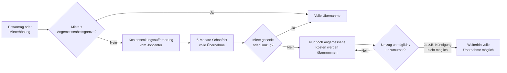

## Hintergrund

Die **Kosten der Unterkunft und Heizung (KdU)** nach § 22 SGB II sind die zweite große Säule des Bürgergeldes neben dem Regelbedarf. Während der Regelbedarf bundesweit einheitlich festgelegt wird, sind die KdU vollständig ortsabhängig — das Prinzip lautet: tatsächliche angemessene Kosten. Da Mieten in München, Hamburg oder Frankfurt ganz anders aussehen als in strukturschwachen Regionen, ist eine Bundeseinheitlichkeit hier weder sinnvoll noch vorgesehen.

Finanziell sind die KdU erheblich: Sie machen je nach Region 40–60 % der gesamten Bürgergeld-Ausgaben aus. 2023 wurden bundesweit rund 15 Milliarden Euro für KdU aufgewendet. Die Kommunen tragen dabei die Hauptlast — der Bund beteiligt sich über eine Bundesbeteiligung an den Kosten der Unterkunft (§ 46 Abs. 5–10 SGB II), die seit 2020 erhöht wurde.

## Was wird übernommen?

§ 22 Abs. 1 SGB II nennt zwei Kostenblöcke:

**Unterkunftskosten** umfassen in der Praxis:
- Nettokaltmiete
- Nebenkosten (Betriebskosten nach BetrKV: Wasser, Abwasser, Müll, Hausmeister, Aufzug, Gemeinschaftsräume etc.)
- Nicht enthalten: Heizkosten (werden separat geprüft), Kabel-TV-Pauschale (streitig, meistens nicht übernommen)

**Heizkosten** werden getrennt nach der tatsächlich verbrauchten Menge übernommen, soweit sie nicht unangemessen hoch sind. Als Orientierungsmaßstab dient der **Bundesweite Heizkostenspiegel** (co2online), der Vergleichswerte nach Heizungsart, Energieträger und beheizter Fläche liefert. Kosten, die den Grenzwert im Heizkostenspiegel überschreiten, können abgelehnt werden — allerdings ist die Rechtsprechung hier großzügiger als bei den Kaltmietkosten.

**Betriebskostennachzahlungen** (§ 22 Abs. 1 Satz 4 SGB II) werden übernommen, sofern die Wohnung zum Zeitpunkt der Nachzahlung noch bewohnt wird und die Kosten angemessen waren. Guthaben aus der Betriebskostenabrechnung sind als Einnahme anzurechnen.

## Angemessenheit: das Schlüsselkonzept

Das Herzstück und gleichzeitig die größte Konfliktquelle bei den KdU ist die **Angemessenheitsgrenze**. § 22 Abs. 1 Satz 1 SGB II sagt nur: übernommen werden die „angemessenen" Kosten — mehr nicht.

Das Bundessozialgericht (BSG) hat in einer langen Rechtsprechungslinie entwickelt, was Angemessenheit bedeutet. Kern ist das **schlüssige Konzept** (BSG, Urteil vom 22.09.2009, B 4 AS 18/09 R):

1. Das Jobcenter muss auf Basis von **Mietdaten des lokalen Wohnungsmarkts** eine Angemessenheitsgrenze ermitteln.
2. Grundlage sollen repräsentative Marktdaten sein (keine reinen Angebotsmieten, sondern auch Bestandsmieten).
3. Als angemessen gilt eine Wohnung im **unteren Marktsegment** — nach BSG-Rechtsprechung typischerweise das 33. Perzentil (Drittel des günstigsten Wohnungsangebots).
4. Die Flächengrenzen richten sich nach den Verwaltungsvorschriften des jeweiligen Bundeslandes zur sozialen Wohnraumförderung (typisch: 50 m² für eine Person, +15 m² je weiterer Person).

In der Praxis setzen viele Kommunen sog. **Richtwerte** (Angemessenheitsgrenzen als Produkt aus Fläche und Quadratmeterpreis). Diese Richtwerte variieren erheblich:

| Region (2024/2025, grobe Orientierung) | 1-Personen-HH | 2-Personen-HH |
| --- | ---: | ---: |
| München | ~800 € Bruttokaltmiete | ~960 € |
| Hamburg | ~650 € | ~800 € |
| Berlin (je nach Bezirk) | ~560–620 € | ~680–760 € |
| Köln | ~620 € | ~750 € |
| Ländlicher Raum (z. B. Sachsen-Anhalt) | ~350–400 € | ~430–490 € |

**Wichtig:** Die konkreten Richtwerte werden von den Jobcentern veröffentlicht (oder sind auf Anfrage erhältlich) und ändern sich periodisch. Wenn ein Jobcenter kein schlüssiges Konzept vorweisen kann, greift nach BSG-Rechtsprechung ersatzweise der **Wohngeldtabellenwert** zuzüglich eines Sicherheitszuschlags von 10 % als Angemessenheitsgrenze.

## Kostensenkungsaufforderung und Umzug

Wenn die tatsächliche Miete die Angemessenheitsgrenze überschreitet, läuft folgendes Verfahren ab:

Die **6-Monate-Schonfrist** nach § 22 Abs. 1 Satz 3 SGB II gilt nur bei erstmaligem Leistungsbezug. Wer bereits Bürgergeld bezieht und umzieht, hat keinen automatischen Bestandsschutz — das Jobcenter muss dem Umzug zustimmen (§ 22 Abs. 4 SGB II), sonst werden nur die bisherigen (angemessenen) Kosten übernommen.

Ein **Umzug ohne Zustimmung** in eine teurere Wohnung führt dazu, dass das Jobcenter nur die vorherige angemessene Miethöhe weiter übernimmt — ein häufiger Fehler mit teuren Folgen.

**Unzumutbarkeit des Umzugs:** Das BSG und die Sozialgerichte haben anerkannt, dass ein Umzug in Ausnahmefällen unzumutbar sein kann: z. B. wenn Kinder mitten im Schuljahr die Schule wechseln müssten, enge Pflegebeziehungen in der Nachbarschaft bestehen oder besondere gesundheitliche Gründe vorliegen. In solchen Fällen sind die tatsächlichen (höheren) Kosten weiter zu übernehmen.

## Eigentümer und Eigenheimbesitzer

§ 22 SGB II gilt nicht nur für Mieter, sondern auch für **selbst genutztes Wohneigentum** — hier werden übernommen:
- Schuldzinsen (nicht Tilgungsanteile!) eines Hypothekendarlehens
- Grundsteuer
- Wohngebäudeversicherung
- Reparatur- und Instandhaltungsaufwendungen (nur soweit unaufschiebbar notwendig)

Tilgungsanteile gelten als Vermögensbildung und werden nicht übernommen. Dies ist ein bekanntes Systemgap: Wer ein kleines, eigengenutztes Haus abbezahlt, erhält für den Tilgungsanteil keine Unterstützung — obwohl der Gesamtaufwand ähnlich hoch sein kann wie eine Miete.

## Antragsweg

KdU werden nicht separat beantragt — sie sind Teil des allgemeinen Bürgergeld-Antrags (Formular KDU oder Anlage KdU). Beizufügen sind:
- Aktueller Mietvertrag
- Aktuelle Betriebskostenabrechnung
- Bei Eigenheim: Kreditvertrag, Grundsteuerbescheid, Versicherungsnachweis

Bei einer Mieterhöhung ist das Jobcenter unverzüglich zu informieren (Mitwirkungspflicht nach § 60 SGB I). Das Jobcenter prüft dann erneut die Angemessenheit.

## Verhältnis zu anderen Leistungen

- **Bürgergeld-Regelbedarf (§ 20 SGB II):** KdU werden zum Regelbedarf hinzuaddiert; sie sind kein Teil des pauschalen Regelbedarfs. Das hat Bedeutung bei der Einkommensanrechnung — Einkommen wird zunächst auf den Regelbedarf angerechnet, danach erst auf die KdU.
- **Wohngeld:** Bürgergeld-Beziehende können kein Wohngeld beziehen (§ 7 Abs. 1 WoGG: Wohngeldfähigkeit setzt voraus, dass keine Leistungen nach SGB II / XII bezogen werden). Wer die KdU wegen eines zu hohen Einkommens nicht mehr voll erstattet bekommt, sollte prüfen, ob ein Wechsel ins Wohngeld-System günstiger ist.
- **§ 35 SGB XII (Sozialhilfe):** Die Parallelvorschrift für Sozialhilfeempfänger gilt inhaltlich identisch; Rechtsprechung zu § 22 SGB II ist weitgehend auf § 35 SGB XII übertragbar.
- **Kinderzuschlag (§ 6a BKGG):** Wer mit dem Kinderzuschlag aus dem Bürgergeld-Bezug herauskommt, erhält stattdessen Wohngeld — das Zusammenspiel ist komplex, weil der Kinderzuschlag nur für Eltern gilt, die ihren eigenen Bedarf (ohne Kinder) aus eigenem Einkommen decken können.
- **Schuldenübernahme (§ 22 Abs. 8 SGB II):** Wenn Mietschulden entstanden sind und Obdachlosigkeit droht, kann das Jobcenter diese Schulden als Darlehen übernehmen. Das verhindert Wohnungsverlust, verpflichtet aber zur Rückzahlung.

## Reichweite und typische Konflikte

KdU ist das am häufigsten vor den Sozialgerichten beklagte Thema im SGB-II-Bereich. Typische Streitpunkte:

- **Schlüssiges Konzept fehlt oder ist veraltet:** Viele Jobcenter aktualisieren ihre Richtwerte nicht regelmäßig. Gerichte fordern aktuelle Daten; fehlen diese, gilt ersatzweise der Wohngeldtabellenwert + 10 %.
- **Nachzahlungen aus Betriebskosten:** Werden oft ganz oder teilweise abgelehnt, obwohl sie eigentlich zu übernehmen wären.
- **Heizkosten bei Fernwärme oder ineffizienten Altbauten:** Wenn die Heizkosten hoch sind, weil das Gebäude schlecht gedämmt ist, trifft das die Mieter hart — sie können die Energieeffizienz des Gebäudes nicht selbst steuern. Die Rechtsprechung differenziert hier, ob die hohen Kosten dem Mieter anzulasten sind.
- **Gemeinsame Nutzung mit anderen Personen:** Bei Wohngemeinschaften oder Untervermietung sind die KdU nur anteilig anzuerkennen.

Der Bundesrechnungshof hat 2024 in einem Bericht festgestellt, dass die Qualität der Angemessenheitskonzepte zwischen den Kommunen stark variiert und die Aufsicht durch Länder und Bund unzureichend ist.
