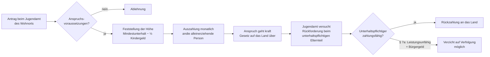

## Geschichte

Der **Unterhaltsvorschuss** wurde 1979 mit dem *Unterhaltsvorschussgesetz* (UhVorschG) eingeführt, um Alleinerziehende vor dem unmittelbaren Einkommensausfall zu schützen, wenn der andere Elternteil keinen Unterhalt zahlt oder zahlungsunfähig ist. Der Staat schießt den ausstehenden Unterhalt vor und versucht ihn anschließend beim unterhaltspflichtigen Elternteil einzutreiben.

Die Leistung wurde in ihrer Geschichte zweimal erheblich ausgeweitet:

- **1979** – Einführung für Kinder bis 6 Jahre, max. 36 Monate Bezugsdauer
- **1994** – Ausweitung auf Kinder bis 12 Jahre, weiterhin 72-Monats-Deckel
- **2017** – Fundamentalreform: Altersgrenze auf 18 Jahre erhöht, **Bezugsdauer unbegrenzt** — der bis dahin geltende 72-Monats-Deckel entfiel vollständig. Zugleich wurde eine Einkommensbedingung für 12- bis 17-Jährige eingeführt.

Die Reform 2017 verdoppelte die Zahl der Leistungsempfängerinnen und -empfänger nahezu auf damals rund 800.000 Kinder.

## Anspruchsvoraussetzungen

Der Unterhaltsvorschuss nach §§ 1–3 UhVorschG setzt kumulativ voraus:

1. **Alter des Kindes**: Das Kind ist noch keine 18 Jahre alt.
2. **Haushalt**: Das Kind lebt bei einem Elternteil, mit dem es dauerhaft zusammenwohnt.
3. **Keine Lebensgemeinschaft der Eltern**: Die beiden Elternteile führen keinen gemeinsamen Haushalt.
4. **Ausbleibender oder unzureichender Unterhalt**: Der andere Elternteil zahlt keinen oder weniger als den gesetzlichen Mindestunterhalt nach § 1612a BGB.
5. **Für 12- bis 17-Jährige zusätzlich**: Das Kind selbst bezieht kein Einkommen (z. B. Ausbildungsvergütung, Unterhalt vom anderen Elternteil), das zusammen mit dem Unterhaltsvorschuss den Unterhaltsvorschuss-Betrag übersteigt — oder ist auf Sozialhilfe/Bürgergeld angewiesen.

**Kein Anspruch besteht**, wenn der betreuende Elternteil die Vaterschaftsfeststellung ohne triftigen Grund verweigert oder keine Angaben zum anderen Elternteil macht.

## Höhe der Leistung

Der Unterhaltsvorschuss entspricht dem gesetzlichen **Mindestunterhalt** nach der Düsseldorfer Tabelle (§ 1612a BGB) abzüglich des halben Kindergelds (§ 2 Abs. 2 UhVorschG):

| Altersstufe | Mindestunterhalt | Halbes Kindergeld | Unterhaltsvorschuss |
| --- | ---: | ---: | ---: |
| 0–5 Jahre | 480 € | 127,50 € | **352,50 €** |
| 6–11 Jahre | 551 € | 127,50 € | **423,50 €** |
| 12–17 Jahre | 645 € | 127,50 € | **517,50 €** |

*Stand 2025: Kindergeld 255 €/Monat, Mindestunterhalt nach Düsseldorfer Tabelle 2025.*

Zahlt der andere Elternteil teilweise Unterhalt, wird dieser Betrag auf den Unterhaltsvorschuss angerechnet — der Staat zahlt nur die Differenz zum Mindestunterhalt.

**Eigenes Einkommen des Kindes** (z. B. Ausbildungsvergütung, Werkstattlohn bei Behinderung) mindert den Anspruch bei 12- bis 17-Jährigen: Erst wenn das Einkommen den Unterhaltsvorschuss übersteigt, entfällt er ganz.

## Antragsweg

Der Antrag wird beim zuständigen **Jugendamt am Wohnort des Kindes** gestellt. Benötigt werden:

- Geburtsurkunde des Kindes
- Einkommensnachweise des betreuenden Elternteils (sofern relevant für 12-17 J.)
- Angaben zum anderen Elternteil (Name, Adresse, ggf. Arbeitgeber)
- Nachweis, dass der andere Elternteil nicht oder zu wenig zahlt

Der Bewilligungsbescheid gilt in der Regel für zwölf Monate; danach muss der Anspruch erneut nachgewiesen werden. Rückwirkend wird die Leistung maximal für den Monat der Antragstellung gewährt.

## Rückforderung und Legalzession

Mit Auszahlung geht der Unterhaltsanspruch des Kindes **kraft Gesetzes** auf das jeweilige Bundesland über (§ 7 UhVorschG) — eine sogenannte *Legalzession*. Das Jugendamt ist dann befugt und verpflichtet, den übergegangenen Anspruch gegenüber dem unterhaltspflichtigen Elternteil geltend zu machen.

In der Praxis ist die Rückholquote gering: Bundesweit werden weniger als **20 %** der ausgezahlten Unterhaltsvorschussbeträge tatsächlich zurückgeholt, weil viele unterhaltspflichtige Elternteile leistungsunfähig sind. Ist der unterhaltspflichtige Elternteil selbst Bürgergeldbeziehend und hat kein Einkommen, kann das Jugendamt gemäß § 7a UhVorschG auf die Weiterverfolgung verzichten — um unnötige Verwaltungskosten zu vermeiden.

## Verhältnis zu anderen Leistungen

- **Bürgergeld (SGB II)**: Der Unterhaltsvorschuss wird als **Einkommen des Kindes** auf den Bürgergeld-Bedarf des Kindes angerechnet, mindert also den Bürgergeld-Anspruch der Bedarfsgemeinschaft. Der **Mehrbedarf für Alleinerziehende** (§ 21 Abs. 3 SGB II) bleibt davon unberührt — er bemisst sich nach dem Bedarf des Elternteils, nicht des Kindes.
- **Kinderzuschlag (BKGG)**: Der Unterhaltsvorschuss wird als Kinder-Einkommen angerechnet und kann den Kinderzuschlag mindern oder ganz aufzehren, da der KIZ-Bedarf des Kindes durch das Einkommen als gedeckt gilt.
- **Wohngeld**: Der Unterhaltsvorschuss zählt als Haushaltseinkommen bei der Wohngeldberechnung.
- **Grundsicherung im Alter (SGB XII)**: Für Alleinerziehende in Rente (ungewöhnlich, aber denkbar bei Pflegekindern) gelten dieselben Anrechnungsregeln.
- **Unterhaltsrecht (BGB)**: Der Unterhaltsvorschuss ersetzt zivilrechtlich keinen Unterhalt — der private Unterhaltsanspruch bleibt bestehen und geht auf das Land über. Zahlt der unterhaltspflichtige Elternteil später, fließt die Zahlung ans Land, nicht ans Kind.
- **Sozialhilfe (SGB XII)**: Kinder, die Unterhaltsvorschuss beziehen, haben keinen eigenständigen Sozialhilfe-Anspruch für den durch den Vorschuss gedeckten Bedarf.

## Nichtinanspruchnahme

Trotz der Bedeutung der Leistung schätzen Studien, dass rund **25–30 %** der anspruchsberechtigten Familien keinen Unterhaltsvorschuss beantragen. Häufige Gründe:

- **Schutz des anderen Elternteils**: Alleinerziehende verzichten auf den Antrag, um dem anderen Elternteil keine behördlichen Konsequenzen zu bereiten.
- **Unkenntnis**: Insbesondere Familien, die erst kurz alleinerziehend sind oder die Leistung nicht kennen.
- **Aufwand**: Der bürokratische Aufwand (Angaben zum anderen Elternteil, jährliche Erneuerung) schreckt ab.
- **Sprachliche Barrieren**: Für Familien ohne ausreichende Deutschkenntnisse ist das Antragsverfahren schwer zugänglich.

Seit 2017 machen insbesondere Väter vermehrt Unterhaltsvorschuss geltend; die klassische Leistungsempfängerin ist nach wie vor die alleinerziehende Mutter.
