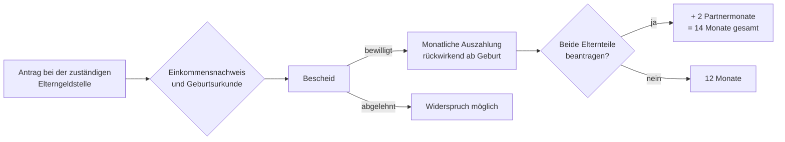

## Geschichte

Das **Elterngeld** wurde zum 1. Januar 2007 eingeführt und löste das frühere *Erziehungsgeld* ab, das eine einkommensunabhängige Pauschale von max. 300 € für bis zu 24 Monate war. Mit dem Systemwechsel auf eine Lohnersatzleistung wollte der Gesetzgeber insbesondere Väter und gut verdienende Elternteile zur Inanspruchnahme von Elternzeit motivieren.

Wichtige Meilensteine:

- **2007** – Einführung des Basiselterngelds (Bundeselterngeld- und Elternzeitgesetz, BEEG)
- **2015** – Einführung von **ElterngeldPlus** und dem **Partnerschaftsbonus** (§ 4a–4d BEEG)
- **2021** – Verlängerter Partnerschaftsbonus: statt 4 nun 4 aufeinanderfolgender Monate je Elternteil
- **April 2024** – Verschärfung der Einkommensgrenze: Paare ab 175.000 € zu versteuerndem Jahreseinkommen verlieren den Anspruch; bisher waren es 300.000 €

## Berechnung

Die Leistung beträgt **65 % des wegfallenden Nettoeinkommens** (bis zu einem Einkommen von 1.200 € netto: 67 %). Die Bemessungsgrundlage sind die zwölf Kalendermonate vor dem Geburtsmonat.

| Nettoeinkommen (monatl.) | Ersatzrate | Monatlicher Betrag |
| --- | ---: | ---: |
| bis 1.200 € | 67 % | 300 € – 804 € |
| 1.200 € – 2.770 € | 65 % | 804 € – 1.800 € |
| über 2.770 € | Deckelung | max. 1.800 € |
| ohne eigenes Einkommen | Mindestbetrag | 300 € |

Der **Geschwisterbonus** erhöht den Betrag um 10 % (mind. 75 €), wenn jüngere Geschwisterkinder unter 3 Jahren bzw. Mehrlingsgeschwister unter 6 Jahren im Haushalt leben (§ 2a BEEG).

## Bezugsdauer

| Variante | Monate | Bedingung |
| --- | ---: | --- |
| Basiselterngeld (ein Elternteil) | 12 | — |
| Basiselterngeld (beide Elternteile) | 14 | mind. 2 Monate je Elternteil |
| ElterngeldPlus | bis 28 | Teilzeit 25–32 h/Woche |
| Partnerschaftsbonus-Monate | +4 je Elternteil | gleichzeitig Teilzeit 24–32 h/Woche |

Basiselterngeld kann nur in den ersten 14 Lebensmonaten des Kindes bezogen werden; ElterngeldPlus verlängert den Bezugszeitraum auf bis zu die ersten 32 Lebensmonate. Ein ElterngeldPlus-Monat entspricht der Hälfte eines Basiselterngeld-Monats, weshalb sich der Gesamtanspruch verdoppelt — nicht verdoppelt der Gesamtbetrag.

## Progressionsvorbehalt

Elterngeld ist nach § 3 Nr. 67 EStG **steuerfrei**, unterliegt aber dem **Progressionsvorbehalt** nach [§ 32b Abs. 1 Satz 1 Nr. 1 Buchst. e EStG](https://www.gesetze-im-internet.de/estg/__32b.html). Das bedeutet: Das Elterngeld selbst wird nicht versteuert, aber es erhöht den Steuersatz, der auf das übrige zu versteuernde Einkommen im selben Kalenderjahr angewendet wird.

**Folge in der Praxis:**

- Wer in einem Kalenderjahr teils Erwerbseinkommen und teils Elterngeld bezieht, zahlt auf das Erwerbseinkommen mehr Steuer als ohne Elterngeld.
- Bei Ehepaaren mit Zusammenveranlagung kann auch das Elterngeld des *anderen* Partners den gemeinsamen Steuersatz erhöhen.
- Viele Eltern erhalten nach dem Bezugsjahr eine unerwartete Steuernachzahlung, weil die Arbeitgeber die Lohnsteuer unterjährig nicht angepasst haben.

**Wer ist besonders betroffen:** Elternteile, die im gleichen Jahr sowohl Elterngeld als auch Lohn oder Gehalt (z. B. wegen früherer Rückkehr) erhalten. Außerdem Paare mit deutlichem Einkommensunterschied, bei denen das Elterngeld des besser verdienenden Partners in die Zusammenveranlagung einfließt.

**Planungstipp:** Ein Steuerberater oder die kostenlose Beratung beim Lohnsteuerhilfeverein kann vor Beginn des Elterngeldbezugs berechnen, ob eine getrennte Veranlagung oder ein Lohnsteuerklassenwechsel günstiger ist.

## Sonderkonstellationen

**Frühgeburt:** Wird ein Kind mehr als sechs Wochen zu früh geboren, verlängert sich der Bezugszeitraum um einen Monat je angefangener Woche der Frühgeburtlichkeit (§ 4 Abs. 4 BEEG). Bei acht Wochen zu früh geborenen Kindern können also bis zu zwei Monate zusätzliche Elterngeldmonate entstehen.

**Adoption und Adoptionspflege:** Adoptiveltern und Adoptionspflegeeltern haben denselben Anspruch wie leibliche Eltern (§ 4 Abs. 3 BEEG). Die 14 Monate beginnen mit dem Tag der Aufnahme des Kindes in den Haushalt; das Höchstalter des Kindes (8 Jahre) ist zu beachten.

**Mehrlinge:** Bei Mehrlingsgeburten entsteht der Anspruch nur einmal, nicht je Kind. Allerdings gilt der erhöhte Geschwisterbonus für Mehrlingsgeschwister unter 6 Jahren, was den Betrag um 10 % je Mehrling erhöht (§ 2a Abs. 4 BEEG).

**Alleiniges Sorgerecht / Alleinerziehende:** Alleinerziehende können allein alle 14 Monate in Anspruch nehmen (§ 4 Abs. 3 Satz 2 BEEG). Die zwei zusätzlichen Partnermonate entfallen nicht, sondern werden dem alleinerziehenden Elternteil zugerechnet.

## Antragsweg

Der Antrag sollte spätestens drei Monate nach der Geburt gestellt werden, da Elterngeld rückwirkend nur für drei Monate ausgezahlt wird (§ 7 Abs. 1 Satz 2 BEEG). Zuständig sind die Elterngeldstellen der Bundesländer (in der Regel beim Landesamt für soziale Sicherung oder beim Jugendamt).

## Einkommensgrenzen

Seit dem 1. April 2024 gilt eine verschärfte Einkommensgrenze: Paare mit einem gemeinsamen zu versteuernden Einkommen über **175.000 €** (zuvor 300.000 €) haben keinen Anspruch mehr auf Elterngeld. Für Alleinerziehende gilt eine Grenze von **150.000 €** (§ 1 Abs. 8 BEEG).

## Verhältnis zu anderen Leistungen

- **Bürgergeld**: Elterngeld wird auf den Bürgergeld-Regelbedarf angerechnet — allerdings bleibt ein Sockelbetrag von 300 € anrechnungsfrei (§ 10 BEEG). Bezieher von Bürgergeld erhalten daher de facto nur den Mindestbetrag ohne nennenswerten Vorteil gegenüber dem Regelbedarf.
- **Kinderzuschlag**: Elterngeld über 300 € zählt als Einkommen bei der Berechnung des Kinderzuschlags. Für Familien, die nur knapp oberhalb der Bürgergeld-Grenze liegen, kann das Elterngeld paradoxerweise den KIZ-Anspruch reduzieren.
- **Mutterschaftsgeld / Krankentagegeld**: Mutterschaftsgeld (aus der gesetzlichen Krankenversicherung oder vom Bundesamt für Soziale Sicherung) und Arbeitgeberzuschuss werden auf das Elterngeld angerechnet und reduzieren faktisch die Auszahlungsdauer oder -höhe.
- **Rentenversicherung**: Elterngeld begründet Kindererziehungszeiten (§ 56 SGB VI), die als beitragsfreie Pflichtbeitragszeiten zur gesetzlichen Rentenversicherung gutgeschrieben werden — drei Jahre je Kind. Diese Rentenanwartschaft entsteht unabhängig vom Elterngeld und wird automatisch berücksichtigt.
- **Arbeitslosengeld I**: Wer nach der Elternzeit arbeitslos wird, erhält ALG I nicht auf Basis des Elterngelds, sondern auf Basis des zuletzt erzielten Arbeitsentgelts — allerdings werden Elternzeitmonate nicht als Versicherungszeiten gewertet. Die Rahmenfrist von 30 Monaten kann sich dadurch verkürzen.
- **Kindergeld**: Elterngeld und Kindergeld sind unabhängig voneinander und werden parallel gezahlt. Sie verfolgen unterschiedliche Ziele (Lohnersatz vs. Existenzsicherung des Kindes).

## Nichtinanspruchnahme und Väterbeteiligung

Elterngeld hat eine vergleichsweise hohe Inanspruchnahmequote bei Müttern: nahezu alle anspruchsberechtigten Mütter beantragen die Leistung. Bei **Vätern** ist die Quote deutlich niedriger: Laut BMFSFJ-Statistik beantragten 2022 rund **25 % der berechtigten Väter** Elterngeld; davon nahmen die meisten nur die zwei Partnermonate in Anspruch.

Strukturelle Gründe für die geringe Väterbeteiligung:

- **Einkommensgefälle**: Bei Paaren mit großem Einkommensunterschied lohnt es sich finanziell oft nicht, den besser verdienenden Partner für längere Zeit freizustellen.
- **Betriebliche Kultur**: In vielen Branchen wird eine längere Elternzeit des Vaters noch immer als karriereschädlich wahrgenommen.
- **Informationsdefizite**: Männer werden seltener über Elternzeit und Elterngeld beraten; Elterngeldstellen richten ihre Kommunikation traditionell an Mütter.

Der **Partnerschaftsbonus** (vier zusätzliche Monate bei gleichzeitiger Teilzeit beider Elternteile) wird trotz der Verlängerung 2021 nur von einem kleinen Teil der berechtigten Elternpaare genutzt — die Koordinationsanforderungen zwischen zwei Arbeitgebern gelten als zu komplex.
