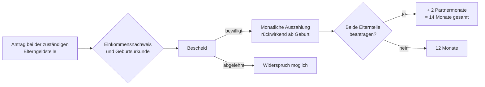

## Geschichte

Das **Elterngeld** wurde zum 1. Januar 2007 eingeführt und löste das frühere *Erziehungsgeld* ab, das eine einkommensunabhängige Pauschale von max. 300 € für bis zu 24 Monate war. Mit dem Systemwechsel auf eine Lohnersatzleistung wollte der Gesetzgeber insbesondere Väter und gut verdienende Elternteile zur Inanspruchnahme von Elternzeit motivieren.

Wichtige Meilensteine:

- **2007** – Einführung des Basiselterngelds (Bundeselterngeld- und Elternzeitgesetz, BEEG)
- **2015** – Einführung von **ElterngeldPlus** und dem **Partnerschaftsbonus** (§ 4a–4d BEEG)
- **2021** – Verlängerter Partnerschaftsbonus: statt 4 nun 4 aufeinanderfolgender Monate

## Berechnung

Die Leistung beträgt **65 % des wegfallenden Nettoeinkommens** (bis zu einem Einkommen von 1.200 € netto: 67 %). Die Bemessungsgrundlage sind die zwölf Kalendermonate vor dem Geburtsmonat.

| Nettoeinkommen (monatl.) | Ersatzrate | Monatlicher Betrag |
| --- | ---: | ---: |
| bis 1.200 € | 67 % | 300 € – 804 € |
| 1.200 € – 2.770 € | 65 % | 804 € – 1.800 € |
| über 2.770 € | Deckelung | max. 1.800 € |
| ohne eigenes Einkommen | Mindestbetrag | 300 € |

Der **Geschwisterbonus** erhöht den Betrag um 10 % (mind. 75 €), wenn jüngere Geschwisterkinder unter 3 Jahren bzw. Mehrlingsgeschwister unter 6 Jahren im Haushalt leben (§ 2a BEEG).

## Bezugsdauer

| Variante | Monate | Bedingung |
| --- | ---: | --- |
| Basiselterngeld (ein Elternteil) | 12 | — |
| Basiselterngeld (beide Elternteile) | 14 | mind. 2 Monate je Elternteil |
| ElterngeldPlus | bis 28 | Teilzeit 25–32 h/Woche |
| Partnerschaftsbonus-Monate | +4 je Elternteil | gleichzeitig Teilzeit 24–32 h/Woche |

Basiselterngeld kann nur in den ersten 14 Lebensmonaten des Kindes bezogen werden; ElterngeldPlus verlängert den Bezugszeitraum auf bis zu den ersten 32 Lebensmonate.

## Antragsweg

Der Antrag sollte spätestens drei Monate nach der Geburt gestellt werden, da Elterngeld rückwirkend nur für drei Monate ausgezahlt wird (§ 7 Abs. 1 Satz 2 BEEG). Zuständig sind die Elterngeldstellen der Bundesländer (in der Regel beim Landesamt für soziale Sicherung oder beim Jugendamt).

## Einkommensgrenzen

Seit dem 1. April 2024 gilt eine verschärfte Einkommensgrenze: Paare mit einem gemeinsamen zu versteuernden Einkommen über **175.000 €** (zuvor 300.000 €) haben keinen Anspruch mehr auf Elterngeld. Für Alleinerziehende gilt eine Grenze von **150.000 €** (§ 1 Abs. 8 BEEG).

## Verhältnis zu anderen Leistungen

- **Bürgergeld**: Elterngeld wird auf den Bürgergeld-Regelbedarf angerechnet — allerdings bleibt ein Sockelbetrag von 300 € anrechnungsfrei (§ 10 BEEG).
- **Krankentagegeld / Mutterschaftsgeld**: Mutterschaftsgeld wird auf das Elterngeld angerechnet und verkürzt faktisch den Bezug.
- **Kinderzuschlag**: Elterngeld über 300 € zählt als Einkommen bei der Berechnung des Kinderzuschlags.
