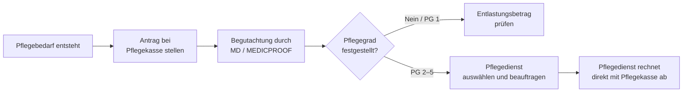

## Hintergrund

Die **Pflegesachleistung** nach § 36 SGB XI ist die ambulante Pflege durch einen zugelassenen Pflegedienst zu Lasten der Pflegekasse. Anders als das Pflegegeld (§ 37 SGB XI), das als Geldleistung an den Pflegebedürftigen ausgezahlt wird, finanziert die Pflegesachleistung die professionelle Pflege direkt: Der Pflegedienst rechnet seine Leistungen unmittelbar mit der Pflegekasse ab.

Im Jahr 2023 wurden in Deutschland rund **900.000 Pflegebedürftige** ausschließlich durch ambulante Pflegedienste versorgt; weitere rund 500.000 nutzten eine Kombination aus Sach- und Geldleistung. Insgesamt beanspruchten damit knapp 1,4 Millionen Pflegebedürftige die Pflegesachleistung — zumindest anteilig. Die Gesamtausgaben der sozialen Pflegeversicherung für Pflegesachleistungen lagen 2025 bei rund **6,9 Mrd. €** pro Jahr.

## Historische Entwicklung

- **1994** – Einführung des SGB XI (Pflegeversicherungsgesetz). Die soziale Pflegeversicherung entsteht als fünfte Säule der Sozialversicherung.
- **1995** – Inkrafttreten der häuslichen Pflegeleistungen (1. Januar): Pflegesachleistungen werden erstmals abgerechnet. Anfangsbeträge: Pflegestufe 1: 750 DM, Stufe 2: 1.800 DM, Stufe 3: 2.800 DM.
- **2002** – Erhöhung der Sachleistungsbeträge durch das Pflegeleistungs-Ergänzungsgesetz.
- **2015** – Erstes Pflegestärkungsgesetz (PSG I): Deutliche Erhöhung der Sachleistungsbeträge und Einführung des Betreuungsgeldes für demenziell Erkrankte.
- **2017** – Zweites Pflegestärkungsgesetz (PSG II): Ablösung der drei Pflegestufen durch fünf **Pflegegrade**. Das neue Begutachtungsinstrument berücksichtigt kognitive und psychische Einschränkungen gleichwertig. Die Leistungsbeträge werden neu gestaffelt.
- **2023/2025** – Pflegeunterstützungs- und -entlastungsgesetz (PUEG): Stufenweise Erhöhung der Pflegesachleistungsbeträge um insgesamt ca. 10 % (5 % ab 2024, weitere 4,5 % ab Januar 2025).

## Wer hat Anspruch?

Pflegesachleistungen erhalten Versicherte der sozialen oder privaten Pflegeversicherung, die

1. einen **Pflegegrad 2, 3, 4 oder 5** haben (Pflegegrad 1 berechtigt **nicht** zur Pflegesachleistung — hier gibt es nur den Entlastungsbetrag nach § 45b SGB XI),
2. **zu Hause** gepflegt werden (nicht vollstationär im Pflegeheim),
3. die Leistungen durch einen **zugelassenen ambulanten Pflegedienst** erbringen lassen.

Voraussetzung ist zudem, dass der Pflegedienst einen Versorgungsvertrag mit den Pflegekassen abgeschlossen hat (§ 72 SGB XI) und nach dem Pflegesatz-Vereinbarungsrecht vergütet wird.

## Leistungsumfang

§ 36 SGB XI umfasst drei Leistungskategorien, die der Pflegedienst im Rahmen des Sachleistungsbudgets erbringen kann:

1. **Körperbezogene Pflegemaßnahmen** – Körperpflege (Waschen, Duschen, Zahnpflege, Haarpflege), Ernährung (Hilfe beim Essen und Trinken), Mobilität (Lagern, Betten, Umsetzen, An- und Auskleiden, Gehen, Stehen, Treppensteigen).
2. **Pflegerische Betreuungsmaßnahmen** – Beschäftigung, Aktivierung und Beaufsichtigung, die der Erhaltung von Alltagskompetenz und Wohlbefinden dienen.
3. **Hilfen bei der Haushaltsführung** – Einkaufen, Kochen, Reinigen der Wohnung, Spülen und Wäschepflege — soweit diese im Zusammenhang mit dem Pflegebedarf notwendig sind.

## Leistungsbeträge (ab 1. Januar 2025)

| Pflegegrad | Pflegesachleistung/Monat |
| ---: | ---: |
| 1 | — |
| 2 | **761 €** |
| 3 | **1.432 €** |
| 4 | **1.778 €** |
| 5 | **2.200 €** |

> Die Beträge stellen monatliche **Höchstbeträge** dar. Nicht verbrauchte Budgetanteile können nicht auf den Folgemonat übertragen werden.

Der Pflegedienst rechnet seine Leistungen direkt mit der Pflegekasse ab; der Pflegebedürftige zahlt in der Regel keinen Eigenanteil — es sei denn, die tatsächlich erbrachten Leistungen übersteigen den Höchstbetrag.

## Zulassung und Auswahl des Pflegedienstes

Nicht jeder Pflegedienst darf nach § 36 SGB XI abrechnen. Voraussetzungen für die Zulassung (§§ 71, 72 SGB XI):

- Nachweis geeigneter Fachkräfte (mindestens eine Pflegefachkraft)
- Abschluss eines Versorgungsvertrags mit den Landesverbänden der Pflegekassen
- Abschluss einer Pflegesatzvereinbarung

Pflegebedürftige haben **freie Pflegedienstwahl** — sie können jeden zugelassenen Pflegedienst beauftragen. Wechsel sind jederzeit möglich. Die Pflegekasse kann die Wahl nicht einschränken.

Praktisch empfiehlt sich ein Vergleich der Pflegedienste über die **Pflegenavigator**-Datenbank des MDS (Medizinischer Dienst des Spitzenverbands Bund der Krankenkassen) oder regionale Pflegestützpunkte.

## Verhältnis zu anderen Leistungen

| Leistung | Verhältnis zur Pflegesachleistung |
| --- | --- |
| **Pflegegeld** (§ 37 SGB XI) | Alternativ — oder anteilig kombinierbar (Kombinationsleistung § 38 SGB XI) |
| **Entlastungsbetrag** (§ 45b SGB XI) | Zusätzlich: 125 €/Monat für alle Pflegegrade, zweckgebunden für anerkannte Angebote |
| **Verhinderungspflege** (§ 39 SGB XI) | Ergänzend, bis zu 1.612 €/Jahr bei Ausfall der Pflegeperson |
| **Kurzzeitpflege** (§ 42 SGB XI) | Ergänzend für vorübergehende vollstationäre Pflege |
| **Pflegehilfsmittel** (§ 40 SGB XI) | Ergänzend, bis 40 €/Monat für Verbrauchshilfsmittel |
| **Vollstationäre Pflege** (§ 43 SGB XI) | Alternativ — § 36 gilt nur für die häusliche Pflege |

## Kombination mit Pflegegeld (§ 38 SGB XI)

Wer den Sachleistungsbetrag nicht vollständig ausschöpft, kann den verbleibenden Anteil anteilig als Pflegegeld erhalten (**Kombinationsleistung**). Das ermöglicht flexible Pflegearrangements, in denen Angehörige und professionelle Dienste zusammenwirken.

```
Beispiel (Pflegegrad 3):
  Sachleistungsbudget: 1.432 €/Monat
  In Anspruch genommene Sachleistungen: 716 € (50 % des Budgets)
  Pflegegeldanteil: 573 € × 50 % = 286,50 €
  Gesamtleistung: 716 € + 286,50 € = 1.002,50 €
```

Das Verhältnis wird durch den tatsächlichen Sachleistungsabruf im jeweiligen Monat bestimmt.

## Antragstellung



- Antrag bei der **Pflegekasse** (= Teil der Krankenkasse, gleiche Mitgliedsnummer).
- Begutachtung durch den **Medizinischen Dienst (MD)** oder bei Privatversicherten durch MEDICPROOF.
- Nach Bewilligung: Pflegedienst beauftragen; dieser schließt einen Pflegevertrag (§ 120 SGB XI) ab und übernimmt die Abrechnung.
- Pflegesachleistungen werden **ab dem Monat der Antragstellung** gewährt, wenn der Pflegegrad anerkannt wird.

## Häufige Fragen

**Kann ich mehrere Pflegedienste gleichzeitig beauftragen?**  
Grundsätzlich ja — das Sachleistungsbudget kann auf mehrere zugelassene Dienste aufgeteilt werden, solange die Gesamtkosten den monatlichen Höchstbetrag nicht überschreiten.

**Was passiert, wenn die erbrachten Leistungen teurer sind als das Budget?**  
Die Differenz muss der Pflegebedürftige selbst tragen. Wer auf Sozialhilfe angewiesen ist, kann beim Sozialamt ergänzende Hilfe zur Pflege (§§ 61 ff. SGB XII) beantragen.

**Kann ein Familienangehöriger als Pflegedienst abrechnen?**  
Nur wenn der Angehörige als selbstständige Person oder im Rahmen eines zugelassenen Pflegedienstes tätig ist und alle Zulassungsvoraussetzungen erfüllt. Die bloße Familienangehörigkeit begründet keinen Abrechnungsanspruch nach § 36 SGB XI — dann kommt Pflegegeld nach § 37 SGB XI in Betracht.

**Muss ich für die Pflegesachleistung Zuzahlungen leisten?**  
Nein — soweit die Leistungen innerhalb des monatlichen Höchstbetrags bleiben, übernimmt die Pflegekasse die Kosten vollständig. Es gibt keine gesetzliche Zuzahlungspflicht wie in der GKV.

**Was kann ich mit dem Entlastungsbetrag zusätzlich finanzieren?**  
Der Entlastungsbetrag (125 €/Monat, § 45b SGB XI) kann für anerkannte Alltagsbegleiter, Betreuungsgruppen oder niedrigschwellige Betreuungsangebote genutzt werden — also für Leistungen, die nicht von der Pflegesachleistung abgedeckt sind. Seit 2018 kann er auch für zugelassene Haushaltshilfeleistungen eingesetzt werden.
