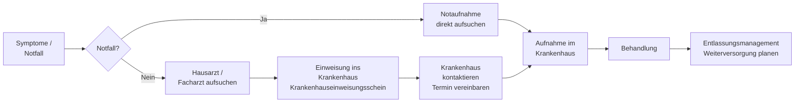

## Hintergrund

Der Anspruch auf **Krankenhausbehandlung** nach § 39 SGB V ist eine der zentralen Leistungen der gesetzlichen Krankenversicherung. Rund **17 Millionen stationäre Behandlungsfälle** werden in Deutschland jährlich in zugelassenen Krankenhäusern abgerechnet. Die GKV trägt dabei den weitaus größten Teil der Kosten — 2024 flossen rund **102 Milliarden Euro** aus GKV-Mitteln in die Krankenhausversorgung.

Das Abrechnungssystem für stationäre Leistungen wurde 2004 auf das **G-DRG-System** (German Diagnosis Related Groups) umgestellt: Jeder Krankenhausaufenthalt erhält einen Fallpauschalen-Code, der sich nach Diagnose, Prozeduren und Schweregrad richtet und mit einem krankenhausindividuellen Basisfallwert verrechnet wird. Dieses leistungsorientierte System hat die Krankenhäuser zu mehr Effizienz veranlasst, aber auch Fehlanreize erzeugt — was eine seit Jahren andauernde Reform-Debatte ausgelöst hat. Die 2024 vom Bundestag beschlossene **Krankenhausreform (KHVVG)** zielt darauf ab, die Finanzierung durch Vorhaltepauschalen zu ergänzen, um rein mengengetriebene Anreize zu reduzieren.

## Anspruchsvoraussetzungen

Der Anspruch entsteht, wenn eine Krankenhausbehandlung **medizinisch notwendig** ist und das Behandlungsziel nicht durch ambulante oder teilstationäre Maßnahmen erreicht werden kann. Im Einzelnen:

| Voraussetzung | Erläuterung |
| --- | --- |
| **GKV-Mitgliedschaft** | Versicherter oder familienversichertes Mitglied |
| **Medizinische Notwendigkeit** | Die Behandlung muss ärztlich begründet und nicht ambulant leistbar sein |
| **Zugelassenes Krankenhaus** | Das Haus muss in den Krankenhausplan des jeweiligen Bundeslandes aufgenommen oder mit den Landesverbänden der Kassen gesondert zugelassen sein |

Für **Notfälle** gilt: der Anspruch besteht auch ohne vorherige Einweisung und ohne Rücksicht auf das nächste zugelassene Krankenhaus — jedes Akutkrankenhaus ist zur Erstversorgung verpflichtet.

## Leistungsumfang

Die Krankenhausbehandlung umfasst alle im Einzelfall erforderlichen Leistungen:

- **Unterkunft und Verpflegung** (einschließlich Pflege und Betreuung)
- **Ärztliche Behandlung** durch alle beteiligten Fachrichtungen
- **Krankenpflege** und pflegerische Versorgung
- **Versorgung mit Arznei-, Heil- und Hilfsmitteln** für die Dauer des stationären Aufenthalts
- **Diagnostik** (Labor, Bildgebung, Funktionsuntersuchungen)
- **Psychologische Betreuung**
- Sofern medizinisch indiziert: **Sozialdienst** und Entlassungsmanagement

Nicht enthalten sind Wahlleistungen wie das **Einbettzimmer** oder die Behandlung durch den **Chefarzt** — diese können gegen Aufpreis vereinbart werden (Krankenhauswahlleistungen, geregelt in § 17 KHEntgG).

## Behandlungsformen

| Form | Beschreibung |
| --- | --- |
| **Vollstationär** | Aufnahme mit Übernachtung; Standardfall bei schwerwiegenden Erkrankungen, Operationen oder Rehabilitationsbedarf |
| **Teilstationär** | Tagestationäre oder nachtstationäre Behandlung ohne Übernachtung; z. B. Chemotherapie oder psychiatrische Behandlung |
| **Vorstationär / Nachstationär** | Vorbereitung oder Nachsorge zur stationären Behandlung, ohne eigentliche Aufnahme |
| **Ambulantes Operieren** | Bestimmte Eingriffe werden ambulant im Krankenhaus durchgeführt und gesondert abgerechnet |

## Freie Krankenhauswahl

GKV-Versicherte haben das **freie Wahlrecht** unter allen zugelassenen Krankenhäusern in Deutschland. Eine Bindung an ein bestimmtes Haus, einen Landkreis oder ein Bundesland besteht nicht. Praktisch relevant:

- Wählt der Patient ein **nicht zugelassenes** oder ein **Privatkrankenhaus**, trägt er die Mehrkosten selbst, die GKV zahlt nur bis zur Höhe der Kosten eines vergleichbaren zugelassenen Krankenhauses.
- Bei **planbaren Eingriffen** kann es sinnvoll sein, ein auf diese Diagnose spezialisiertes Zentrum zu wählen — auch wenn es weiter entfernt liegt. Fahrkosten können nach § 60 SGB V unter bestimmten Voraussetzungen übernommen werden.

## Einweisung und Aufnahme

Der **Krankenhauseinweisungsschein** (Muster 2) gilt nur für das dort genannte Krankenhaus und die angegebene Diagnose. Wer ein anderes Haus bevorzugt, muss die Einweisung ggf. ummelden oder eine neue ausstellen lassen. Im Notfall entfällt der Einweisungsschein vollständig.

## Zuzahlung

Für jeden Tag der vollstationären Krankenhausbehandlung fällt eine **Zuzahlung von 10 €** an — maximal für **28 Tage** pro Kalenderjahr, also maximal **280 € jährlich**. Die Tage werden über alle Krankenhausaufenthalte im Jahr hinweg addiert.

| Regelung | Details |
| --- | --- |
| Tagessatz | 10 € pro Kalendertag |
| Jahreshöchstbetrag | 280 € (28 Tage) |
| Anrechnung auf Belastungsgrenze | Ja — die Zuzahlungen zählen zur allgemeinen Belastungsgrenze (2 % des Bruttoeinkommens, 1 % für chronisch Kranke) |
| Befreiung | Automatisch ab Erreichen der Belastungsgrenze; Kinder und Jugendliche unter 18 Jahren sind zuzahlungsfrei |

Das Krankenhaus zieht die Zuzahlung direkt ein und rechnet sie mit der GKV ab.

## Entlassungsmanagement

Seit 2017 sind Krankenhäuser gesetzlich verpflichtet (§ 39 Abs. 1a SGB V), ein **strukturiertes Entlassungsmanagement** anzubieten. Dabei soll sichergestellt werden, dass nach der Entlassung keine Versorgungslücke entsteht:

- **Anschlussheilbehandlung (AHB)** oder stationäre Reha kann direkt eingeleitet werden
- **Häusliche Krankenpflege** (§ 37 SGB V) kann direkt vom Krankenhaus verordnet werden
- Sozialdienstmitarbeiter helfen bei der Organisation von Pflegehilfsmitteln, Pflegegrad-Antrag oder Haushaltshilfe

Patienten haben das Recht, das Entlassungsmanagement **abzulehnen** oder einen eigenen Dienstleister zu beauftragen.

## Abgrenzung zu ähnlichen Leistungen

| Leistung | Rechtsgrundlage | Wann zutreffend |
| --- | --- | --- |
| Krankenhausbehandlung (vollstationär) | § 39 SGB V | Schwere Erkrankungen, Operationen, keine ambulante Behandlung möglich |
| Ambulante Rehabilitation | § 40 Abs. 1 SGB V | Wenn stationäre Reha nicht erforderlich, aber Reha-Bedarf besteht |
| Stationäre Rehabilitation | § 40 Abs. 2 SGB V | Längerfristige Wiederherstellung von Funktionen nach Krankheit |
| Stationäre Kurzzeitpflege | § 39c SGB V | Wenn häusliche Pflege nach Krankenhausentlassung vorübergehend nicht möglich |
| Spezialisierte ambulante Palliativversorgung | § 37b SGB V | Schwerstkranke, die zu Hause betreut werden wollen |

## Zahlen und Fakten

- **16,9 Mio.** vollstationäre Behandlungsfälle in deutschen Krankenhäusern (2024)
- **1.893** zugelassene Krankenhäuser mit rund 475.000 Betten (Destatis 2023)
- Durchschnittliche **Verweildauer**: rund 7,3 Tage
- **102 Mrd. €** Krankenhausausgaben aus GKV-Mitteln (2024), der größte Einzelposten in der GKV-Ausgabenstruktur
- Rund **43 % aller** Bundesbürger sind mindestens einmal in 10 Jahren stationär im Krankenhaus

## Krankenhausreform 2024

Das **Krankenhausversorgungsverbesserungsgesetz (KHVVG)** vom November 2024 leitet eine grundlegende Reform der Krankenhausfinanzierung ein:

- Einführung von **Vorhaltepauschalen** (neben DRG-Fallpauschalen), damit Krankenhäuser nicht mehr ausschließlich von der Fallzahl abhängen
- **Leistungsgruppen** mit Qualitätsvorgaben — Eingriffe dürfen künftig nur noch in Häusern durchgeführt werden, die die Anforderungen der jeweiligen Leistungsgruppe erfüllen
- **Konzentration** bestimmter hochspezialisierter Leistungen auf Levelversorgungsebenen
- Ziel: weniger Krankenhäuser, dafür mit höherer Qualität und besserer Ausstattung

Für Patienten bedeutet das mittelfristig: **längere Anfahrten** zu bestimmten Spezialzentren, aber **bessere Qualitätssicherung** bei komplexen Eingriffen.
