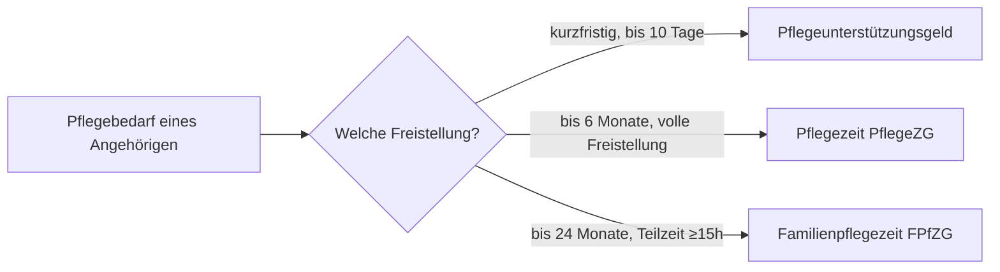

## Hintergrund

Die **Familienpflegezeit** nach § 2 FPfZG erlaubt es Beschäftigten, ihre Arbeitszeit über einen längeren Zeitraum zu reduzieren, um einen pflegebedürftigen nahen Angehörigen in häuslicher Umgebung zu pflegen. Sie ergänzt die kürzere **Pflegezeit** (bis zu 6 Monate vollständige Freistellung nach dem Pflegezeitgesetz).

## Eckdaten

| Merkmal | Regelung |
|---|---|
| Höchstdauer | 24 Monate |
| Mindestarbeitszeit | 15 Wochenstunden (im Jahresdurchschnitt) |
| Anspruch besteht ab | Arbeitgeber mit **mehr als 25** Beschäftigten |
| Pflegeort | häusliche Umgebung des Angehörigen |

Bei kleineren Betrieben (25 oder weniger Beschäftigte) besteht **kein Rechtsanspruch**; die Familienpflegezeit kann dort nur einvernehmlich vereinbart werden.

## Zinsloses Darlehen

Da die Arbeitszeitreduzierung zu Einkommensverlust führt, gewährt das **Bundesamt für Familie und zivilgesellschaftliche Aufgaben (BAFzA)** auf Antrag ein **zinsloses Darlehen**:

- Es deckt die **Hälfte des durch die Arbeitszeitreduzierung wegfallenden Nettogehalts** ab.
- Auszahlung in monatlichen Raten während der Freistellung.
- Rückzahlung in monatlichen Raten innerhalb von **48 Monaten** nach Beginn der Freistellung.
- Härtefallregelungen (Stundung, Teilerlass) sind möglich, etwa bei fortbestehender Pflegebedürftigkeit (§ 7 FPfZG).

## Abgrenzung zur Pflegezeit

Pflegezeit und Familienpflegezeit können kombiniert werden, dürfen zusammen aber **24 Monate** nicht überschreiten.

## Soziale Absicherung

Während der Familienpflegezeit bleibt das Beschäftigungsverhältnis bestehen; es besteht **Kündigungsschutz** von der Ankündigung bis zum Ende der Freistellung. Die Pflegekasse zahlt unter bestimmten Voraussetzungen Rentenversicherungsbeiträge für die Pflegeperson.
