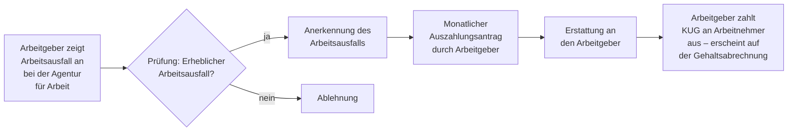

## Geschichte

Das **Kurzarbeitergeld** (KUG) ist eine der ältesten Instrumente der deutschen Arbeitslosenversicherung. Die Idee, Beschäftigte bei vorübergehender Arbeitszeitverkürzung staatlich zu stützen, reicht bis ins frühe 20. Jahrhundert zurück.

Wichtige Meilensteine:

- **1924** – Einführung einer „Kurzarbeiterunterstützung" im Deutschen Reich
- **1969** – Systematische Verankerung im Arbeitsförderungsgesetz (AFG) als Regelinstrument
- **1998** – Überführung ins SGB III (§§ 95–109 SGB III)
- **2008/09** – Massennutzung während der Weltfinanzkrise: bis zu **1,4 Millionen Kurzarbeiter** gleichzeitig; breite internationale Rezeption als „German Model" der Beschäftigungssicherung
- **2020/21** – COVID-19-Krise: historischer Spitzenwert von über **6 Millionen Kurzarbeitern** im April 2020. Der Gesetzgeber vereinfachte den Zugang erheblich (Schwellenwert von 10 % auf 10 % gesenkt; rückwirkende Anerkennung, Leiharbeit einbezogen) und verlängerte die maximale Bezugsdauer auf 24 Monate.
- **2022** – Schrittweiser Abbau der COVID-Sonderregelungen; Rückkehr zur Normallage

Das KUG gilt in der Arbeitsmarktforschung als eines der am besten evaluierten Instrumente zur Konjunkturstabilisierung. Ökonomen führen es regelmäßig als wesentlichen Grund an, warum Deutschland in Rezessionen vergleichsweise wenig Beschäftigung verliert.

## Leistungshöhe

Das Kurzarbeitergeld ersetzt einen prozentualen Anteil des **pauschalierten Nettolohnausfalls** — also der Differenz zwischen dem Soll-Entgelt (normaler Monatslohn) und dem Ist-Entgelt (tatsächlicher Lohn für die verkürzten Stunden):

| Leistungssatz | Personengruppe | Prozentwert |
| --- | --- | ---: |
| Allgemeiner Satz | Kein Kind im Haushalt | 60 % |
| Erhöhter Satz | Mind. 1 Kind im Haushalt (§ 105 Nr. 2 SGB III) | 67 % |

Die Bemessung richtet sich nach dem **Leistungsentgelt** gemäß § 153 SGB III (pauschalierter Nettobetrag). Der Arbeitgeber zahlt das KUG an die Arbeitnehmer aus und lässt es sich anschließend von der Agentur für Arbeit erstatten.

**Tarifliche Aufstockung:** Viele Tarifverträge — insbesondere in der Metall- und Chemieindustrie — verpflichten den Arbeitgeber, das KUG auf 80–90 % des Nettoentgelts aufzustocken. Diese Aufstockungsbeträge sind steuerpflichtig und mindern den Progressionsvorbehalt-Effekt des KUG.

## Voraussetzungen

Das KUG setzt drei Ebenen von Voraussetzungen voraus:

**1. Erheblicher Arbeitsausfall (§ 96 SGB III)**
- Mindestens **10 % der Belegschaft** eines Betriebs müssen von einem Entgeltausfall von mehr als 10 % betroffen sein.
- Der Ausfall muss auf **wirtschaftlichen Gründen** (z.B. Auftragsmangel, Rohstoffknappheit) oder einem **unabwendbaren Ereignis** (z.B. Brand, Naturkatastrophe, staatlich angeordneter Betriebsschließung) beruhen.
- Der vorübergehende Charakter ist konstitutiv: dauerhafter Stellenabbau begründet keinen KUG-Anspruch.

**2. Betriebliche Voraussetzungen (§ 97 SGB III)**
- Im Betrieb muss mindestens 1 versicherungspflichtig Beschäftigter tätig sein.
- Der Arbeitgeber muss zumutbare Maßnahmen zur Vermeidung von Kurzarbeit ausgeschöpft haben (z.B. Überstundenabbau, Urlaubsgewährung, Nutzung von Arbeitszeitkonten).

**3. Persönliche Voraussetzungen (§ 98 SGB III)**
- Nur **versicherungspflichtige Beschäftigte** erhalten KUG. Minijobber, Selbstständige und Beamte sind ausgeschlossen.
- Auszubildende haben in der Regel keinen Anspruch, es sei denn, die Berufsausbildung kann nicht fortgesetzt werden.

## Bezugsdauer

| Regelung | Dauer |
| --- | ---: |
| Reguläre Bezugsdauer (§ 104 Abs. 1 SGB III) | 12 Monate |
| Verlängerung per Verordnung (§ 109 SGB III) | bis zu 24 Monate |

Die Verlängerungsmöglichkeit per Rechtsverordnung wurde sowohl 2008/09 als auch 2020/21 genutzt. Der Lauf der Bezugsdauer beginnt mit dem Monat, in dem KUG erstmals gewährt wird.

## Antragsweg

Das Verfahren ist **arbeitgebergetrieben** — nicht der Arbeitnehmer, sondern der Betrieb beantragt das KUG:

1. **Anzeige des Arbeitsausfalls** (§ 99 SGB III): Der Arbeitgeber — bei Betrieben mit Betriebsrat: zusammen mit dem Betriebsrat — zeigt der zuständigen Agentur für Arbeit den Arbeitsausfall schriftlich an. Die Anzeige muss spätestens für den Monat eingehen, ab dem KUG beansprucht wird.
2. **Monatlicher Leistungsantrag** (§ 325 SGB III): Nach Ablauf des Abrechnungsmonats stellt der Arbeitgeber einen Auszahlungsantrag mit Abrechnung (Soll- und Ist-Entgelt je Beschäftigten). Frist: innerhalb von **3 Monaten** nach Ende des Antragsmonats.
3. **Erstattung** durch die Agentur für Arbeit an den Arbeitgeber.
4. **Weiterzahlung** an die Arbeitnehmer mit der nächsten Gehaltsabrechnung.

Für Arbeitnehmer ist das Verfahren damit weitgehend passiv: Sie erhalten das KUG über ihren Arbeitgeber, ohne selbst bei der Behörde vorstellig werden zu müssen.

## Steuerliche Behandlung

Kurzarbeitergeld ist **steuerfrei**, unterliegt aber dem **Progressionsvorbehalt** (§ 32b EStG): Es erhöht den Steuersatz, der auf das übrige Einkommen angewendet wird. Für Bezieher mit nennenswertem Einkommen kann dies zu Steuernachzahlungen im Rahmen der Einkommensteuererklärung führen — ein häufig unterschätzter Effekt, besonders für Arbeitnehmer, die während der Kurzarbeit keine Lohnsteuerklasse angepasst haben.

## Verhältnis zu anderen Leistungen

- **Arbeitslosengeld I (§§ 136 ff. SGB III):** Das KUG verhindert Entlassungen und damit das Entstehen von ALG-I-Ansprüchen. Zeiten der Kurzarbeit werden bei der Anwartschaft für das ALG I nur für die tatsächlich geleisteten Arbeitsstunden berücksichtigt.
- **Saison-Kurzarbeitergeld (§ 101 SGB III):** Spezifisches Instrument für das Baugewerbe und verwandte Branchen während der Schlechtwetterperiode (Dezember–März). Kombiniert mit ergänzendem Wintergeld (Mehraufwands-Wintergeld, Zuschuss-Wintergeld).
- **Transfer-Kurzarbeitergeld (§ 111 SGB III):** Eingesetzt bei betriebsbedingten Stellenabbau-Maßnahmen. Betroffene Arbeitnehmer wechseln in eine Transfergesellschaft und erhalten Transfer-KUG für bis zu 12 Monate, während sie auf neue Beschäftigung vorbereitet werden.
- **Bürgergeld (SGB II):** Wer trotz KUG-Bezug die Bedarfsgrenze unterschreitet, kann ergänzend Bürgergeld beantragen. Das KUG wird dabei als Einkommen angerechnet.
- **Insolvenzgeld (§§ 165 ff. SGB III):** Wird der Arbeitgeber insolvent, kann das noch ausstehende KUG als Insolvenzforderung geltend gemacht werden; Arbeitnehmer können dann ggf. Insolvenzgeld erhalten.

## Kritische Einordnung

Das KUG erhält regelmäßig gute Evaluationsnoten als Rezessionsinstrument. Gleichzeitig gibt es strukturelle Einwände:

- **Strukturerhalt vs. Strukturwandel:** KUG hält Beschäftigung in schrumpfenden Branchen und kann notwendige Anpassungsprozesse verlangsamen. Diese Debatte wurde besonders intensiv im Kontext der Automobilindustrie und der Transformation zu Elektromobilität geführt.
- **Verteilungswirkung:** Da das KUG proportional zum Lohn bemessen ist, profitieren Besserverdienende absolut stärker. Die 67-%-Variante für Eltern mildert diesen Effekt nur begrenzt.
- **Mobilitätshemmung:** Arbeitnehmer, die zu einem anderen Arbeitgeber wechseln könnten, bleiben möglicherweise im subventionierten Betrieb — und verpassen Anpassungsmöglichkeiten.
