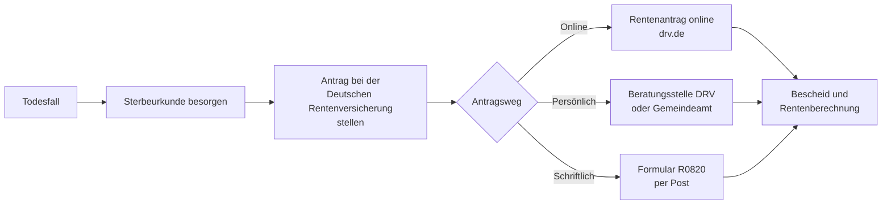

## Hintergrund

Die **Witwenrente und Witwerrente** nach § 46 SGB VI ist eine Hinterbliebenenrente der gesetzlichen Rentenversicherung. Sie soll den überlebenden Ehegatten oder eingetragenen Lebenspartner finanziell absichern, wenn durch den Tod des Versicherten Einkommen wegfällt. Rund **5,2 Millionen Hinterbliebenenrenten** zahlt die Deutsche Rentenversicherung insgesamt aus (Stand 2024).

## Geschichte

Die Hinterbliebenenversorgung in der deutschen Sozialversicherung hat eine lange Tradition:

- **1911** – Reichsversicherungsordnung (RVO): Erstmals Witwenrente für Arbeiter und Angestellte; Witwerrente zunächst nicht vorgesehen.
- **1957** – Rentenreform: Grundlegende Neugestaltung der gesetzlichen Rentenversicherung; Hinterbliebenenversorgung wird ausgebaut.
- **1986** – Hinterbliebenenrenten-Reform: Einführung der Einkommensanrechnung (§ 97 SGB VI), um Doppelversorgung zu vermeiden. Gleichzeitig wird der Witwerrente zum ersten Mal systematisch gleichgestellt mit der Witwenrente.
- **2002** – Einbeziehung eingetragener Lebenspartner durch das Lebenspartnerschaftsgesetz.
- **2012** – Schrittweise Anhebung der Altersgrenze für die große Witwenrente von 45 auf 47 Jahre.
- **2024** – Vereinheitlichung des Rentenwertes Ost und West; der Freibetrag bei der Einkommensanrechnung gilt seitdem bundeseinheitlich.

## Zwei Arten der Witwenrente

### Kleine Witwenrente

- Wird an **alle** anspruchsberechtigten Witwen und Witwer gezahlt, die keine Voraussetzungen für die große Witwenrente erfüllen.
- Laufzeit: **24 Kalendermonate** nach dem Sterbemonat.
- Rentenhöhe: **25 %** des Rentenanspruchs des Verstorbenen (Rentenartfaktor 0,25).

### Große Witwenrente

- Wird **dauerhaft** bis zum eigenen Tod oder zur Wiederheirat gezahlt.
- Rentenhöhe: **55 %** des Rentenanspruchs des Verstorbenen (Rentenartfaktor 0,55).
- Voraussetzung: Mindestens **eine** der folgenden Bedingungen ist erfüllt:

| Voraussetzung | Detail |
| --- | --- |
| Eigenes Alter | mindestens **47 Jahre** (für ab 2029 Leistungsbeziehende; Übergangsregelungen gelten) |
| Kindererziehung | Erziehung eines eigenen Kindes oder Kindes des Verstorbenen (unter 18 Jahren; bei Behinderung auch darüber hinaus) |
| Erwerbsminderung | Dauerhaft volle Erwerbsminderung des überlebenden Ehegatten |

> **Übergangsregel Altersgrenze:** Die Altersgrenze wurde schrittweise von 45 auf 47 Jahre angehoben. Wer vor dem 1.1.1962 geboren ist und dessen Ehepartner nach dem 1.1.2012 verstorben ist, unterliegt der Übergangsregelung (§ 242a SGB VI). Exakte Grenzalter je Jahrgang sind der DRV-Tabelle zu entnehmen.

## Anspruchsvoraussetzungen

1. **Versicherungszeit des Verstorbenen:** Mindestens **5 Jahre** Wartezeit in der gesetzlichen Rentenversicherung (§ 50 SGB VI).
2. **Ehe oder eingetragene Lebenspartnerschaft:** Zum Zeitpunkt des Todes muss eine gültige Ehe oder eingetragene Lebenspartnerschaft bestanden haben.
3. **Keine Versorgungsehe:** Dauerte die Ehe weniger als 1 Jahr, greift die **gesetzliche Vermutung einer Versorgungsehe** (§ 46 Abs. 2a SGB VI). Der überlebende Ehepartner kann diese Vermutung widerlegen — z. B. wenn der Tod unerwartet eingetreten ist (Unfall, plötzliche Krankheit).

## Berechnung der Rentenhöhe

Die Witwenrente berechnet sich aus dem Rentenanspruch, den der Verstorbene hatte oder bei Erreichen des Rentenalters gehabt hätte:

```
Witwenrente = Entgeltpunkte × Rentenartfaktor × Zugangsfaktor × aktueller Rentenwert
```

- **Rentenartfaktor:** 0,25 (kleine) oder 0,55 (große Witwenrente)
- **Aktueller Rentenwert 2025:** 40,44 € (bundeseinheitlich ab 1.7.2025)
- **Entgeltpunkte:** Die Summe der Entgeltpunkte, die der Verstorbene bis zu seinem Tod angesammelt hat — ggf. mit einer Zurechnungszeit, falls er vor dem Rentenalter verstorben ist.

**Zurechnungszeit:** War der Verstorbene zum Todeszeitpunkt noch kein Rentner, werden ihm fiktive Entgeltpunkte bis zum 67. Lebensjahr gutgeschrieben (§ 59 SGB VI). Das erhöht die Witwenrente erheblich, wenn der Ehepartner jung verstorben ist.

**Beispiel (vereinfacht):**

| Position | Wert |
| --- | --- |
| Entgeltpunkte des Verstorbenen (inkl. Zurechnungszeit) | 35,0 |
| Rentenwert | 40,44 € |
| Rentenartfaktor (große Witwenrente) | 0,55 |
| **Brutto-Witwenrente (vor Einkommensanrechnung)** | **778,47 €/Monat** |

## Einkommensanrechnung (§ 97 SGB VI)

Eigenes Einkommen des überlebenden Ehegatten wird auf die Witwenrente angerechnet — jedoch erst oberhalb eines **Freibetrags**. Einkommen über dem Freibetrag wird zu **40 %** auf die Witwenrente angerechnet.

```
Anrechnungsbetrag = (Einkommen − Freibetrag) × 0,40
Ausgezahlte Witwenrente = Brutto-Witwenrente − Anrechnungsbetrag
```

- **Freibetrag ab Juli 2025:** **1.076,86 €/Monat** (entspricht 26,4 × aktueller Rentenwert; erhöht sich je Kind um ca. 226 €)
- Als **Einkommen** zählen: Arbeitseinkommen, Renten, Versorgungsbezüge, Arbeitslosengeld — nicht jedoch z. B. Wohngeld, Krankengeld oder Pflegegeld.
- Besteht die Witwenrente nur für die ersten **24 Monate** (Sterbevierteljahr: die ersten 3 Monate nach dem Sterbemonat), wird in dieser Karenzzeit **keine Einkommensanrechnung** vorgenommen (§ 97 Abs. 2 SGB VI). Das soll die unmittelbare Notlage nach dem Todesfall abfedern.

## Besonderheiten

### Geschiedene Ehegatten

Geschiedene haben grundsätzlich **keinen** Anspruch auf Witwenrente. Als Ausgleich gibt es den **Versorgungsausgleich** (§§ 1587 ff. BGB) bei der Scheidung, durch den Rentenansprüche aufgeteilt werden. In Ausnahmefällen besteht ein Anspruch nach § 243 SGB VI (Witwen- oder Witwerrente nach dem vorletzten Ehegatten).

### Wiederheirat

Bei Wiederheirat **endet die Witwenrente**. Als Abfindung wird eine **Einmalzahlung** in Höhe von 24 Monatsbeiträgen der Witwenrente gezahlt (§ 107 SGB VI – Rentenabfindung). Wird die neue Ehe wieder aufgelöst (Scheidung, Witwerschaft), lebt die ursprüngliche Witwenrente ggf. wieder auf.

### Eingetragene Lebenspartner

Nach § 46 Abs. 4 SGB VI haben eingetragene Lebenspartner und Lebenspartnerinnen die **gleichen Rechte** wie Ehegatten. Seit der vollständigen Öffnung der Ehe für gleichgeschlechtliche Paare (2017) werden neue Partnerschaften als Ehe geschlossen; bestehende eingetragene Lebenspartnerschaften behalten ihre Schutzwirkung.

### Zusammentreffen mit eigener Altersrente

Bezieht der Hinterbliebene bereits eine eigene Altersrente, werden beide Renten **gleichzeitig** gezahlt. Die eigene Rente gilt jedoch als anrechenbares Einkommen und mindert die Witwenrente entsprechend der Einkommensanrechnungsregeln. In der Praxis kann sich die tatsächlich ausgezahlte Witwenrente dadurch erheblich reduzieren oder auf null sinken.

## Antragsweg



**Benötigte Unterlagen:**
- Sterbeurkunde des Verstorbenen
- Heiratsurkunde oder Lebenspartnerschaftsurkunde
- Eigener Personalausweis
- Rentenversicherungsausweis beider Partner (Sozialversicherungsnummer)
- Bei Kindern: Geburtsurkunden der Kinder
- Nachweise über eigenes Einkommen (für die Einkommensanrechnung)

**Rückwirkung:** Der Antrag kann bis zu **12 Monate rückwirkend** gestellt werden — ab dem 1. des Sterbemonats. Wird der Antrag später gestellt, verfallen die Ansprüche für die Zwischenzeit.

## Verhältnis zu anderen Leistungen

- **Waisenrente (§ 48 SGB VI):** Kinder des Verstorbenen erhalten parallel eine Halb- oder Vollwaisenrente. Diese ist von der Witwenrente unabhängig.
- **Grundsicherung im Alter (SGB XII):** Reicht die Witwenrente nicht zum Lebensunterhalt aus, kann aufstockende Grundsicherung beantragt werden. Grundsicherung wird dabei nicht auf die Witwenrente angerechnet — umgekehrt schon.
- **Bürgergeld (SGB II):** Wer das Rentenalter noch nicht erreicht hat und Bürgergeld bezieht, muss die Witwenrente als Einkommen anrechnen lassen.
- **Versorgungsausgleich:** Bei Scheidungen vor dem Tod kann der Versorgungsausgleich die Entgeltpunkte des Verstorbenen und damit die Witwenrente mindern (§ 101 SGB VI).
- **Unfallrenten (SGB VII):** Stirbt der Versicherte infolge eines Arbeitsunfalls, kann neben der gesetzlichen Rentenversicherung auch die Unfallversicherung Hinterbliebenenleistungen erbringen (§ 65 SGB VII). Beide Leistungen können parallel bezogen werden, unterliegen aber ggf. einer Gesamtanrechnung.

## Häufige Fragen

**Muss ich die Witwenrente beantragen?**  
Ja, die Rente wird nicht automatisch ausgezahlt. Der Antrag ist aktiv bei der DRV zu stellen.

**Was ist, wenn mein Ehepartner noch nicht in Rente war?**  
Die Witwenrente berechnet sich trotzdem, da dem Verstorbenen fiktiv Entgeltpunkte bis zum Rentenalter gutgeschrieben werden (Zurechnungszeit).

**Kann ich die Witwenrente mit meinem Job kombinieren?**  
Ja, aber eigenes Erwerbseinkommen wird auf die Witwenrente angerechnet (40 % des Betrags über dem Freibetrag).

**Endet die Witwenrente automatisch?**  
Die Rente endet bei Wiederheirat oder eigenem Tod. Bei der kleinen Witwenrente endet sie nach 24 Monaten.
