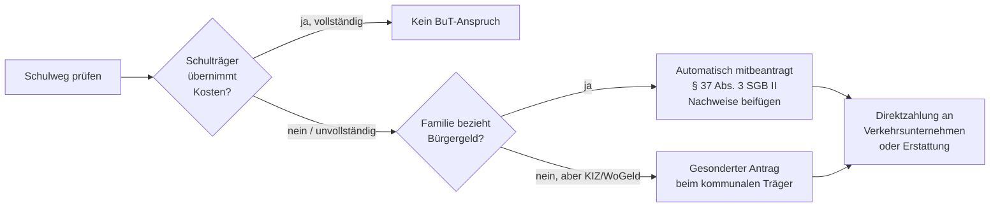

## Hintergrund

Die **Schülerbeförderungskosten** nach § 28 Abs. 4 SGB II erstatten die notwendigen Fahrtkosten zur Schule, wenn die öffentliche Hand keine kostenfreie Beförderung bereitstellt und die Entfernung eine zumutbare Fußweg-Strecke überschreitet. Die Leistung ist Teil des Bildungs- und Teilhabepakets (BuT), das 2011 nach dem BVerfG-Urteil (BVerfGE 125, 175 vom 9. Februar 2010) eingeführt wurde.

## Verhältnis zur kommunalen Schülerbeförderungspflicht

Das Schulrecht der Länder verpflichtet die Kommunen, Schülerinnen und Schüler ab einer bestimmten Mindestentfernung kostenlos oder kostengünstig zu befördern — je nach Bundesland und Schulart in der Regel ab 2 bis 4 km. Die BuT-Leistung greift nur **subsidiär**: erst wenn kein anderer Träger (Schulträger, ÖPNV-Freifahrt) die Kosten übernimmt.

**Typische Anwendungsfälle:**
- Schulweg unterschreitet die kommunale Mindestentfernung, aber ÖPNV ist trotzdem faktisch notwendig (z. B. wegen Topographie, fehlender Fußwegverbindung oder Behinderung)
- Schüler besucht eine Förderschule, zu der kein Schulträger-Bus fährt
- ÖPNV-Zuschuss des Schulträgers deckt die tatsächlichen Kosten nicht vollständig

## Erstattungsfähige Kosten

Es werden **notwendige Aufwendungen** erstattet — keine Pauschale. Was als notwendig gilt:

| Beförderungsart | Erstattung |
|---|---|
| ÖPNV (Schülermonatskarte) | Ja — tatsächlicher Ticketpreis |
| Schulbus (nicht kostenlos) | Ja |
| Taxi / Begleitservice | Nur bei nachgewiesenem Bedarf (z. B. Behinderung) |
| PKW der Eltern | Grundsätzlich nein — ÖPNV vorrangig; Ausnahmen bei fehlender ÖPNV-Verbindung |
| Fahrrad | Nicht erstattet |

Jobcenter können direkt mit dem Verkehrsunternehmen abrechnen (§ 29 SGB II), sodass Eltern nicht in Vorleistung gehen müssen.

## Nur zur nächsten geeigneten Schule

§ 28 Abs. 4 SGB II begrenzt den Anspruch auf die Kosten zur **nächstgelegenen geeigneten** Schule des jeweiligen Schulzweigs. Besucht das Kind eine weiter entfernte Schule (z. B. ein Gymnasium mit besonderem Profil), werden höchstens die Kosten zur nächstgelegenen Schule des gleichen Typs erstattet. In der Praxis ist strittig, welche Schule bei spezialisierten Förderbedarfen oder konfessionellen Schulen als „geeignet" gilt.

## Antragsweg

Bei Bürgergeld-Bezug gilt die Leistung als automatisch mitbeantragt. Familien, die nur Wohngeld oder Kinderzuschlag beziehen, müssen einen gesonderten Antrag stellen — was viele nicht wissen und damit den Anspruch verfallen lassen.

## Nichtinanspruchnahme

BuT-Leistungen insgesamt und die Schülerbeförderungskosten im Besonderen weisen eine erhebliche Nichtinanspruchnahme auf. Als Ursachen gelten:

- Familien mit Wohngeld oder Kinderzuschlag müssen aktiv einen Antrag stellen, erhalten aber oft keine proaktive Information darüber
- Die Subsidiaritätsprüfung (erst bei Schulträger anfragen) erfordert zusätzliche Schritte und Kenntnis des Systems
- Häufig besteht Unsicherheit, ob der Schulweg als „nicht zumutbar zu Fuß" gilt

## Verhältnis zu anderen BuT-Leistungen

| BuT-Leistung | Rechtsgrundlage | Besonderheit |
|---|---|---|
| Schulausflüge / Kita-Ausflüge | § 28 Abs. 2 Nr. 1 | Tatsächliche Kosten, einfacher Nachweis |
| Klassenfahrten | § 28 Abs. 2 Nr. 2 | Mehrtägig; vollständige Kostenübernahme |
| Schulbedarfspaket | § 28 Abs. 3 | Pauschale 2× jährlich |
| **Schülerbeförderungskosten** | **§ 28 Abs. 4** | **Subsidiär; aufwendigere Prüfung** |
| Lernförderung | § 28 Abs. 5 | Auf Antrag, pädagogischer Nachweis nötig |
| Mittagsverpflegung | § 28 Abs. 6 | Nur institutionelle Verpflegung |
| Soziale Teilhabe | § 28 Abs. 7 | Freizeitaktivitäten, max. 15 €/Monat |
