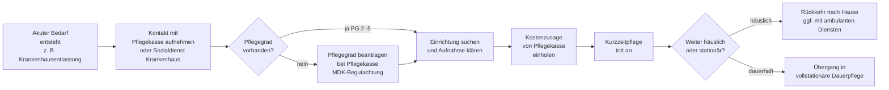

## Hintergrund

Die **Kurzzeitpflege** nach § 42 SGB XI ist eine vorübergehende vollstationäre Unterbringung pflegebedürftiger Menschen in einer zugelassenen Pflegeeinrichtung. Sie greift in Situationen, in denen die häusliche Pflege kurzfristig nicht sichergestellt werden kann — klassischerweise nach einem Krankenhausaufenthalt, bei Erkrankung der pflegenden Angehörigen oder in der Phase zwischen Krankenhausentlassung und Einzug in ein dauerhaftes Pflegeheim.

Das Instrument wurde 1994 mit dem Pflegeversicherungsgesetz (PflegeVG) eingeführt. Seitdem wurde der Leistungsbetrag mehrfach angehoben: Das Erste Pflegestärkungsgesetz (PSG I, 2015) erhöhte ihn von 1.550 € auf 1.612 €, das PSG II (2017) stellte den Pflegegradübergang sicher, und das Gesetz zur Weiterentwicklung der Gesundheitsversorgung (GVWG, 2021) hob den Betrag auf **1.774 € pro Kalenderjahr** an, der seit 2022 gilt.

Politisch ist die Kurzzeitpflege Teil der Debatte über die Nachhaltigkeit der häuslichen Pflege. Etwa 80 % der Pflegebedürftigen in Deutschland werden zu Hause gepflegt — viele davon von Angehörigen ohne professionelle Ausbildung. Die Kurzzeitpflege dient als Entlastungs- und Brückenpuffer, damit häusliche Pflegearrangements nicht dauerhaft zusammenbrechen.

## Anspruchsvoraussetzungen

Kurzzeitpflege kann in Anspruch genommen werden, wenn:

1. **Pflegegrad 2–5** festgestellt ist (Pflegegrad 1 begründet keinen Anspruch auf Kurzzeitpflege)
2. Die häusliche oder teilstationäre Pflege **vorübergehend nicht möglich oder nicht ausreichend** ist
3. Die Unterbringung in einer **zugelassenen Pflegeeinrichtung** erfolgt (vollstationäre Kurzzeitpflegeeinrichtung oder, wenn keine freien Kapazitäten vorhanden sind, auch in einer vollstationären Dauerpflegeeinrichtung, § 42 Abs. 1 S. 2 SGB XI)

Der Anspruch besteht **unabhängig davon, ob Pflegegeld oder Pflegesachleistung** bezogen wird. Auch pflegende Angehörige, die kein Pflegegeld beziehen (weil die betroffene Person z. B. Sachleistungen nutzt), können Kurzzeitpflege in Anspruch nehmen.

**Keine Beschränkung auf bestimmte Auslöser:** Das Gesetz nennt keine abschließenden Gründe; jede Situation, in der häusliche Pflege vorübergehend nicht möglich ist, reicht aus — Krankenhausnachsorge, Urlaub des pflegenden Angehörigen, Krankheit der Pflegeperson, Umbau der häuslichen Pflegeumgebung.

## Leistungshöhe und Eigenanteil

Die Pflegekasse übernimmt die **pflegebedingten Aufwendungen**, Aufwendungen der sozialen Betreuung und die Aufwendungen für medizinische Behandlungspflege in der Kurzzeitpflegeeinrichtung bis zu folgenden Grenzen:

| Merkmal | Betrag / Dauer |
| --- | ---: |
| Maximalbetrag pro Kalenderjahr | 1.774 € |
| Maximale Dauer pro Kalenderjahr | 8 Wochen (56 Tage) |
| Erweiterungsbetrag (aus Verhinderungspflegebudget, § 39 SGB XI) | bis zu 1.612 € zusätzlich |
| Gesamtmaximum mit Verhinderungspflege-Aufstockung | bis zu 3.386 € |

**Wichtig:** Die 8 Wochen und der Geldbetrag sind **unabhängige** Grenzen — erschöpft, wer zuerst eintritt.

**Eigenanteil:** Die Pflegekasse zahlt nur die pflegebedingten Kosten. Unterkunft, Verpflegung und Investitionskosten trägt die pflegebedürftige Person selbst. In der Praxis können diese Kosten 40–80 € pro Tag betragen, sodass eine vierwöchige Kurzzeitpflege trotz Kassenleistung mit 1.000–2.000 € Eigenkosten verbunden sein kann.

**Pflegegeldfortzahlung:** Während der Kurzzeitpflege wird das Pflegegeld zur Hälfte weitergezahlt (§ 37 Abs. 2 SGB XI) — eine Regelung, die pflegenden Angehörigen ermöglicht, auch während der Einrichtungsphase ihren Lebensunterhalt zu sichern.

## Wechselwirkung mit Verhinderungspflege (§ 39 SGB XI)

Die Kurzzeitpflege und die Verhinderungspflege (§ 39 SGB XI) sind eng miteinander verknüpft. Nicht verbrauchte Mittel aus dem Verhinderungspflegebudget (1.612 €/Jahr) können vollständig für Kurzzeitpflege genutzt werden:

```
Kurzzeitpflegebudget:     1.774 €
+ Verhinderungspflege:  + 1.612 €
= Gesamtmaximum:          3.386 €
```

Umgekehrt gilt: Bis zu 50 % des Kurzzeitpflegebudgets (= 887 €) können für Verhinderungspflege eingesetzt werden.

Diese Flexibilisierung wurde mit dem PSG II (2017) eingeführt, um Familien mehr Spielraum bei der Pflegeplanung zu geben. In der Praxis erfordert sie eine genaue Haushaltskontrolle, da beide Budgets jahreszyklisch gebunden sind.

## Antragsweg



**Antrag:** Der Antrag auf Kurzzeitpflege kann formlos per Telefon oder schriftlich bei der Pflegekasse gestellt werden. In vielen Fällen übernimmt der Sozialdienst des Krankenhauses die Koordination.

**Keine Genehmigungspflicht im Voraus:** Die Kurzzeitpflege muss nicht vorab genehmigt werden; die Abrechnung erfolgt direkt zwischen Einrichtung und Pflegekasse. Eine frühzeitige Ankündigung ist jedoch sinnvoll, damit die Pflegekasse die Kostenübernahme bestätigen kann.

**Kassenwechsel:** Bei einem Wechsel der Pflegekasse im Laufe des Jahres läuft der Anspruch anteilig weiter; bereits verbrauchte Budgetanteile werden vom neuen Träger berücksichtigt.

## Verhältnis zu anderen Leistungen

- **Verhinderungspflege (§ 39 SGB XI):** Engster Verwandter der Kurzzeitpflege. Während die Verhinderungspflege eher für stundenweise oder tagesweise Vertretungen (ambulant oder im häuslichen Umfeld) konzipiert ist, adressiert die Kurzzeitpflege vollstationäre Unterbringung. Beide Budgets können unter bestimmten Bedingungen füreinander genutzt werden (s. o.).
- **Vollstationäre Dauerpflege (§ 43 SGB XI):** Kurzzeitpflege wird häufig als Übergangslösung vor dem Einzug ins Pflegeheim genutzt. Nach spätestens 8 Wochen muss eine Entscheidung über die weitere Versorgungsform getroffen werden.
- **Krankenhausbehandlung (SGB V):** Die Krankenkasse finanziert die Akutbehandlung; nach Entlassung übernimmt die Pflegekasse via Kurzzeitpflege — die Schnittstelle ist häufig Reibungspunkt. Seit 2022 kann der Sozialdienst des Krankenhauses Kurzzeitpflegeplätze über ein digitales Belegungsmanagement anfragen.
- **Geriatrische Rehabilitation:** Wenn nach einem Krankenhausaufenthalt Rehabilitationspotenzial besteht, sollte zunächst Rehabilitationsleistungen nach § 40 SGB V geprüft werden — Reha hat Vorrang vor Kurzzeitpflege. In der Praxis wird Kurzzeitpflege oft zu früh gewählt.
- **Pflegegeld (§ 37 SGB XI):** Läuft während der Kurzzeitpflege zur Hälfte weiter (§ 37 Abs. 2 SGB XI). Diese hälftige Fortzahlung soll pflegende Angehörige für den Zeitraum der Entlastung absichern.
- **Hilfe zur Pflege (SGB XII):** Wer die Eigenkostenanteil (Unterkunft, Verpflegung) nicht selbst tragen kann, kann bei Bedürftigkeit Hilfe zur Pflege beim Sozialamt beantragen. Diese übernimmt die Kosten nach Vermögens- und Einkommensprüfung.

## Versorgungslage und praktische Herausforderungen

**Platzmangel:** In Ballungsräumen und in bestimmten Regionen sind Kurzzeitpflegeplätze knapp. Viele vollstationäre Einrichtungen bevorzugen Dauerpflegeplätze wegen besserer Planbarkeit. Bundesweit gibt es deutlich weniger spezialisierte Kurzzeitpflegeeinrichtungen als den Bedarf decken könnte.

**Bürokratie:** Die Antragstellung und Abrechnung ist trotz formloser Möglichkeit in der Praxis mit erheblichem Aufwand verbunden — insbesondere wenn Verhinderungspflegebudget mitgenutzt werden soll. Pflegeberatung nach § 7a SGB XI kann helfen.

**Nichtinanspruchnahme:** Schätzungen des Wissenschaftlichen Instituts der AOK (WIdO) zufolge schöpfen nur etwa 40–50 % der anspruchsberechtigten Pflegebedürftigen die Kurzzeitpflegeleistungen vollständig aus. Gründe sind Informationsmangel, Platzmangel und die Hemmung pflegender Angehöriger, „loszulassen".

**Reform 2025 (Jahrespflegebetrag):** Im Rahmen der Pflegefinanzierungsreform-Diskussionen wurde die Zusammenlegung von Kurzzeitpflege und Verhinderungspflege zu einem gemeinsamen „Jahrespflegebetrag" von ca. 3.386 € diskutiert. Eine entsprechende Regelung ist im Koalitionsvertrag 2025 vorgesehen, aber zum Redaktionszeitpunkt noch nicht final in Kraft getreten.
