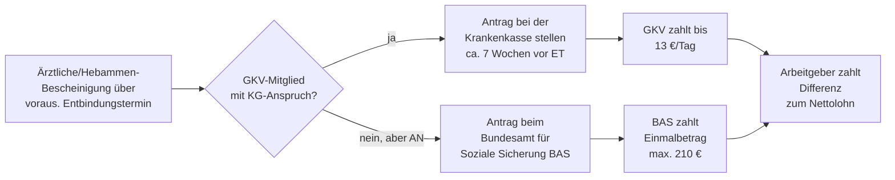

## Geschichte

Der Schutz von Müttern im Arbeitsleben gehört zu den ältesten sozialpolitischen Errungenschaften in Deutschland:

- **1878** – *Arbeiterschutzgesetz*: Verbot der Fabrikarbeit für vier Wochen nach der Geburt — erster gesetzlicher Nachschutz, jedoch ohne Lohnersatz.
- **1883** – *Krankenversicherungsgesetz* (Bismarck): Krankengeld wurde in der Mutterschutzzeit auch für Wöchnerinnen gewährt — der Keim des späteren Mutterschaftsgeldes.
- **1927** – Ausdehnung der Fristen und Einführung eines eigenständigen Wochenhilfegeldes in der Reichsversicherung.
- **1952** – Erstes **Mutterschutzgesetz (MuSchG)** der Bundesrepublik: Kodifizierung von Beschäftigungsverbot und Lohnfortzahlung durch Krankenkassen. Schutzfrist: 6 Wochen vor und 6 Wochen nach der Geburt.
- **1965** – Reform des MuSchG: Mutterschaftsgeld wird erstmals als eigenständige Leistung ausgestaltet (nicht mehr als Krankengeld-Variante).
- **1979** – Verlängerung der Nachfrist auf **8 Wochen** nach der Geburt; bei Früh- und Mehrlingsgeburten 12 Wochen.
- **2006** – Einführung des **Elterngeldes** (BEEG): Mutterschaftsgeld und Elterngeld werden seither als aufeinanderfolgende Leistungen konzipiert; Mutterschaftsgeld wird auf Elterngeld angerechnet.
- **2018** – **Neues Mutterschutzgesetz**: Persönlicher Anwendungsbereich wird erheblich erweitert — nunmehr auch Schülerinnen, Studentinnen und in Heimarbeit Beschäftigte sind geschützt. Allerdings besteht für diese Gruppen kein Anspruch auf *Mutterschaftsgeld* (nur auf das Beschäftigungsverbot).

## Anspruchsgruppen

Das Mutterschaftsgeld splittet sich in zwei rechtlich eigenständige Leistungen:

### 1. GKV-Mutterschaftsgeld (§ 24i SGB V)

Voraussetzungen:
- **Mitgliedschaft in der GKV** mit Anspruch auf Krankengeld (Pflicht- oder freiwillig Versicherte; **nicht** familienversicherte Mitglieder ohne eigene Mitgliedschaft)
- **Bestehendes Beschäftigungs- oder Heimarbeitsverhältnis** zu Beginn der Mutterschutzfrist
- Ausstellung einer **ärztlichen Bescheinigung** über den voraussichtlichen Entbindungstermin

### 2. Bundesamt-Mutterschaftsgeld (§ 19 Abs. 2 MuSchG)

Für Frauen mit Beschäftigungsverhältnis, die **nicht** über die GKV anspruchsberechtigt sind:
- Privat krankenversicherte Arbeitnehmerinnen
- Geringfügig Beschäftigte (Minijob), die freiwillig in der GKV ohne Krankengeldanspruch versichert sind

Die Zahlung ist eine **einmalige Pauschale von maximal 210 €** und wird vom **Bundesamt für Soziale Sicherung (BAS)** in Bonn ausgezahlt.

**Keinen Anspruch** auf Mutterschaftsgeld haben:
| Personengruppe | Grund |
| --- | --- |
| Selbstständige | Kein Beschäftigungsverhältnis im Sinne des MuSchG |
| Beamtinnen | Eigene Regelungen über Mutterschutz und Bezüge |
| Studentinnen / Schülerinnen | Kein Arbeitsverhältnis; Mutterschutzfrist gilt, aber kein Geldanspruch |
| Personen ohne Arbeitsverhältnis (z. B. arbeitssuchend) | Kein laufendes Beschäftigungsverhältnis |

Selbstständige und andere Nicht-Arbeitnehmerinnen können ggf. über die GKV-freiwillige Versicherung Krankengeld erhalten — dieses endet jedoch mit Beginn der Mutterschutzfrist und wird dort nicht durch Mutterschaftsgeld ersetzt.

## Berechnung

### GKV-Mutterschaftsgeld

Das Mutterschaftsgeld beträgt **100 % des durchschnittlichen kalendertäglichen Netto-Arbeitsentgelts** der letzten drei abgerechneten Kalendermonate vor dem Beginn der Mutterschutzfrist, **höchstens 13 € pro Kalendertag** (§ 24i Abs. 2 SGB V).

```
Tägliches GKV-Mutterschaftsgeld = Ø Netto-Arbeitsentgelt/Tag (letzte 3 Monate)
                                   max. 13 €
```

**Beispielrechnung:**

| Position | Betrag |
| --- | ---: |
| Nettolohn Monat –3 | 2.100 € |
| Nettolohn Monat –2 | 2.200 € |
| Nettolohn Monat –1 | 2.050 € |
| Summe 3 Monate | 6.350 € |
| Ø pro Kalendertag (÷ 90) | 70,56 € |
| **GKV-Mutterschaftsgeld/Tag (gedeckelt)** | **13,00 €** |

Da 13 € täglich in vielen Fällen unter dem tatsächlichen Nettolohn liegt, schließt der **Arbeitgeberzuschuss** (§ 20 MuSchG) die Lücke (→ *Arbeitgeberzuschuss zum Mutterschaftsgeld*).

### Arbeitgeberzuschuss (§ 20 MuSchG)

Der Arbeitgeber zahlt die Differenz zwischen dem GKV-Mutterschaftsgeld (max. 13 €/Tag) und dem tatsächlichen durchschnittlichen Netto-Arbeitsentgelt pro Kalendertag:

```
Arbeitgeberzuschuss/Tag = Ø Netto-Arbeitsentgelt/Tag − GKV-Mutterschaftsgeld/Tag
```

Im obigen Beispiel: 70,56 € − 13,00 € = **57,56 €/Tag** vom Arbeitgeber. Zusammen ergibt sich eine vollständige Einkommensersatzleistung in Höhe des Nettolohns.

### Bundesamt-Mutterschaftsgeld

Maximal **210 €** als Einmalbetrag für die gesamte Mutterschutzfrist; kein Tagessatz-Modell.

## Bezugsdauer

| Phase | Dauer |
| --- | --- |
| Vor dem errechneten Entbindungstermin | **6 Wochen** (Beschäftigungsverbot nach § 3 MuSchG) |
| Entbindungstag | zählt zur Nachfrist |
| Nach der Geburt (Regelfall) | **8 Wochen** |
| Nach Frühgeburt (vor der 37. SSW) | **12 Wochen** |
| Nach Mehrlingsgeburt | **12 Wochen** |
| Nach einer Behinderung des Kindes | **12 Wochen** |

**Verlängerung bei Frühgeburt:** Wird das Kind vor dem errechneten Termin geboren, verlängert sich die Nachfrist entsprechend: Die 6 Wochen-Vorschutzfrist wird rückwirkend durch die tatsächlich nicht ausgefüllte Vorschutzzeit aufgestockt (§ 3 Abs. 2 MuSchG). Das GKV-Mutterschaftsgeld wird über die verlängerte Frist ausgezahlt.

**Rückwirkender Beginn:** Wird das Kind nach dem errechneten Termin geboren (Überschreitung), verlängert sich die Nachfrist nicht — die Vorschutzzeit verlängert sich hingegen faktisch, da das Beschäftigungsverbot bis zum tatsächlichen Geburtstermin andauert. Mutterschaftsgeld wird für die tatsächliche Vorschutzzeit gezahlt.

## Antragsweg



**Erforderliche Unterlagen (GKV):**
- Formloser Antrag oder Formular der Krankenkasse
- Ärztliche oder Hebammen-Bescheinigung mit voraussichtlichem Entbindungstermin (nicht erst nach der Geburt warten — Antrag kann bereits 7 Wochen vor dem Termin gestellt werden)

**Erforderliche Unterlagen (BAS):**
- Amtlicher Vordruck des BAS
- Bescheinigung des Arztes oder der Hebamme
- Angaben zum Arbeitgeber und zur Beschäftigung

Der Antrag beim BAS kann erst nach der Geburt abgeschlossen werden (weil der genaue Geburtstermin relevant ist); es empfiehlt sich jedoch, alle Unterlagen frühzeitig zusammenzustellen.

## Steuerliche Behandlung

Mutterschaftsgeld ist nach § 3 Nr. 1d EStG **steuerfrei**, unterliegt jedoch dem **Progressionsvorbehalt** (§ 32b Abs. 1 Satz 1 Nr. 1 Buchst. g EStG). Das bedeutet: Das steuerfreie Mutterschaftsgeld wird dem zu versteuernden Einkommen rechnerisch hinzugerechnet, um den maßgebenden Steuersatz zu ermitteln. Im Jahr des Bezugs kann daher eine Steuernachzahlung entstehen, wenn parallel steuerpflichtige Einkünfte (z. B. Arbeitslohn im selben Jahr) vorlagen.

Der **Arbeitgeberzuschuss** ist hingegen **steuerpflichtiger Arbeitslohn** (§ 14 Abs. 1 MuSchG, R 3.2 LStR) und wird mit den übrigen Bezügen versteuert.

## Verhältnis zu anderen Leistungen

- **Arbeitgeberzuschuss zum Mutterschaftsgeld (§ 20 MuSchG)**: Ergänzt das GKV-Mutterschaftsgeld auf das volle Netto-Arbeitsentgelt. Beide Leistungen laufen parallel und zusammen ergibt sich eine vollständige Lohnfortzahlung während der Mutterschutzfrist (→ *Arbeitgeberzuschuss zum Mutterschaftsgeld*).
- **Elterngeld (BEEG)**: Schließt direkt an die Mutterschutzfrist an. Das Mutterschaftsgeld und der Arbeitgeberzuschuss werden auf das Elterngeld **angerechnet** (§ 3 Abs. 1 BEEG): Für Monate, in denen Mutterschaftsgeld gezahlt wurde, entfällt das Elterngeld (da das Mutterschaftsgeld in der Regel höher ist als der Elterngeld-Mindestsatz von 300 €). Elterngeldmonate während der Mutterschutzfrist sind damit tatsächlich nicht verbraucht — sie stehen noch zur Verfügung.
- **Krankengeld (§ 49 Abs. 1 Nr. 3 SGB V)**: Ruht mit Beginn der Mutterschutzfrist; das Mutterschaftsgeld tritt an seine Stelle. Da das Mutterschaftsgeld typischerweise höher ist, entsteht kein Nachteil.
- **Bürgergeld (SGB II)**: Das Mutterschaftsgeld gilt als **Einkommen** und wird auf das Bürgergeld angerechnet (§ 11 SGB II). Für Bürgergeld-Beziehende bedeutet das im Regelfall keine zusätzliche Zahlung.
- **Elterngeld-Bemessungszeitraum**: Für die Berechnung des Elterngeldes werden die letzten 12 Monate vor dem Geburtsmonat herangezogen. Monate mit Mutterschaftsgeld-Bezug werden aus dem Bemessungszeitraum **herausgenommen** (§ 2b Abs. 1 BEEG) und durch frühere Monate ersetzt, um eine Minderung des Elterngeldes zu vermeiden.

## Häufige Fehler und Fallstricke

- **Antrag zu spät stellen**: Das GKV-Mutterschaftsgeld beginnt bereits 6 Wochen vor dem errechneten Termin. Wer erst nach der Geburt beantragt, erhält rückwirkend die Leistung — die Auszahlung verzögert sich jedoch. Sinnvoll: Antrag stellen, sobald die Bescheinigung vorliegt (etwa ab der 32. SSW).
- **Familienversicherte ohne eigene Mitgliedschaft**: Mütter, die über den Ehepartner familienversichert sind, ohne selbst GKV-Mitglied zu sein, haben **keinen** Anspruch auf das GKV-Mutterschaftsgeld (§ 10 SGB V schließt Krankengeld und damit Mutterschaftsgeld aus). Ggf. BAS-Antrag prüfen.
- **Progressionsvorbehalt-Überraschung**: Das steuerfreie Mutterschaftsgeld muss in der Steuererklärung angegeben werden (Anlage N). Wer das vergisst, riskiert eine Steuernachforderung mit Säumniszuschlägen.
- **Arbeitgeberzuschuss bei neuem Arbeitgeber**: Einige Frauen wechseln kurz vor der Geburt den Arbeitgeber. Der Arbeitgeberzuschuss wird vom Arbeitgeber gezahlt, der zum Zeitpunkt des Beginns der Mutterschutzfrist der aktuelle Arbeitgeber ist — selbst wenn das Arbeitsverhältnis während der Mutterschutzfrist enden würde (§ 17 MuSchG schützt vor ordentlicher Kündigung).
- **Kündigung und Mutterschutz**: Der Mutterschutz gilt ab Bekanntgabe der Schwangerschaft (§ 17 MuSchG). Eine ordentliche Kündigung durch den Arbeitgeber ist während der gesamten Mutterschutzfrist und der Elternzeit unzulässig. Die Leistungspflicht des Arbeitgebers für den Zuschuss bleibt während dieser Zeit bestehen.
