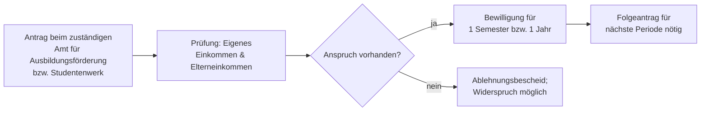

## Geschichte

Das **Bundesausbildungsförderungsgesetz (BAföG)** trat am 1. September 1971 in Kraft und löste das *Honnefer Modell* ab, ein 1957 eingeführtes Stipendiensystem, das nur einen kleinen Teil der Studierenden erreichte und weitgehend als Darlehen ausgestaltet war. Mit dem BAföG verfolgte die sozialliberale Koalition unter Willy Brandt das Ziel, Bildung vom Elterneinkommen zu entkoppeln und den Hochschulzugang zu demokratisieren.

Wichtige Meilensteine:

- **1971** – Einführung des BAföG für Hochschulen und Akademien; Schüler folgen 1972
- **1983** – Systemwechsel: Das Schüler-BAföG bleibt Vollzuschuss; das Studierenden-BAföG wird vollständig auf Darlehen umgestellt — ein unpopulärer Sparschritt
- **1990** – Erneuter Systemwechsel zurück: Das Studierenden-BAföG wird zur heutigen **50/50-Lösung** (hälftig Zuschuss, hälftig Darlehen)
- **2002** – Abschaffung des Darlehensanteils für Schüler-BAföG; es wird wieder vollständig zum Zuschuss
- **2010–2022** – Mehrere BAföGÄndG erhöhen sukzessive Bedarfssätze und Freibeträge, bleiben aber oft hinter der Inflation und steigenden Lebenshaltungskosten zurück
- **2022/23** – **26. BAföGÄndG**: Bislang größte Reform seit 1990. Bedarfssätze und Freibeträge werden um rund 5 % erhöht; die Wohnpauschale für nicht bei den Eltern Wohnende wird auf 360 € angehoben; neue **Studienstarthilfe** ([[d833f122ea]]) für besonders Bedürftige eingeführt
- **2024/25** – Weitere Anhebung der Wohnpauschale auf 380 €; Höchstsatz erreicht 992 €/Monat

## Was wird gefördert?

Gefördert werden **Lebensunterhalt und Ausbildungskosten** für:

- Hochschulen (Universitäten, Fachhochschulen, Berufsakademien)
- bestimmte **schulische** Ausbildungen — Berufsfachschulen, Fachoberschulen, Fachschulen (Schüler-BAföG, [[38ef597ba1]])
- **Praktika**, die im Zusammenhang mit der Ausbildung stehen ([[2d4f02971b]])

Nicht gefördert werden duale Ausbildungen (hier greift die Berufsausbildungsbeihilfe, BAB) und private Hochschulen ohne staatliche Anerkennung.

## Förderungsarten (§ 17)

Die Form der Förderung hängt von der Ausbildungsart ab:

| Ausbildung | Förderform |
|---|---|
| Studium (Hochschule) | 50 % Zuschuss + 50 % zinsloses Staatsdarlehen |
| Schüler-BAföG | Vollzuschuss — muss nicht zurückgezahlt werden |

Beim Studierenden-BAföG ist die eine Hälfte ein nicht rückzahlbarer **Zuschuss**, die andere ein **zinsloses Staatsdarlehen** (§ 17 Abs. 2 BAföG), das nach Ende der Ausbildung zurückgezahlt wird — gedeckelt auf maximal **10.010 €** (§ 17 Abs. 2 Satz 1 BAföG). Wer über die Förderungshöchstdauer hinaus mehr Darlehen erhalten hat, zahlt trotzdem höchstens 10.010 € zurück; der Rest wird erlassen.

## Darlehensrückzahlung

Die Rückzahlung des Darlehensanteils beginnt **5 Jahre nach dem Ende der Förderungshöchstdauer** (§ 18 Abs. 1 BAföG). Die monatliche Mindestrate beträgt **130 €**; wer weniger als 1.330 € netto monatlich verdient, kann Stundung beantragen.

Besonderheiten:
- **Einkommensabhängige Stundung**: Auf Antrag wird die Rückzahlung ausgesetzt, wenn das Einkommen unter dem Freibetrag liegt. Die gestundeten Beträge verfallen nach einer Gesamtfrist von 20 Jahren, falls die Rückzahlung bis dahin nicht abgeschlossen ist (§ 18a BAföG).
- **Frühzahlerrabatt**: Wer den gesamten Darlehensbetrag auf einmal tilgt, erhält einen Nachlass; der Rabatt sinkt mit zunehmender Zeit nach Rückzahlungsbeginn.
- **Rückzahlungsadressat**: Die Rückzahlung erfolgt an das **Bundesverwaltungsamt (BVA)**, das auch Verzögerungen und Ratenpläne verwaltet.

## Zahlen zur Inanspruchnahme

- **2024**: rund **612.800 Geförderte**, durchschnittlich etwa **635 € pro Monat**
- Ausgaben: ca. **3,4 Mrd. €** jährlich (Bund und Länder gemeinsam)
- Die **Gefördertenquote** (Anteil der Studierenden mit BAföG) sank von ihrem Hochpunkt Mitte der 1990er Jahre auf unter 20 % bis Mitte der 2010er Jahre. Trotz der Reformen 2022 und 2024 ist der Trend strukturell rückläufig, weil steigende Studierendenzahlen und steigende Elterneinkommen mehr Haushalte über die Einkommensfreibeträge heben.

## Antragsweg

BAföG wird **nicht rückwirkend** bewilligt: Es gilt ab dem Monat der **Antragstellung**, frühestens. Wer im Oktober das Studium beginnt, aber den Antrag erst im Dezember stellt, erhält kein Geld für Oktober und November. Frühzeitige Antragstellung ist daher essentiell. Für Studentinnen und Studenten ist in der Regel das **Studentenwerk** am Hochschulort zuständig, für Schüler das kommunale **Amt für Ausbildungsförderung**.

## Kritik: sinkende Gefördertenquote

Die langfristig **rückläufige Gefördertenquote** ist der meistdiskutierte Kritikpunkt am BAföG. Kernprobleme:

1. **Stagnierende Freibeträge**: Elterneinkommen werden anhand von Freibeträgen aus dem Vorvorjahr berechnet. In wirtschaftlich guten Phasen wächst das Einkommen schneller als die Freibeträge, wodurch Familien mit mittlerem Einkommen herausfallen.
2. **Wohnpauschale unter Marktmieten**: In Großstädten deckt die Pauschale die reale Miete nicht. Dies trifft vor allem städtische Hochschulen mit teuren Wohnungsmärkten.
3. **Elternunabhängiges BAföG**: Nur für Kinder ab 30 Jahren oder unter engen Ausnahmen ist Elterneinkommen irrelevant. Viele Studierende, deren Eltern zahlen könnten, aber nicht zahlen, fallen durch alle Raster.

Reformen (höhere Freibeträge, Studienstarthilfe [[d833f122ea]], Wohnpauschalen-Erhöhungen) haben die Gefördertenquote kurzfristig stabilisiert, lösen aber das Strukturproblem nicht dauerhaft. Die konkreten Bedarfssätze regeln §§ 12–14, die Freibeträge §§ 23, 25, 29.
