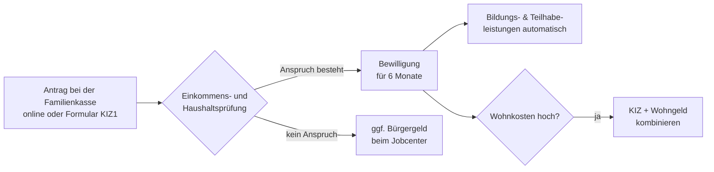

## Geschichte

Der **Kinderzuschlag** (KIZ) wurde zum 1. Januar 2005 als Teil des Vierten Gesetzes für moderne Dienstleistungen am Arbeitsmarkt eingeführt. Ziel war, Familien mit kleinem Erwerbseinkommen davor zu bewahren, allein wegen der Kosten ihrer Kinder auf Arbeitslosengeld II angewiesen zu sein.

Wichtige Meilensteine:

- **2005** – Einführung bei max. 140 € pro Kind und Monat (§ 6a BKGG)
- **2017** – Erhöhung auf 170 €
- **2019** – Grundlegende Reform durch das **Starke-Familien-Gesetz**: Abschaffung des abrupten Einkommensendes (vorher: 1 € Mehreinkommen = vollständiger Wegfall), gleitende Einkommensanrechnung, Erhöhung auf 185 €, Kombination mit Wohngeld explizit ermöglicht
- **2021** – Erhöhung auf 205 €
- **2023** – Erhöhung auf 250 €
- **2024** – Erhöhung auf 292 €
- **2025** – 297 € pro Kind und Monat

## Anspruchsvoraussetzungen

Der KIZ setzt folgende Bedingungen kumulativ voraus (§ 6a Abs. 1 BKGG):

1. **Kindergeldbezug**: Die antragstellende Person erhält Kindergeld für das Kind.
2. **Haushalt**: Das Kind lebt im Haushalt und ist unter 25 Jahre alt.
3. **Mindesteinkommen** (§ 6a Abs. 1 Nr. 2 BKGG):
   - **900 € brutto/Monat** für Paare
   - **600 € brutto/Monat** für Alleinerziehende
4. **Keine Hilfebedürftigkeit**: Mit dem KIZ — ggf. ergänzt durch Wohngeld — ist keine Hilfebedürftigkeit nach SGB II mehr anzunehmen.

Die Mindesteinkommensgrenze soll sicherstellen, dass der KIZ nur erwerbstätigen Eltern zugute kommt; wer deutlich unter dieser Grenze liegt, wird auf Bürgergeld verwiesen.

## Berechnung

Der monatliche KIZ-Betrag wird für jedes Kind gesondert bestimmt. Vereinfacht gilt:

```
KIZ je Kind = Max. KIZ − 0,45 × (elterliches Nettoeinkommen − elterlicher Bedarf)
```

Für jeden Euro, den das bereinigte Elterneinkommen den elterlichen Bedarf nach SGB II übersteigt, sinkt der KIZ um **45 Cent**. Damit löst das Starke-Familien-Gesetz 2019 die frühere Klippe ab, bei der jede zusätzliche Einnahme sofort den gesamten Zuschlag wegfallen ließ.

| Einkommenssituation der Eltern | KIZ-Effekt |
| --- | --- |
| Einkommen = elterlicher Bedarf | Voller KIZ (297 €/Kind, Stand 2025) |
| Einkommen 100 € über elterl. Bedarf | KIZ sinkt um 45 € → 252 €/Kind |
| Einkommen 660 € über elterl. Bedarf | KIZ = 0 |

Eigenes Einkommen des Kindes (z. B. Unterhalt, Ausbildungsvergütung) wird ebenfalls angerechnet: Es mindert den kindlichen Bedarf, den der KIZ decken soll.

## Kombination mit Wohngeld

Seit 2019 ist der KIZ ausdrücklich mit **Wohngeld** kombinierbar. Das sogenannte *Gesamtpaket* (KIZ + Wohngeld) ist häufig vorteilhafter als Bürgergeld, wenn Eltern Erwerbseinkommen haben. Die Familienkasse bietet auf ihrer Website einen Vergleichsrechner an.

Das Jobcenter prüft bei einem Bürgergeld-Antrag automatisch, ob ein KIZ-/Wohngeld-Paket zumutbar wäre; in diesem Fall kann die Hilfebedürftigkeit verneint und der Antrag abgelehnt werden.

## Bildungs- und Teilhabeleistungen

Familien mit Kinderzuschlag haben **kraft Gesetzes Anspruch auf Bildungs- und Teilhabeleistungen** (§ 6b BKGG) — ohne eigenen SGB-II-Antrag:

- Eintägige Schul- und Kitaausflüge
- Schulbedarfspaket (195 € pro Schuljahr)
- Schülerbeförderungskosten
- Lernförderung (Nachhilfe)
- Mittagsverpflegung in Schule, Kita und Hort
- Teilhabe am sozialen und kulturellen Leben (15 €/Monat für Verein, Musikschule, Ferienfreizeit)

## Antragsweg



Der Bewilligungszeitraum beträgt immer **sechs Monate**; danach ist eine erneute Antragstellung erforderlich. Rückwirkend kann der KIZ nur für den Monat der Antragstellung gewährt werden — es gibt keine Drei-Monats-Rückwirkung wie beim Elterngeld.

## Nichtinanspruchnahme

Studien schätzen, dass je nach Jahr nur 30–60 % der anspruchsberechtigten Familien den KIZ tatsächlich beantragen. Häufige Gründe:

- Unkenntnis: Viele Familien wissen nicht, dass sie trotz Erwerbsarbeit Anspruch haben könnten
- Berührungsangst mit Behörden und Bürgergeld-Stigma
- Komplexität des Einkommenstests (bereinigtes Nettoeinkommen nach SGB II-Logik)
- Annahme, das Einkommen liege zu hoch — oft falsch, weil Freibeträge nicht berücksichtigt werden

Die Familienkasse und das BMAS werben daher gezielt für den Online-Schnellcheck.

## Verhältnis zu anderen Leistungen

- **Kindergeld**: Voraussetzung für den KIZ; der KIZ schließt die Lücke, die das Kindergeld allein nicht schließen kann
- **Bürgergeld**: KIZ ist vorrangig; wer mit KIZ aus der Hilfebedürftigkeit herauskommt, kann kein Bürgergeld beziehen
- **Wohngeld**: Kombinierbar; das KIZ-Wohngeld-Paket ist für erwerbstätige Familien oft günstiger als Bürgergeld
- **Elterngeld**: Elterngeld über 300 € wird als Einkommen bei der KIZ-Berechnung angerechnet
- **Unterhalt**: Unterhaltszahlungen für das Kind mindern den KIZ-Bedarf des Kindes und damit den Zuschlag
