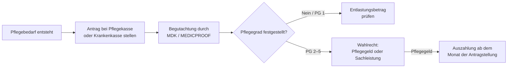

## Hintergrund

Das **Pflegegeld** nach § 37 SGB XI ist die meistgenutzte Geldleistung der sozialen Pflegeversicherung. Es wird an Pflegebedürftige gezahlt, die ihre Pflege selbst organisieren — in der Regel durch Familienangehörige oder andere nahestehende Personen. Anders als die Pflegesachleistung (§ 36 SGB XI) bindet das Pflegegeld nicht an zugelassene Pflegedienste: Es steht dem Empfänger frei, das Geld zur Anerkennung und Unterstützung seiner Pflegeperson(en) einzusetzen.

Rund **2,4 Millionen Menschen** bezogen Anfang 2024 ausschließlich Pflegegeld (Pflegegeld ohne Kombination mit Sachleistungen). Zusammen mit Kombinationsleistungsbeziehern ist Pflegegeld damit die quantitativ dominante häusliche Pflegeleistung. Dieser Anteil spiegelt die in Deutschland tief verankerte Tradition der Pflege durch Angehörige wider: Etwa drei Viertel aller Pflegebedürftigen werden zumindest teilweise zu Hause versorgt.

## Historische Entwicklung

- **1994** – Einführung des SGB XI (Pflegeversicherungsgesetz). Die soziale Pflegeversicherung wird als fünfte Säule der Sozialversicherung eingeführt.
- **1995** – Inkrafttreten der häuslichen Pflegeleistungen (1. Januar): Pflegegeld wird erstmals ausgezahlt. Anfangsbeträge: Pflegestufe 1: 400 DM, Stufe 2: 800 DM, Stufe 3: 1.300 DM.
- **2008** – Pflege-Weiterentwicklungsgesetz: Einführung des Anspruchs auf Pflegeberatung und Beratungseinsätze für Pflegegeldempfänger.
- **2017** – Zweites Pflegestärkungsgesetz (PSG II): Ablösung der drei Pflegestufen durch fünf **Pflegegrade**. Das neue Begutachtungsinstrument berücksichtigt erstmals gleichberechtigt kognitive und psychische Beeinträchtigungen (relevant für Demenz). Die Pflegegeldbeträge werden neu gestaffelt.
- **2022** – Erhöhung der Pflegegeldbeträge um jeweils ca. 5 % (Pflegeunterstützungs- und -entlastungsgesetz – PUEG).
- **2025** – Weitere Anpassung der Leistungsbeträge um 4,5 % ab 1. Januar 2025 (PUEG Stufe 2).

## Wer hat Anspruch?

Pflegegeld erhalten Versicherte der sozialen oder privaten Pflegeversicherung, die

1. einen **Pflegegrad 2, 3, 4 oder 5** haben (Pflegegrad 1 berechtigt nicht zum Pflegegeld — hier gibt es nur den Entlastungsbetrag nach § 45b SGB XI),
2. **zu Hause** gepflegt werden (nicht vollstationär in einem Pflegeheim),
3. die erforderliche Grundpflege und hauswirtschaftliche Versorgung **in geeigneter Weise sicherstellen** — d. h. ihre Pflegeperson(en) müssen die Pflege tatsächlich übernehmen.

Ein formelles Verwandtschaftsverhältnis zur Pflegeperson ist **nicht** erforderlich. Auch Freunde, Nachbarn oder ehrenamtliche Helfer gelten als „selbst beschaffte Pflegehilfen".

## Leistungsbeträge (ab 1. Januar 2025)

| Pflegegrad | Pflegegeld/Monat |
| ---: | ---: |
| 1 | — |
| 2 | **332 €** |
| 3 | **573 €** |
| 4 | **765 €** |
| 5 | **947 €** |

> Die genauen aktuellen Beträge veröffentlicht das Bundesgesundheitsministerium laufend. Maßgeblich ist stets die zuletzt geltende Fassung der Leistungsbetragsübersicht (→ Ressourcen).

Das Pflegegeld wird monatlich im Voraus auf das Konto des Pflegebedürftigen überwiesen. Es ist **steuerfrei** und wird nicht auf Sozialleistungen wie Grundsicherung oder Bürgergeld angerechnet.

## Beratungseinsätze (Pflicht)

Pflegegeldempfänger sind verpflichtet, regelmäßig **Beratungseinsätze** durch einen zugelassenen Pflegedienst oder eine anerkannte Beratungsstelle abzurufen (§ 37 Abs. 3 SGB XI). Diese Hausbesuche dienen der Qualitätssicherung und der Beratung der Pflegeperson.

| Pflegegrad | Häufigkeit |
| ---: | --- |
| 2 und 3 | halbjährlich (alle 6 Monate) |
| 4 und 5 | vierteljährlich (alle 3 Monate) |

Der Beratungseinsatz ist **keine kostenpflichtige Dienstleistung** für den Empfänger — die Pflegekasse trägt die Kosten. Wird ein fälliger Beratungseinsatz **nicht abgerufen**, kann die Pflegekasse das Pflegegeld kürzen oder vorübergehend einstellen (§ 37 Abs. 6 SGB XI). In der Praxis erhalten Betroffene zunächst eine Aufforderung und eine Nachfrist.

## Pflegegeld und Pflegeperson

Das Pflegegeld fließt rechtlich dem Pflegebedürftigen zu — nicht direkt der Pflegeperson. Wie es weitergegeben wird, bleibt der Familie überlassen. In der Praxis leiten viele Empfänger das Pflegegeld ganz oder teilweise an die pflegende Person weiter, um deren Zeitaufwand anzuerkennen.

Die **Pflegeperson** selbst kann sozialrechtliche Vorteile erlangen:
- **Rentenversicherung:** Pflegende, die eine pflegebedürftige Person mit Pflegegrad 2–5 mindestens 10 Stunden wöchentlich pflegen und daneben nicht mehr als 30 Stunden berufstätig sind, werden von der Pflegekasse in der **gesetzlichen Rentenversicherung** pflichtversichert (§ 44 SGB XI). Die Pflegekasse übernimmt die Beiträge.
- **Arbeitslosenversicherung:** Unter bestimmten Bedingungen werden Pflegepersonen auch in der Arbeitslosenversicherung berücksichtigt (§ 26 Abs. 2b SGB III).
- **Unfallversicherung:** Pflegepersonen sind während der Pflegetätigkeit gesetzlich unfallversichert (§ 2 Abs. 1 Nr. 17 SGB VII) — ohne eigenen Beitrag.

## Kombination mit Sachleistungen (§ 38 SGB XI)

Wer nicht den vollen Sachleistungsbetrag ausschöpft, kann den verbleibenden Anteil anteilig als Pflegegeld erhalten (**Kombinationsleistung**). Das ermöglicht ein flexibles Modell:

```
Beispiel (Pflegegrad 3):
  Sachleistungsbudget: 1.363 €/Monat
  In Anspruch genommene Sachleistungen: 681,50 € (50 %)
  Pflegegeldanteil: 573 € × 50 % = 286,50 €
  Gesamtleistung: 681,50 € + 286,50 € = 968 €
```

Das Verhältnis von Sach- und Geldleistung kann monatlich variieren, muss aber vorab mit der Pflegekasse abgestimmt werden, wenn das Verhältnis sich dauerhaft ändert.

## Verhinderungspflege und Pflegegeldzahlung

Wenn die Pflegeperson erkrankt oder in Urlaub fährt, übernimmt die Pflegekasse die Kosten einer Ersatzpflege nach § 39 SGB XI (**Verhinderungspflege**) — bis zu 1.612 € pro Kalenderjahr (ab 2025) für maximal sechs Wochen. Während des Zeitraums der Verhinderungspflege wird das Pflegegeld **zur Hälfte** weiter ausgezahlt. Das soll die Pflegeperson entlasten, ohne dass der Pflegebedürftige seinen finanziellen Spielraum vollständig verliert.

## Verhältnis zu anderen Leistungen

| Leistung | Verhältnis zum Pflegegeld |
| --- | --- |
| **Entlastungsbetrag** (§ 45b SGB XI) | Zusätzlich: 125 €/Monat für alle Pflegegrade (auch PG 1), zweckgebunden für Betreuungsangebote |
| **Pflegesachleistung** (§ 36 SGB XI) | Alternativ oder in Kombination (§ 38 SGB XI) |
| **Verhinderungspflege** (§ 39 SGB XI) | Ergänzend; Pflegegeld läuft zur Hälfte weiter |
| **Kurzzeitpflege** (§ 42 SGB XI) | Ergänzend; Pflegegeld läuft zur Hälfte weiter |
| **Bürgergeld / Grundsicherung** | Pflegegeld wird **nicht** als Einkommen angerechnet (§ 13 Abs. 5 SGB XII) |
| **Pflegegeld nach SGB VIII** | Für Kinder in Pflegefamilien anderer Rechtskreis (Jugendhilfe) — inhaltlich ähnlich, aber anderer Anspruch |

## Antragstellung



- Der Antrag wird bei der **Pflegekasse** gestellt (Teil der Krankenkasse; gleiche Mitgliedsnummer).
- Der **Medizinische Dienst (MD)** oder bei Privatversicherten MEDICPROOF führt die Begutachtung durch — meist ein Hausbesuch.
- Pflegegeld wird **rückwirkend ab dem Monat der Antragstellung** gezahlt, wenn der Pflegegrad anerkannt wird.
- Im Widerspruchsfall (abgelehnter oder zu niedriger Pflegegrad) kann innerhalb von **einem Monat** Widerspruch eingelegt werden.

## Häufige Fragen

**Kann ich Pflegegeld und Berufstätigkeit kombinieren?**  
Ja, das Pflegegeld ist an keine Bedingung zur Berufstätigkeit des Pflegebedürftigen geknüpft. Die Pflegeperson kann ebenfalls berufstätig sein — allerdings entfällt die Rentenversicherungspflicht der Pflegeperson, wenn sie mehr als 30 Stunden pro Woche arbeitet.

**Was passiert, wenn ich ins Pflegeheim muss?**  
Im Monat des Heimeinzugs wird das Pflegegeld noch anteilig für die Tage zu Hause gezahlt. Ab dem Folgemonat entfällt es. Im Heim greift stattdessen die stationäre Pflegesachleistung (§ 43 SGB XI).

**Kann das Pflegegeld gepfändet werden?**  
Das Pflegegeld ist nach § 54 Abs. 3 Nr. 3 SGB I weitgehend unpfändbar, soweit es zweckgebunden für die Pflege eingesetzt wird.

**Muss ich Pflegegeld versteuern?**  
Nein. Pflegegeld ist nach § 3 Nr. 1a EStG steuerfrei. Auch wenn der Pflegebedürftige das Geld an die Pflegeperson weitergibt, ist diese Zahlung für die Pflegeperson in der Regel steuerfrei, solange sie nicht den Charakter eines Arbeitsverhältnisses annimmt (Grundsatz der familiären Pflege).
