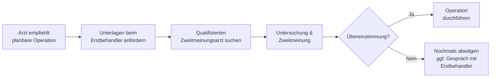

## Hintergrund

Das Recht auf eine ärztliche **Zweitmeinung** wurde 2015 mit dem **GKV-Versorgungsstärkungsgesetz (GKV-VSG)** in § 27b SGB V verankert. Auslöser war eine breite Debatte über unnötige Operationen: Statistiken zeigten erhebliche regionale Unterschiede in der Operationshäufigkeit, die medizinisch nicht erklärbar sind. Das **Wissenschaftliche Institut der AOK (WIdO)** schätzte, dass bei mehreren Eingriffstypen 20–40 % der Operationen vermeidbar wären. In rund **30 % der Fälle** entscheiden sich Patientinnen und Patienten nach einer Zweitmeinung gegen den ursprünglich empfohlenen Eingriff.

## Erfasste Eingriffe

Nicht jede Operation löst das Zweitmeinungsrecht aus. Der **Gemeinsame Bundesausschuss (G-BA)** legt in der **Zweitmeinungs-Richtlinie** fest, welche planbaren, mengenmäßig relevanten und risikobehafteten Eingriffe erfasst sind:

| Eingriff | Hintergrund |
| --- | --- |
| **Hysterektomie** (Gebärmutterentfernung) | Sehr hohe Operationsrate; oft konservativ behandelbar |
| **Tonsillektomie / Tonsillotomie** | Häufige Kinderkrankheit; Potenzial für konservative Alternativen |
| **Schulteroperationen** (Rotatorenmanschette) | Hohe regionale Varianz; Physiotherapie oft unterschätzt |
| **Kniegelenkoperationen** (Meniskus) | Häufig operiert, nicht immer zwingend erforderlich |
| **Wirbelsäulenoperationen** | Hohes Komplikationsrisiko; konservative Therapie oft viable |

Die Liste wird vom G-BA laufend überprüft und kann erweitert werden.

## Wer darf die Zweitmeinung erbringen?

Der zweitmeinungsgebende Arzt muss unabhängig sein und bestimmte Qualifikationsvoraussetzungen erfüllen:

- Zulassung als Vertragsarzt oder ermächtigter Arzt
- Relevante Facharztqualifikation (z. B. Gynäkologie bei Hysterektomie)
- **Keine wirtschaftliche Abhängigkeit** vom Eingriff — der Arzt darf selbst nicht operieren wollen
- Keine organisatorische Verbindung zur empfehlenden Einrichtung

Qualifizierte Zweitmeinungsärzte lassen sich über das Arztsuche-Portal der **Kassenärztlichen Bundesvereinigung (KBV)** finden.

## Ablauf

Der Erstbehandler ist gesetzlich verpflichtet, alle relevanten Unterlagen (Befunde, Diagnosen, Operationsindikation) herauszugeben. Wichtig: Zwischen dem Gespräch über den Eingriff und der Operation muss ausreichend Zeit für die Zweitmeinung eingeplant werden — eine zu kurzfristige Terminierung durch den Erstbehandler ist ohne medizinischen Notfall unzulässig.

## Kosten

Die Zweitmeinung ist für GKV-Versicherte **kostenlos**. Die Krankenkasse übernimmt:

- Das Arzthonorar (abgerechnet nach EBM)
- Ergänzende Diagnostik, die für die Zweitmeinung notwendig ist

Nicht erstattet werden Reisekosten zum Zweitmeinungsarzt (außer in Ausnahmefällen nach § 60 SGB V). Für Eingriffe außerhalb der G-BA-Richtlinie kann eine informelle Zweitmeinung eingeholt werden — manche Kassen übernehmen diese als freiwillige Satzungsleistung. Eine Nachfrage bei der eigenen Kasse lohnt sich.
