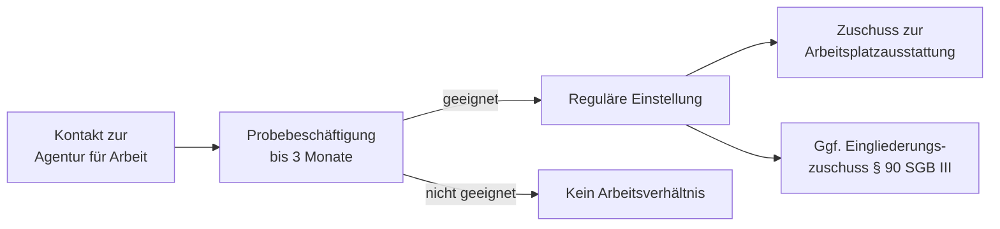

## Worum geht es?

**Arbeitshilfen für Menschen mit Behinderungen** nach § 46 SGB III sind ein zweiteiliges Instrument der Bundesagentur für Arbeit: eine **Probebeschäftigung** zur risikoarmen Erprobung auf beiden Seiten und **Zuschüsse zur behinderungsgerechten Arbeitsplatzausstattung** für Arbeitgeber, die eine behinderte Person einstellen oder beschäftigen.

## Probebeschäftigung (§ 46 Abs. 1)

Arbeitgeber können Bewerberinnen und Bewerber mit anerkannter Behinderung (§ 2 SGB IX) bis zu **3 Monate** ohne reguläres Arbeitsverhältnis erproben. Die Bundesagentur für Arbeit übernimmt die anfallenden Kosten — in der Regel eine Unterhaltsbeihilfe für den Bewerber sowie ggf. Sozialversicherungsanteile.

Die Logik: Arbeitgeber zögern oft, weil sie unsicher sind, ob die Leistungsfähigkeit für die konkrete Stelle ausreicht. Bewerberinnen und Bewerber sind umgekehrt unsicher, ob der Betrieb und die Aufgabe zu ihren Möglichkeiten passen. Die Probebeschäftigung soll diese Unsicherheit durch praktisches Erleben abbauen — ohne die rechtlichen Folgen einer Festanstellung.

| Merkmal | Detail |
| --- | --- |
| Dauer | bis zu 3 Monate |
| Kostentragung | Bundesagentur für Arbeit |
| Rechtsstatus | kein reguläres Arbeitsverhältnis, kein Kündigungsschutz |
| Einstellungspflicht | nein — Unternehmen entscheidet am Ende frei |

## Arbeitshilfen / Arbeitsplatzausstattung (§ 46 Abs. 2)

Entscheidet sich ein Arbeitgeber für die Einstellung, kann er Zuschüsse für die **behinderungsgerechte Einrichtung oder Ausstattung des Arbeitsplatzes** erhalten. Das umfasst technische Hilfsmittel, spezielle Möblierung oder sonstige Anpassungen, die die Beschäftigung erst ermöglichen oder erleichtern.

## Typischer Verlauf

In der Praxis wird die Probebeschäftigung häufig mit dem **Eingliederungszuschuss für Menschen mit Behinderungen** (§ 90 SGB III) kombiniert: Erst Erprobung, dann — bei Erfolg — reguläre Einstellung mit Lohnkostenzuschuss.

## Wer kann die Leistung beantragen?

Die Initiative geht typischerweise vom **Arbeitgeber** aus, der die Förderung bei der zuständigen Agentur für Arbeit beantragt. Bewerberinnen und Bewerber mit Behinderungen können das Instrument jedoch aktiv ansprechen und in Bewerbungsgesprächen einbringen — die Agentur berät beide Seiten.

Voraussetzung auf Seiten des Bewerbers ist eine anerkannte Behinderung im Sinne des § 2 SGB IX (Grad der Behinderung ≥ 20 oder gleichgestellte Personen).

## Praktischer Hinweis

Die Probebeschäftigung nach § 46 SGB III ist breiter angelegt als die allgemeine Aktivierungsmaßnahme desselben Paragraphen und bietet günstigere Konditionen speziell für Menschen mit Behinderungen. Wer als Arbeitgeber oder Bewerber von diesem Instrument profitieren möchte, sollte frühzeitig das Gespräch mit dem zuständigen Arbeitgeberservice oder der Berufsberatung der Agentur für Arbeit suchen.
