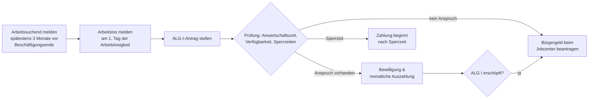

## Geschichte

Das **Arbeitslosengeld I** (ALG I) ist die Kernleistung der deutschen Arbeitslosenversicherung und im Sozialgesetzbuch Drittes Buch (SGB III) geregelt. Die Wurzeln reichen bis in die Weimarer Republik: Das *Gesetz über Arbeitsvermittlung und Arbeitslosenversicherung (AVAVG)* von **1927** begründete erstmals eine beitragsfinanzierte, obligatorische Arbeitslosenversicherung.

- **1927** – AVAVG: Einführung der Pflicht-Arbeitslosenversicherung
- **1969** – Arbeitsförderungsgesetz (AFG): Ausbau zum aktiven Förderinstrument mit stärkerem Fokus auf Beratung und Weiterbildung
- **1998** – SGB III löst das AFG ab; modernes Leistungsrecht mit vereinheitlichtem Anspruchssystem
- **2005** – **Hartz-IV-Reform**: Aufspaltung in ALG I (SGB III, beitragsfinanziert, befristet) und ALG II (SGB II, steuerfinanziert) — die größte sozialpolitische Zäsur der Nachkriegszeit
- **2023** – Bürgergeld-Gesetz: ALG II wird zum Bürgergeld; ALG I bleibt strukturell unverändert

## Anspruchsvoraussetzungen

Anspruch auf ALG I hat, wer alle Bedingungen aus §§ 136–138 SGB III kumulativ erfüllt:

1. **Arbeitslosigkeit** (§ 138 SGB III): keine versicherungspflichtige Beschäftigung oder weniger als 15 Stunden/Woche
2. **Persönliche Arbeitslosmeldung** bei der zuständigen Agentur für Arbeit
3. **Verfügbarkeit und Eigenbemühungen**: aktive Jobsuche und Bereitschaft, jede zumutbare Arbeit anzunehmen
4. **Anwartschaftszeit** (§ 137 SGB III): mindestens **12 Monate** versicherungspflichtige Beschäftigung innerhalb der letzten **30 Monate**

Selbstständige, Beamte und Personen mit nur geringfügiger Beschäftigung erfüllen die Anwartschaftszeit in der Regel nicht und werden direkt an das Bürgergeld verwiesen.

## Höhe der Leistung

Die Leistungshöhe ergibt sich aus dem **Bemessungsentgelt** — dem durchschnittlichen beitragspflichtigen Bruttoentgelt der letzten 12 Monate vor Arbeitslosmeldung. Davon wird ein pauschaler Abzug für Lohnsteuer und Sozialversicherung (21 %) vorgenommen; auf das so ermittelte pauschalierte Nettoentgelt wird dann der Leistungssatz angewendet:

| Leistungssatz | Personengruppe | Prozentwert |
| --- | --- | ---: |
| Erhöhter Satz | Kind im Haushalt (§ 149 Nr. 1 SGB III) | 67 % |
| Allgemeiner Satz | kein Kind | 60 % |

**Beispielrechnung 2025** (Bruttoentgelt 3.500 €/Monat, Steuerklasse I):

| Position | Betrag |
| --- | ---: |
| Pauschaliertes Nettoentgelt | ca. 2.310 € |
| ALG I allgemeiner Satz (60 %) | ca. 1.386 €/Monat |
| ALG I erhöhter Satz (67 %) | ca. 1.548 €/Monat |

Die Obergrenze ergibt sich aus der Beitragsbemessungsgrenze (2025: **96.600 €/Jahr** West / **89.400 €/Jahr** Ost).

## Bezugsdauer

Die Dauer hängt von den zurückgelegten Versicherungszeiten und — ab einem Alter von 50 Jahren — vom Lebensalter ab (§ 147 SGB III):

| Versicherungszeit (letzte 5 Jahre) | Mindestalter | Bezugsdauer |
| ---: | --- | ---: |
| 12 Monate | — | 6 Monate |
| 16 Monate | — | 8 Monate |
| 20 Monate | — | 10 Monate |
| 24 Monate | — | 12 Monate |
| 30 Monate | 50 Jahre | 15 Monate |
| 36 Monate | 55 Jahre | 18 Monate |
| 48 Monate | 58 Jahre | 24 Monate |

Die verlängerten Bezugszeiten für Ältere sind sozialpolitisch umstritten: Sie tragen dem schwierigeren Wiedereinstieg Rechnung, können aber auch Anreize zur Frühverrentung setzen.

## Sperrzeiten

Bei eigenem Verschulden an der Arbeitslosigkeit oder Ablehnung zumutbarer Arbeit drohen **Sperrzeiten** nach § 159 SGB III — in dieser Zeit wird kein ALG I gezahlt, und die Gesamtbezugsdauer verkürzt sich entsprechend:

| Sperrzeit-Grund | Dauer |
| --- | ---: |
| Eigene Kündigung ohne wichtigen Grund | 12 Wochen |
| Einvernehmliche Aufhebung des Arbeitsverhältnisses | 12 Wochen |
| Ablehnung einer zumutbaren Arbeitsstelle | 3 Wochen |
| Abbruch einer Weiterbildungsmaßnahme | 3 Wochen |
| Unzureichende Eigenbemühungen | 2 Wochen |

Ein **wichtiger Grund** (§ 159 Abs. 1 S. 2 SGB III) kann eine Sperrzeit ausschließen — etwa bei Kündigung wegen eines Umzugs zum Partner oder aus gesundheitlichen Gründen. Betroffene sollten diesen Sachverhalt der Agentur frühzeitig darlegen.

## ALG I und Weiterbildung

Eine oft übersehene Besonderheit: Nach § 136 Abs. 1 S. 2 SGB III kann das ALG I **während einer geförderten beruflichen Weiterbildung weiterlaufen** — selbst wenn die Teilnahme an einem Vollzeitkurs die Verfügbarkeit für den Arbeitsmarkt faktisch einschränkt. Die Verfügbarkeitsvoraussetzung gilt in diesem Fall als erfüllt.

Das typische Szenario: Die Agentur für Arbeit bewilligt eine Weiterbildung per **Bildungsgutschein** (§ 81 SGB III) und übernimmt die Kurskosten; das ALG I läuft weiter. Besonders relevant: Die Weiterbildungszeit wird **nicht auf den verbleibenden ALG-Anspruch angerechnet** — wer noch 12 Monate Anspruch hat und 6 Monate Weiterbildung absolviert, hat danach noch volle 12 Monate übrig.

Dieses Instrument ist gerade im Strukturwandel bedeutsam, wird aber nicht ausreichend genutzt: Viele Betroffene wählen kurzfristige Überbrückungsjobs, statt die Arbeitslosigkeit für eine nachhaltige Qualifizierung zu nutzen.

## Antragsweg

Wichtige Fristen: Die **Arbeitssuchendmeldung** (§ 38 SGB III) muss spätestens **3 Monate** vor Ende der Beschäftigung erfolgen — bei späterer Meldung droht eine einwöchige Sperrzeit. Die **Arbeitslosmeldung** selbst muss am **ersten Tag** der Arbeitslosigkeit erfolgen; eine rückwirkende Meldung ist nicht möglich.

## Verhältnis zu anderen Leistungen

- **Bürgergeld (SGB II)**: ALG I ist vorrangig. Reicht es nicht zum Lebensunterhalt, kann aufstockendes Bürgergeld beantragt werden; nach Erschöpfung des ALG I sichert das Bürgergeld den weiteren Lebensunterhalt.
- **Krankengeld**: Erkrankt ein ALG-I-Beziehender und wird arbeitsunfähig, zahlt die Krankenkasse Krankengeld in Höhe des ALG I — der ALG-Anspruch ruht und verlängert sich entsprechend.
- **Kurzarbeitergeld**: Wird vor Eintritt der Arbeitslosigkeit gezahlt und verzögert den Übergang in das ALG I.
- **Insolvenzgeld**: Sichert die letzten drei Lohnmonate vor Insolvenz des Arbeitgebers und schließt lückenlos an, bevor ALG I greift.
