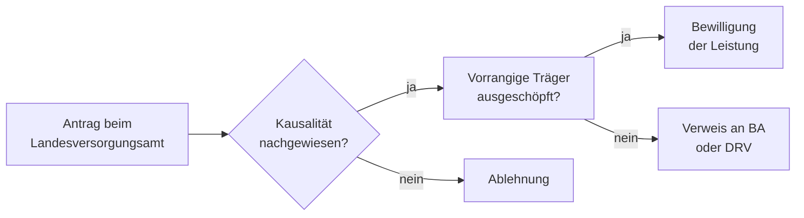

## Worum geht es?

Die **Ausbildungsförderung nach § 94 SGB XIV** ist eine Ergänzungsleistung der Sozialen Entschädigung. Sie greift, wenn eine Schädigungsfolge — etwa nach einer Gewalttat, einem Dienstunfall oder einem anderen anerkannten Schädigungsereignis — die Bildungsbiografie des Betroffenen oder seiner Waisen beeinträchtigt hat.

Ziel ist es, dauerhafte bildungsmäßige Nachteile durch die Schädigung auszugleichen.

## Wer hat Anspruch?

Anspruchsberechtigt sind:

- **Geschädigte selbst**, wenn die Schädigungsfolge dazu geführt hat, dass sie eine Ausbildung abbrechen, verschieben oder neu beginnen mussten
- **Waisen** (Kinder eines schädigungsbedingt verstorbenen Elternteils), die infolge der wirtschaftlichen Not nach dem Tod des Elternteils Ausbildungsdarlehen aufnehmen mussten

In beiden Fällen muss ein **kausaler Zusammenhang** zwischen der Schädigungsfolge und der Ausbildungssituation nachgewiesen werden.

## Was wird gefördert?

| Leistungsart | Beschreibung |
| --- | --- |
| Rückzahlung von Ausbildungsdarlehen | Übernahme oder Bezuschussung von Darlehen, die wegen der Schädigungsfolge nicht zurückgezahlt werden können |
| Ausbildungskosten | Ergänzende Finanzierung einer notwendigen Ausbildung oder Umschulung |

Die Leistung ist **nachrangig**: Leistungen der Bundesagentur für Arbeit, der Deutschen Rentenversicherung oder anderer Träger müssen zuerst ausgeschöpft werden. SGB XIV springt nur für den verbleibenden, nicht anderweitig gedeckten Bedarf ein.

## Antrag und Zuständigkeit

Zuständig ist das **Landesversorgungsamt** des jeweiligen Bundeslandes. Der Antrag sollte frühzeitig gestellt werden — idealerweise bevor Ausbildungskosten entstehen oder ein Darlehen fällig wird.

## Praktische Bedeutung

Die Leistung ist in der Praxis selten, kann aber für die betroffenen Einzelpersonen erhebliche Bedeutung haben — besonders für junge Waisen, die nach dem schädigungsbedingten Tod eines Elternteils auf Darlehen angewiesen waren und diese nun nicht aus eigener Kraft zurückzahlen können. Für sie schließt § 94 SGB XIV eine Lücke, die andere Sozialleistungssysteme nicht abdecken.
