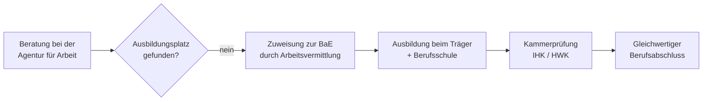

## Was ist die BaE?

Die **Außerbetriebliche Berufsausbildung (BaE)** nach § 76 SGB III richtet sich an Jugendliche, die trotz ernsthafter Suche keinen betrieblichen Ausbildungsplatz finden. Statt in einem Unternehmen findet ihre Ausbildung bei einem anerkannten außerbetrieblichen Träger statt — etwa einem Berufsbildungswerk, einem gewerkschaftlichen Bildungswerk, einer kirchlichen Organisation oder einem freien Bildungsträger.

## Zielgruppe

Die BaE richtet sich vor allem an junge Menschen mit besonderen Hemmnissen bei der Ausbildungsplatzsuche:

- Jugendliche mit **Lernbeeinträchtigungen** oder **sozialer Benachteiligung**
- Bewerberinnen und Bewerber in **strukturschwachen Regionen** mit zu wenig betrieblichen Ausbildungsplätzen
- Jugendliche, die nach intensiver Suche keinen Betrieb gefunden haben

Die Agentur für Arbeit vermittelt in die BaE, wenn feststeht, dass eine betriebliche Ausbildung im Ausbildungsjahr nicht realisierbar ist.

## Ausbildung und Abschluss

Die praktische Ausbildung findet in den eigenen Werkstätten des Trägers oder in kooperierenden Betrieben statt. Der Unterricht erfolgt — wie bei einer regulären Berufsausbildung — an der Berufsschule.

Entscheidend: Der **Abschluss ist einem betrieblichen Abschluss vollständig gleichgestellt**. Die Prüfung wird vor der zuständigen Kammer (IHK oder HWK) abgelegt — auf dem Zeugnis ist nicht ersichtlich, dass die Ausbildung außerbetrieblich stattfand.

## Förderung und Kosten

Die Kosten der BaE trägt die **Bundesagentur für Arbeit**. Jugendliche erhalten eine **Ausbildungsvergütung**, deren Höhe sich an den tariflichen oder branchenüblichen Sätzen orientiert. Zusätzlich werden Lernmittel, Fahrkosten und bei Bedarf auch die Unterbringung übernommen.

## Antragsweg

Der erste Schritt ist ein Beratungsgespräch beim **Berufsberatungs- oder Ausbildungsstellenteam** der Agentur für Arbeit. Jugendliche sollten sich frühzeitig — spätestens bis Ende des vorangegangenen Schuljahres — melden, da die Plätze begrenzt sind und die Träger eigene Auswahlverfahren durchführen.

## Wichtige Hinweise

- Die BaE ist eine **Auffanglösung**, kein Wunschberuf-Garant: Das Angebot an Ausbildungsberufen hängt vom jeweiligen Träger und der Region ab.
- Wer während der BaE einen **betrieblichen Ausbildungsvertrag** erhält, kann in den Betrieb wechseln — die bisher abgeleistete Ausbildungszeit wird in der Regel angerechnet.
- Die Maßnahme schließt sich an andere Förderinstrumente (z. B. Berufsvorbereitende Bildungsmaßnahmen, BvB) an und ist Teil der **gestuften Ausbildungsförderung** der Bundesagentur.
