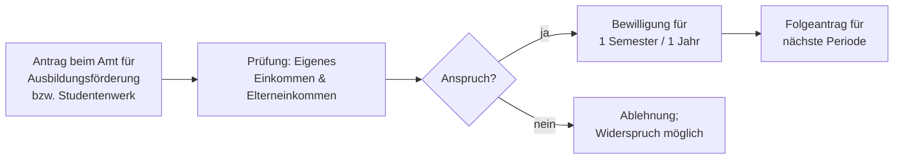

## Geschichte

Das **Bundesausbildungsförderungsgesetz (BAföG)** trat am 1. September 1971 in Kraft und löste das *Honnefer Modell* ab — ein Stipendiensystem, das nur einen kleinen Teil der Studierenden erreichte. Ziel der sozialliberalen Koalition unter Willy Brandt war es, Bildung vom Elterneinkommen zu entkoppeln und den Hochschulzugang zu demokratisieren.

- **1971** – Einführung für Hochschulen; Schüler folgen 1972
- **1983** – Studierenden-BAföG wird vollständig auf Darlehen umgestellt (unpopulärer Sparschritt)
- **1990** – Rückkehr zur heutigen **50/50-Lösung** (hälftig Zuschuss, hälftig Darlehen)
- **2002** – Schüler-BAföG wird wieder voller Zuschuss
- **2022/23** – **26. BAföGÄndG**: größte Reform seit 1990; Bedarfssätze und Freibeträge +5 %, neue Studienstarthilfe
- **2024/25** – Wohnpauschale auf 380 €, Höchstsatz erreicht **992 €/Monat**

## Was gefördert wird

Gefördert werden **Lebensunterhalt und Ausbildungskosten** für Hochschulen, bestimmte schulische Ausbildungen (Schüler-BAföG) und Pflichtpraktika. Nicht gefördert werden duale Ausbildungen (hier greift die Berufsausbildungsbeihilfe) und private Hochschulen ohne staatliche Anerkennung.

Die Form der Förderung hängt von der Ausbildungsart ab (§§ 11, 17):

| Ausbildung | Förderform |
|---|---|
| Studium (Hochschule) | 50 % Zuschuss + 50 % zinsloses Staatsdarlehen |
| Schüler-BAföG | Vollzuschuss — keine Rückzahlung |

Beim Studierenden-BAföG ist die eine Hälfte zinsloses Staatsdarlehen, dessen Rückzahlung auf maximal **10.010 €** gedeckelt ist — überschießende Beträge werden erlassen.

## Bedarfssätze und Zuschläge

Der **Bedarf** ist der Ausgangspunkt jeder Berechnung; vom Bedarf wird anrechenbares Einkommen und Vermögen abgezogen. Der Höchstsatz für Studierende setzt sich zusammen (Stand Wintersemester 2024/25, §§ 13, 13a):

| Bestandteil | Betrag |
|---|---:|
| Grundbedarf | 475 € |
| Wohnpauschale (nicht bei Eltern) | 380 € |
| KV-Zuschlag | 102 € |
| PV-Zuschlag | 35 € |
| **Höchstsatz** | **992 €** |

BAföG zahlt **Pauschalen, keine Kostenerstattung** — die Wohnpauschale gilt unabhängig von der tatsächlichen Miete und reicht in Hochpreisstädten oft nicht. Für Schüler (§ 12) und Praktikanten (§ 14) gelten eigene, niedrigere Bedarfssätze.

Zwei familienfreundliche Sonderkomponenten sind reine Zuschüsse:

- **Kinderbetreuungszuschlag** (§ 14b): 160 € pro Monat und Kind unter 14 Jahren, einkommensunabhängig.
- Der **KV-/PV-Zuschlag** (§ 13a) deckt die Beiträge, sobald die beitragsfreie Familienversicherung (i. d. R. mit 25) endet.

## Bedürftigkeitsprüfung: Freibeträge

BAföG ist **einkommens- und vermögensabhängig**. Drei Freibeträge bestimmen den individuellen Förderbetrag:

- **Elterneinkommen** (§ 25): gestaffelt nach Familienstand und weiteren unterhaltsberechtigten Kindern. Die Höhe dieser Freibeträge ist die zentrale Stellschraube — Erhöhungen heben mehr Familien unter die Förderschwelle.
- **Eigenes Einkommen** (§ 23): ein Nebenjob bleibt bis zu einem Freibetrag anrechnungsfrei; ein Minijob ist seit der Reform in der Regel voll anrechnungsfrei.
- **Eigenes Vermögen** (§ 29): bis **15.000 €** anrechnungsfrei (ab 30 Jahren 45.000 €). Vermögen darüber wird auf den Bewilligungszeitraum verteilt und mindert die Förderung.

## Antragsweg

BAföG wird **nicht rückwirkend** bewilligt — es gilt frühestens ab dem Monat der Antragstellung. Frühzeitige Antragstellung ist daher essenziell.

## Zahlen und Kritik

2024 wurden rund **612.800 Personen** gefördert, durchschnittlich etwa **635 €/Monat**. Der meistdiskutierte Kritikpunkt ist die langfristig **sinkende Gefördertenquote**: stagnierende Freibeträge, Wohnpauschalen unter Marktmieten und die enge Elternabhängigkeit lassen viele Haushalte mit mittlerem Einkommen durchs Raster fallen. Reformen stabilisieren die Quote kurzfristig, lösen das Strukturproblem aber nicht dauerhaft.
