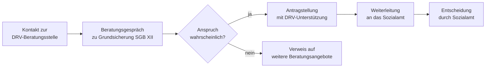

## Hintergrund

Nach **§ 109a SGB VI** sind die Träger der gesetzlichen Rentenversicherung verpflichtet, Versicherte und Rentnerinnen bei Fragen der **Grundsicherung im Alter und bei Erwerbsminderung** (SGB XII, 4. Kapitel) zu beraten und bei der Antragstellung zu unterstützen. Die Leistung ist kein Geldanspruch, sondern ein **Beratungs- und Unterstützungsanspruch** gegenüber der Deutschen Rentenversicherung (DRV).

## Warum braucht es diese Beratung?

Grundsicherung im Alter und bei Erwerbsminderung ist eine Sozialhilfeleistung — zuständig ist das **Sozialamt**, nicht die Rentenversicherung. Viele ältere und erwerbsgeminderte Menschen wissen jedoch nicht, dass ihnen neben einer niedrigen Rente noch ergänzende Grundsicherungsleistungen zustehen könnten. Hinzu kommen Schamgefühl und bürokratische Hürden. Das Ergebnis ist ein bekanntes „**verdecktes Armutsproblem**": Ein erheblicher Anteil der Anspruchsberechtigten stellt keinen Antrag.

Die DRV kennt die Rentenhöhe ihrer Versicherten und kann erkennen, wann eine Grundsicherungsergänzung realistisch in Betracht kommt. Sie übernimmt damit eine **Lotsenfunktion** zwischen Rentenrecht und Sozialhilfe.

## Was leisten die DRV-Beratungsstellen konkret?

| Aufgabe | Inhalt |
| --- | --- |
| Information | Aufklärung über Grundsicherung nach §§ 41–46 SGB XII |
| Beratung | Erläuterung der Anspruchsvoraussetzungen (Bedürftigkeit, Altersgrenze, Wohnsitz) |
| Antragshilfe | Unterstützung beim Ausfüllen der Antragsformulare |
| Weiterleitung | Übergabe des ausgefüllten Antrags an das zuständige Sozialamt |

Die DRV **entscheidet nicht** über den Grundsicherungsanspruch — das bleibt Aufgabe des Sozialamts. Sie erleichtert aber den Zugang erheblich.

## Wer kann die Beratung in Anspruch nehmen?

Alle Versicherten und Rentenbeziehenden der gesetzlichen Rentenversicherung können sich an ihre DRV-Beratungsstelle wenden. Ein konkreter Antrag auf Grundsicherung ist nicht Voraussetzung — die Beratung setzt früher an.

## Antragsweg

Beratungstermine sind persönlich in den DRV-Auskunfts- und Beratungsstellen möglich, teils auch telefonisch. Die DRV bietet zudem Sprechtage in Gemeinden und Sozialeinrichtungen an.

## Praktische Hinweise

- Die Beratung ist **kostenlos** und ohne bürokratische Vorbedingungen zugänglich.
- Wer Rentenbescheid und Einkommensnachweise mitbringt, ermöglicht eine treffsichere erste Einschätzung.
- Neben der DRV bieten auch **Sozialverbände** (VdK, SoVD) und kommunale Beratungsstellen ähnliche Hilfen an — insbesondere für Menschen ohne Rentenversicherungsschutz.
