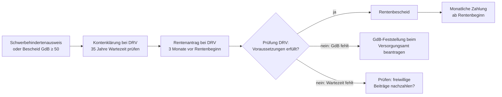

## Hintergrund

Die **Altersrente für schwerbehinderte Menschen** nach § 37 SGB VI ermöglicht es Personen mit einem **Grad der Behinderung (GdB) von mindestens 50**, früher in Rente zu gehen als der allgemeine Rentenjahrgang. Sie honoriert damit, dass langjährige Erwerbstätigkeit mit einer Schwerbehinderung körperlich und psychisch besonders belastend ist — und dass Menschen mit Behinderungen statistisch seltener bis zur Regelaltersgrenze arbeitsfähig bleiben.

Die Rentenart ist einer der ältesten Sondertatbestände im deutschen Rentenrecht und wird durch § 236a SGB VI ergänzt, der die konkreten Altersgrenzen nach Geburtsjahrgängen staffelt — ein typisches Instrument, wenn der Gesetzgeber bestehende Ansprüche schrittweise anhebt, ohne Vertrauensschutz abrupt zu brechen.

## Voraussetzungen

Drei Bedingungen müssen **gleichzeitig** erfüllt sein:

| Voraussetzung | Detail |
| --- | --- |
| **Schwerbehinderung** | GdB ≥ 50, anerkannt durch das Versorgungsamt (Schwerbehindertenausweis oder Bescheid nach § 152 SGB IX) |
| **Wartezeit** | 35 Jahre Versicherungszeit in der gesetzlichen Rentenversicherung |
| **Mindestalter** | Abhängig vom Geburtsjahrgang (§ 236a SGB VI); frühestens ab 62 Jahren mit Abschlag für ab 1964 Geborene |

Die Schwerbehinderung muss **im Zeitpunkt des Rentenbeginns** vorliegen. Nachträgliche Anerkennungen können rückwirkend helfen, wenn der GdB-Bescheid rechtzeitig beantragt wurde.

### Besonderheit: Gleichgestellte Behinderung

Personen mit einem GdB zwischen 30 und 50, die einer schwerbehinderten Person gleichgestellt sind (§ 151 SGB IX), profitieren **nicht** von dieser Rentenart — die Gleichstellung gilt für Kündigungsschutz und Fördermaßnahmen, aber nicht für die vorzeitige Altersrente. Für die Altersrente zählt ausschließlich ein GdB ≥ 50.

### Was zählt zur Wartezeit?

Die 35-Jahres-Wartezeit ist deutlich großzügiger als die einfache 5-Jahres-Wartezeit der Regelaltersrente und lässt viele Zeiten zu:

- Pflichtbeitragszeiten (Arbeit, Ausbildung, Kindererziehung)
- Freiwillige Beitragszeiten
- Anrechnungszeiten (z. B. Schule, Studium, Arbeitslosigkeit, Krankheit)
- Berücksichtigungszeiten (z. B. Kindererziehung unter 10 Jahren)
- Ersatzzeiten (z. B. Wehrdienstzeiten)

Nicht anrechenbar sind hingegen ausschließlich Zeiten ohne Versicherungsbezug zur deutschen gesetzlichen Rentenversicherung.

## Altersgrenzen nach § 236a SGB VI

§ 236a SGB VI (Übergangsregelung) staffelt, ab wann die Rente frühestens beginnen kann und ab wann sie abschlagsfrei läuft:

| Geburtsjahr | Frühestbeginn (mit Abschlag) | Abschlagsfreier Rentenbeginn |
| ---: | --- | --- |
| vor 1952 | 60 Jahre 0 Monate | 60 Jahre 0 Monate |
| 1952 | 60 Jahre 1 Monat | 60 Jahre 1 Monat |
| 1953 | 60 Jahre 2 Monate | 60 Jahre 2 Monate |
| 1954 | 60 Jahre 3 Monate | 60 Jahre 3 Monate |
| 1955 | 60 Jahre 4 Monate | 60 Jahre 4 Monate |
| 1956 | 60 Jahre 5 Monate | 60 Jahre 5 Monate |
| 1957 | 60 Jahre 6 Monate | 60 Jahre 6 Monate |
| 1958 | 60 Jahre 7 Monate | 62 Jahre 3 Monate |
| 1959 | 60 Jahre 8 Monate | 62 Jahre 6 Monate |
| 1960 | 60 Jahre 9 Monate | 62 Jahre 9 Monate |
| 1961 | 60 Jahre 10 Monate | 63 Jahre 0 Monate |
| 1962 | 60 Jahre 11 Monate | 63 Jahre 3 Monate |
| 1963 | 61 Jahre 0 Monate | 63 Jahre 6 Monate |
| ab 1964 | **62 Jahre 0 Monate** | **65 Jahre 0 Monate** |

*Hinweis: Die genauen Übergangsregelungen für die Jahrgänge 1952–1963 sind komplex und enthalten Vertrauensschutz-Ausnahmen (s. u.). Für konkrete Auskünfte ist die DRV maßgeblich.*

**Kernaussage für jüngere Jahrgänge (ab 1964):** Der maximale Zeitgewinn gegenüber der Regelaltersrente (67 Jahre) beträgt **5 Jahre** (Rentenbeginn ab 62). Wer die volle Rente ohne Abschlag will, kann ab 65 in Rente gehen — 2 Jahre vor der regulären Altersgrenze.

## Abschläge

Wer vor dem abschlagsfreien Rentenbeginn in Rente geht, muss dauerhaft mit Abschlägen rechnen:

- **0,3 % pro Monat** vor der abschlagsfreien Altersgrenze
- **Maximaler Abschlag**: 36 Monate × 0,3 % = **10,8 %**

Der Abschlag gilt für die gesamte Rentenlaufzeit — er wird nicht rückgängig gemacht, wenn man später das abschlagsfreie Alter erreicht.

**Rechenbeispiel** (Jahrgang 1970):
- Abschlagsfreie Altersgrenze: 65 Jahre
- Rentenbeginn: 62 Jahre → 36 Monate früher → Abschlag: 10,8 %
- Rente ohne Abschlag: 1.500 € → Rente mit Abschlag: **1.338 €/Monat**

Die Abschläge amortisieren sich — je nach Leben­serwartung — erst nach ca. 15–20 Jahren. Wer gesundheitlich stark beeinträchtigt ist, sollte diesen Aspekt in der Entscheidung berücksichtigen.

## Vertrauensschutz

Für Versicherte, die vor dem **17. November 2000** durch eine **verbindliche Vereinbarung** (z. B. Altersteilzeitvertrag, schriftliche Zusage des Arbeitgebers) auf eine bestimmte Altersrente vertraut haben, gelten besondere Schutzregeln. Sie können in vielen Fällen zu den alten, günstigeren Bedingungen in Rente gehen, selbst wenn die allgemeinen Regelungen inzwischen ungünstiger sind. Die genauen Bedingungen finden sich in § 236a Abs. 2 ff. SGB VI.

## Verhältnis zu anderen Rentenarten

| Rentenart | Vergleich |
| --- | --- |
| **Regelaltersrente (§ 35 SGB VI)** | Beginnt ab 65/67 Jahren; nur 5-Jahres-Wartezeit; keine Voraussetzung Behinderung |
| **Altersrente für langjährig Versicherte (§ 36 SGB VI)** | 35-Jahres-Wartezeit; frühestens ab 63 (mit Abschlag); keine Behinderungsvoraussetzung |
| **Rente mit 63 (§ 38 SGB VI)** | 45-Jahres-Wartezeit; ab 65 abschlagsfrei für Jahrgang ab 1964; keine Behinderungsvoraussetzung |
| **Erwerbsminderungsrente (§ 43 SGB VI)** | Für dauerhaft Erwerbsgeminderte; keine Altersvoraussetzung; greift bei ≥ 50 % Einschränkung der Erwerbsfähigkeit; enthält Zurechnungszeit bis Regelaltersgrenze |

Ein wichtiger Unterschied zur Erwerbsminderungsrente: Die Schwerbehindertenrente setzt **keine Erwerbsminderung** voraus. Wer mit GdB 50 noch vollschichtig arbeiten kann und will, hat trotzdem Anspruch. Umgekehrt gilt: Eine Erwerbsminderungsrente kann höher ausfallen, wenn die Zurechnungszeit viele Entgeltpunkte bringt — daher lohnt ein Vergleich der zu erwartenden Rentenhöhe.

## Antragsweg

**Achtung Fristen**: Die DRV empfiehlt, den Antrag **3 Monate vor dem gewünschten Rentenbeginn** zu stellen. Wer den GdB-Bescheid nicht rechtzeitig hat, kann den Rentenantrag nicht stellen — das Versorgungsamt-Verfahren kann mehrere Monate dauern. Frühzeitige Planung (1–2 Jahre vorher) ist ratsam.

## Hinweise für die Praxis

**Hinzuverdienst**: Wer neben der Altersrente weiterarbeitet, darf seit 2023 unbegrenzt hinzuverdienen, ohne dass die Rente gekürzt wird. Die Hinzuverdienstgrenze für Altersrenten wurde mit dem Rentenanpassungs- und Erwerbsminderungsrentenverbesserungsgesetz 2023 dauerhaft aufgehoben.

**GdB-Verschlechterung nach Rentenbeginn**: Wenn der GdB nach Rentenbeginn unter 50 sinkt, entfällt die Rentenart nicht automatisch rückwirkend. Der Rentenanspruch bleibt bestehen, solange er zum Zeitpunkt des Rentenbeginns erfüllt war.

**Kombination mit Pflegeleistungen**: Wer Rente bezieht und gleichzeitig Pflegegrad hat, kann parallel Leistungen der Pflegeversicherung erhalten. Die Altersrente ist kein Ausschlussgrund für Pflegegeld oder Pflegesachleistungen.

**Rentenanpassung und Steuer**: Die Altersrente für schwerbehinderte Menschen unterliegt denselben jährlichen Anpassungen (Rentenanpassung ab Juli) und der nachgelagerten Besteuerung wie alle anderen Altersrenten. Für Rentner, die 2025 erstmals Rente beziehen, sind 83 % steuerpflichtig; der steuerfreie Anteil ist im Rentenbescheid festgeschrieben.
