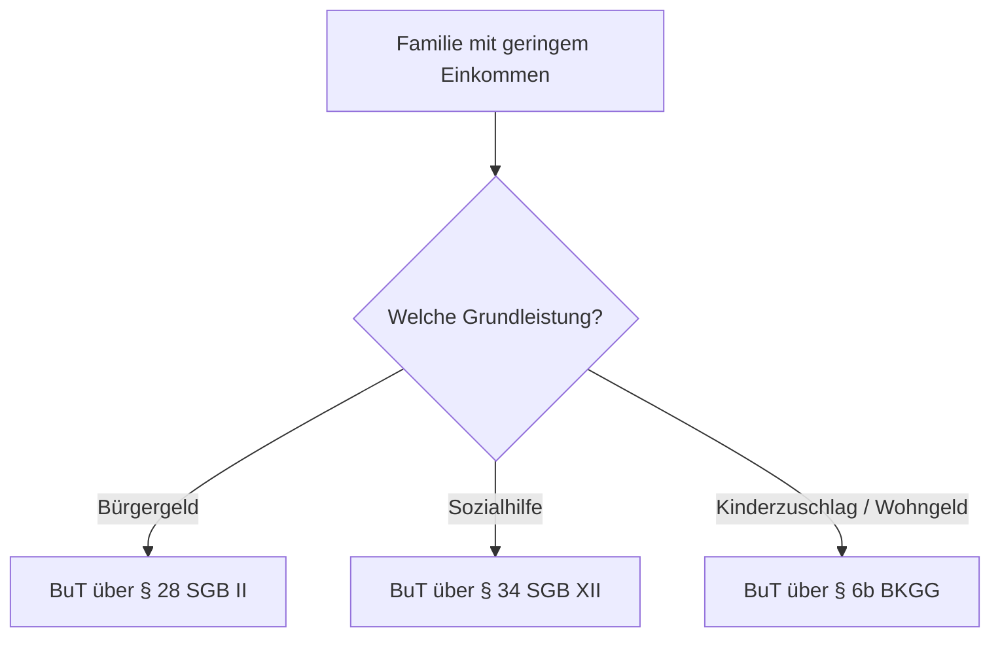

## Hintergrund

Die **Leistungen für Bildung und Teilhabe (BuT)** nach § 6b BKGG richten sich an Familien, die knapp oberhalb der Bürgergeld-Grenze liegen — also **Kinderzuschlag oder Wohngeld** beziehen. Sie sollen Kindern aus einkommensschwachen Haushalten die gleichberechtigte Teilnahme am schulischen und sozialen Leben ermöglichen. Inhaltlich sind die Leistungen identisch mit den BuT-Ansprüchen für Bürgergeld-Beziehende (§ 28 SGB II) und Sozialhilfeempfänger (§ 34 SGB XII) — lediglich der Zugangsweg unterscheidet sich.

## Leistungen im Überblick

| Leistung | Höhe (2025) |
|---|---|
| Persönlicher Schulbedarf | 195 € / Jahr (130 € + 65 €) |
| Schülerbeförderung | tatsächliche Kosten |
| Lernförderung (Nachhilfe) | tatsächliche Kosten |
| Gemeinschaftliche Mittagsverpflegung | tatsächliche Kosten |
| Soziale & kulturelle Teilhabe | 15 € / Monat |
| Klassenfahrten & Ausflüge | tatsächliche Kosten |

Der **persönliche Schulbedarf** wird in zwei Raten ausgezahlt: 130 € zu Beginn des ersten und 65 € zu Beginn des zweiten Schulhalbjahres. Die meisten anderen Leistungen werden als Sachleistungen oder Direktzahlungen an Anbieter erbracht.

## Zugang über Kinderzuschlag und Wohngeld

Wer Kinderzuschlag (bis zu 297 € je Kind monatlich, Stand 2025) oder Wohngeld bezieht, hat **automatisch** Anspruch auf BuT. Das ist ein wichtiger Anreiz, diese vorrangigen Leistungen zu beantragen, bevor der Weg ins Bürgergeld beschritten wird.

## Antragsweg

Zuständig sind in der Regel die Gemeinden oder Jobcenter — je nach Land und Wohnort. Antragsteller sollten den laufenden Bewilligungsbescheid für Kinderzuschlag oder Wohngeld als Nachweis mitbringen. Für Klassenfahrten oder Nachhilfe ist ein gesonderter Nachweis (z. B. Schreiben der Schule) erforderlich.

## Kritik und Praxis

Trotz bestehender Ansprüche wird das Bildungspaket von vielen berechtigten Familien nicht abgerufen. Gründe sind Bürokratiehürden, unzureichende Information und die Notwendigkeit, mehrere Leistungen separat zu beantragen. Besonders der monatliche Betrag von **15 € für soziale und kulturelle Teilhabe** gilt als zu niedrig, um Vereins- oder Musikschulbeiträge vollständig zu decken — viele Familien verzichten daher trotz Anspruch auf die Mitgliedschaft.
