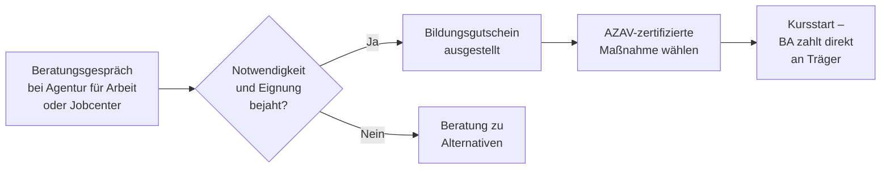

## Hintergrund

Der **Bildungsgutschein** ist das zentrale Förderinstrument der Bundesagentur für Arbeit (BA) für berufliche Weiterbildung. Gesetzlich verankert in **§ 81 SGB III**, ermöglicht er Arbeitslosen und von Arbeitslosigkeit bedrohten Personen den Zugang zu anerkannten Qualifizierungsmaßnahmen — mit freier Wahl des Bildungsträgers. Die BA zahlt die Kursgebühren direkt an den Anbieter; der Gutschein ist also kein Bargeld, sondern ein Förderanspruch.

Ab **1. Januar 2025** liegt die Finanzierungsverantwortung für Bildungsgutscheine vollständig bei den Agenturen für Arbeit — auch für Personen, die bislang über Jobcenter betreut wurden.

## Wer hat Anspruch?

Es gibt keine starre Checkliste. Die Agentur entscheidet nach **pflichtgemäßem Ermessen**, ob eine Weiterbildung notwendig und die Person geeignet ist. Typische Konstellationen:

- **Arbeitslose**, die eine Zusatzqualifikation für die Wiedereingliederung benötigen
- **Beschäftigte**, denen Entlassung droht (kombinierbar mit § 82 SGB III)
- **Bürgergeld-Beziehende**, bei denen Weiterbildung die Beschäftigungsfähigkeit verbessert

Die gewählte Maßnahme und der Bildungsträger müssen **AZAV-zertifiziert** sein (Akkreditierungs- und Zulassungsverordnung Arbeitsförderung). Nicht zertifizierte Angebote werden grundsätzlich nicht anerkannt.

## Was wird übernommen?

| Kostenart | Übernahme |
| --- | --- |
| Lehrgangsgebühren (inkl. Lernmittel, Prüfungsgebühren) | 100 % |
| Auswärtige Unterbringung und Verpflegung | Ja, bei unzumutbarer Pendeldistanz |
| Kinderbetreuungskosten | Ja, ergänzend möglich |
| **Weiterbildungsgeld** | 150 €/Monat zusätzlich (seit 2023) |

Das **Weiterbildungsgeld** von 150 € monatlich wurde mit dem Weiterbildungsgesetz 2023 eingeführt und gilt als Anreizzahlung für abschlussorientierte Maßnahmen. Es wird **nicht** auf ALG I oder Bürgergeld angerechnet.

## Antragsweg

Der Gutschein enthält eine **Gültigkeitsdauer** (in der Regel drei Monate), ein definiertes Bildungsziel und ggf. eine räumliche Einschränkung. Wer in diesem Zeitraum keinen passenden Kurs findet, kann eine Verlängerung beantragen.

## Abgrenzung zu ähnlichen Instrumenten

| Instrument | Zielgruppe | Besonderheit |
| --- | --- | --- |
| **Bildungsgutschein** (§ 81 SGB III) | Arbeitslose und von Arbeitslosigkeit Bedrohte | Freie Trägerwahl, AZAV-Pflicht |
| **Weiterbildungsförderung Beschäftigte** (§ 82 SGB III) | Beschäftigte im Betrieb | Zuschuss an Arbeitgeber, kein Gutschein |
| **Qualifizierungsgeld** (§ 82a SGB III) | Betriebe im Strukturwandel | Lohnersatz ähnlich Kurzarbeitergeld |
| **AVGS** | Arbeitslose | Vermittlungsmaßnahmen, keine Weiterbildung |

## Nutzung in der Praxis

Die BA weist keine Zahl ausgegebener Gutscheine aus, da ein Gutschein nur den Anspruch bescheinigt — entscheidend ist die tatsächliche Einlösung. Statistisch werden daher **Eintritte in geförderte Weiterbildungen (FbW)** gezählt: 2024 nahmen im Monatsdurchschnitt rund **167.000 Personen** an solchen Maßnahmen teil. Rund 80 % des gesamten Weiterbildungsbereichs entfallen auf Gutschein-finanzierte Kurse — der Bildungsgutschein ist damit das mit Abstand wichtigste Instrument aktiver Arbeitsmarktpolitik in diesem Segment.
