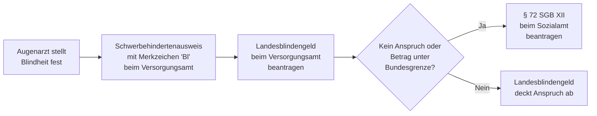

## Hintergrund

Die **Blindenhilfe nach § 72 SGB XII** ist eine Leistung der Sozialhilfe und bildet das bundesrechtliche Fundament der Unterstützung für blinde Menschen in Deutschland. Sie geht auf das Bundessozialhilfegesetz (BSHG) der 1960er Jahre zurück und wurde mit Einführung des SGB XII im Jahr 2005 fortgeführt.

In der Praxis spielt § 72 SGB XII eine **Auffangfunktion**: Alle 16 Bundesländer haben eigene Landesblindengeldgesetze erlassen, die in der Regel einkommensunabhängig und höher dotiert sind. Der Bundesanspruch greift nur, wenn kein vergleichbarer Landesanspruch besteht — oder wenn das Landesblindengeld ausnahmsweise unter dem Bundesbetrag liegt.

## Anspruchsvoraussetzungen

Das Sozialrecht verwendet eine präzise medizinisch-rechtliche Definition von Blindheit:

Als blind gilt, wessen **Sehschärfe auf dem besseren Auge** — auch mit Sehhilfe — nicht mehr als **1/50 (0,02)** beträgt, oder wessen **Gesichtsfeld auf unter 5°** eingeschränkt ist. Gleichgestellt sind vergleichbare Funktionsstörungen des Sehapparats.

Die Blindheit wird durch ein **augenärztliches Attest** nachgewiesen und in der Praxis über den **Schwerbehindertenausweis mit Merkzeichen „Bl"** (GdB 100) dokumentiert, der beim Versorgungsamt beantragt wird.

## Leistungshöhe

Die Blindenhilfe ist ein monatlicher **Pauschalbetrag** zur Abdeckung blindheitsbedingter Mehraufwendungen — etwa für Vorlesedienste, erhöhten Begleitbedarf und spezielles Hilfsmittel.

| Personengruppe | Monatlicher Betrag (ca. 2024/2025) |
| --- | ---: |
| Erwachsene (ab 18 Jahren) | ~ 770–820 € |
| Kinder und Jugendliche (unter 18) | ~ 385–410 € |

Der Betrag wird durch Rechtsverordnung regelmäßig angepasst.

## Landesblindengeld — die entscheidende Weiche

Das **Landesblindengeld** geht dem Bundesanspruch nach § 72 SGB XII vor. Die Leistungen der Länder unterscheiden sich erheblich:

| Bundesland | Monatl. Blindengeld (ca. 2024) | Einkommensabhängig? |
| --- | ---: | :---: |
| Bayern | ~ 1.302 € | Nein |
| Nordrhein-Westfalen | ~ 771 € | Nein |
| Baden-Württemberg | ~ 695 € | Nein |
| Berlin | ~ 695 € | Nein |
| Hamburg | ~ 660 € | Nein |
| Niedersachsen | ~ 513 € | Nein |

*Beträge nach jeweiligem Landesgesetz; regelmäßige Anpassungen — bitte beim zuständigen Versorgungsamt prüfen.*

Liegt das Landesblindengeld **unter** dem Bundesbetrag, kann die Differenz beim Sozialamt beantragt werden. Wer noch keinen Landesanspruch aufgebaut hat (z. B. bei Zuzug aus dem Ausland), kann § 72 SGB XII als eigenständige Leistung nutzen.

## Einkommens- und Vermögensprüfung

Anders als das Landesblindengeld ist die Blindenhilfe nach § 72 SGB XII **einkommens- und vermögensgeprüft** (§ 19 SGB XII). Einkommen oberhalb der Sozialhilfegrenzen sowie verwertbares Vermögen werden angerechnet. Das ist der wesentliche Unterschied zur einkommensunabhängigen Landesleistung.

## Antragsweg

Antrag auf Blindenhilfe nach § 72 SGB XII beim **Sozialamt** des zuständigen Landkreises oder der kreisfreien Stadt. Einzureichen sind: ärztliches Attest, Schwerbehindertenausweis (Merkzeichen „Bl"), Einkommens- und Vermögensnachweise sowie Nachweis über den Landesblindengeld-Anspruch.

## Abgrenzung zu ähnlichen Leistungen

| Leistung | Rechtsgrundlage | Besonderheit |
| --- | --- | --- |
| Landesblindengeld | Landesrecht | Einkommensunabhängig; geht § 72 SGB XII vor |
| Blindengeld UV | § 35 SGB VII | Bei Blindheit infolge eines Arbeitsunfalls |
| Blindenpauschbetrag | § 33b Abs. 3 EStG | Steuerlicher Freibetrag von 7.400 €/Jahr |
| Pflegeleistungen | SGB XI | Ergänzend bei anerkannter Pflegebedürftigkeit |
| Eingliederungshilfe | §§ 90 ff. SGB IX | Assistenz und Hilfsmittel zur gesellschaftlichen Teilhabe |

## Häufig übersehene Ansprüche

§ 72 SGB XII ist vielen blinden Menschen unbekannt, weil das Landesblindengeld den Alltag dominiert. Relevant wird der Bundesanspruch vor allem bei **Zuzug aus dem Ausland** (Überbrückung bis zum Landesanspruch) oder in Ländern mit **niedrigerem Landesblindengeld**. Zudem wird der **Blindenpauschbetrag nach § 33b EStG** (7.400 €/Jahr) von vielen Berechtigten nicht in der Steuererklärung eingetragen — obwohl er keiner gesonderten Beantragung beim Sozialamt bedarf.

Beratung bieten das kommunale Sozialamt, das Versorgungsamt sowie Selbsthilfeorganisationen wie der **Deutsche Blinden- und Sehbehindertenverband (DBSV)**.
