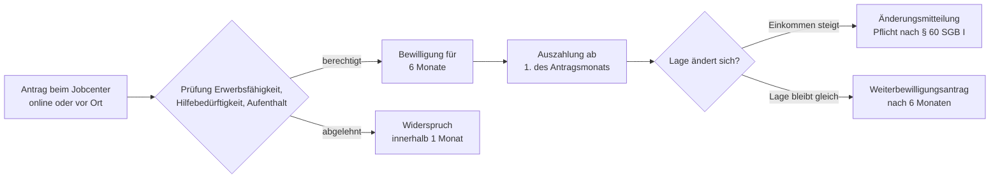

## Geschichte

Der **Regelbedarf nach § 20 SGB II** bildet das Herzstück der deutschen Grundsicherung für Erwerbsfähige. Die Leistung hat eine wechselvolle Reformgeschichte:

- **1961** – *Bundessozialhilfegesetz (BSHG)*: Erste bundeseinheitliche Sozialhilfe; Langzeitarbeitslose erhielten nachrangige Arbeitslosenhilfe.
- **2005** – *Hartz-IV-Reform*: Das **Arbeitslosengeld II (ALG II)** löst Arbeitslosenhilfe und Sozialhilfe für Erwerbsfähige ab; Jobcenter entstehen als gemeinsame Einrichtungen von Bundesagentur für Arbeit und Kommunen.
- **2010** – Das Bundesverfassungsgericht erklärt die damaligen Regelsätze für verfassungswidrig, da ihre Herleitung nicht transparent und sachgerecht sei. Der Gesetzgeber leitet die Beträge seitdem aus der **Einkommens- und Verbrauchsstichprobe (EVS)** ab.
- **2023** – *Bürgergeld-Gesetz*: Das ALG II wird zum **Bürgergeld** umbenannt. Kernänderungen: höhere Schonvermögen während einer zweijährigen Karenzzeit, weniger strenge Wohnkostenanforderungen und abgemilderte Sanktionsregeln.

## Anspruchsvoraussetzungen

Berechtigt ist, wer alle vier Voraussetzungen des § 7 SGB II gleichzeitig erfüllt:

1. **Erwerbsfähigkeit** – nicht dauerhaft (> 6 Monate) außerstande, wenigstens 3 Stunden täglich zu arbeiten.
2. **Hilfebedürftigkeit** – Einkommen und Vermögen reichen nicht zur Bedarfsdeckung.
3. **Gewöhnlicher Aufenthalt** in Deutschland.
4. **Alter** – 15 bis 64 Jahre.

Während der ersten zwei Bezugsjahre (Karenzzeit) gilt ein erhöhtes **Schonvermögen von 40.000 €** für die erste Person im Haushalt (je 15.000 € für weitere Personen).

## Höhe der Leistung

Der Regelbedarf deckt den allgemeinen Lebensunterhalt (Ernährung, Kleidung, Hygiene, Hausrat, Freizeit). Wohn- und Heizkosten werden **gesondert** nach § 22 SGB II erstattet. Stand **2025**:

| Stufe | Personengruppe | Monatlich |
| --- | --- | ---: |
| 1 | Alleinstehende, Alleinerziehende | 563 € |
| 2 | Paare (je Person) | 506 € |
| 3 | Erwachsene unter 25 im Elternhaus | 451 € |
| 4 | Jugendliche 14–17 Jahre | 471 € |
| 5 | Kinder 6–13 Jahre | 390 € |
| 6 | Kinder 0–5 Jahre | 357 € |

Die Beträge werden jährlich durch einen **Mischindex** fortgeschrieben: 70 % Preisentwicklung regelbedarfsrelevanter Güter, 30 % Nettolohnentwicklung.

### Einkommensanrechnung

Eigenes Erwerbseinkommen wird nicht vollständig gegengerechnet. Nach § 11b SGB II bleiben vom Nettoeinkommen weitere **20 % (max. 330 €/Monat)** anrechnungsfrei — ein Anreiz, auch im Leistungsbezug zu arbeiten.

## Verhältnis zu anderen Leistungen

- **Mehrbedarfe (§ 21 SGB II)**: Zuschläge für Alleinerziehende (12–60 %), Schwangere (17 %), Menschen mit Behinderung und kostenaufwändiger Ernährung.
- **Kinderzuschlag + Wohngeld**: Für erwerbstätige Familien kann dieses Paket günstiger sein als Bürgergeld; das Jobcenter prüft dies von Amts wegen.
- **Arbeitslosengeld I**: Vorrangig. Reicht ALG I nicht aus, kann aufstockendes Bürgergeld beantragt werden.
- **Grundsicherung im Alter (SGB XII)**: Paralleles System für Menschen ab 65 — gleiche Regelbedarfsstufen, aber andere Kostenträger (Kommunen).

## Sanktionen

Bei Pflichtverletzungen (z. B. Ablehnung zumutbarer Arbeit, Terminversäumnis) kann das Bürgergeld gemindert werden:

| Pflichtverletzung | Minderung | Dauer |
| --- | ---: | --- |
| Erste Verletzung | 10 % des Regelbedarfs | 1 Monat |
| Wiederholung (innerhalb eines Jahres) | 20 % des Regelbedarfs | 2 Monate |

Das Existenzminimum bleibt durch § 31a Abs. 3 SGB II stets gesichert. Die früheren 100-%-Sanktionen des ALG II wurden durch das Bürgergeld-Gesetz und ein BVerfG-Urteil (2019) abgeschafft.

## Antragsweg

Der Antrag wirkt auf den Ersten des Antragsmonats zurück (§ 37 Abs. 2 SGB II) — **es gibt keine weitergehende Rückwirkung**. Bei finanzieller Not sollte der Antrag deshalb so früh wie möglich gestellt werden.

## Nichtinanspruchnahme

Studien von DIW und IAB schätzen, dass **40–60 % der Anspruchsberechtigten** das Bürgergeld bzw. seine Vorgängerleistungen nicht beantragen. Besonders betroffen sind Geringverdiener, die nicht wissen, dass aufstockendes Bürgergeld möglich ist, sowie ältere Menschen kurz vor dem Rentenalter. Häufige Gründe sind Unkenntnis des Anspruchs, Scham, Komplexität des Antrags und — bei Ausländerinnen und Ausländern — Angst vor aufenthaltsrechtlichen Folgen.
