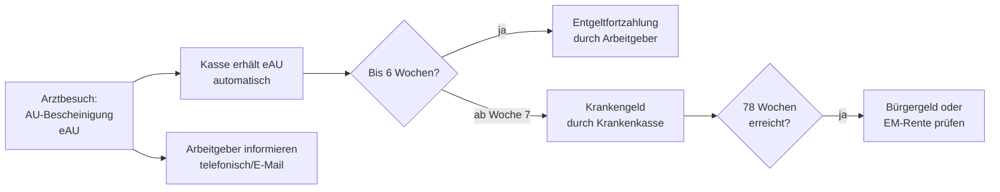

## Geschichte

Das **Krankengeld** ist eine der ältesten Leistungen des deutschen Sozialversicherungssystems. Die gesetzliche Krankenversicherung wurde durch Otto von Bismarcks *Krankenversicherungsgesetz von 1883* begründet — eines der ersten staatlich organisierten Krankenversicherungssysteme weltweit. Bereits dieses Gesetz sah eine lohnbezogene Unterstützung bei Krankheit vor.

Wichtige Meilensteine:

- **1883** – Bismarcks Krankenversicherungsgesetz: erstmals staatlich organisierte Geldleistung bei Arbeitsunfähigkeit
- **1969** – *Lohnfortzahlungsgesetz*: Alle Arbeitnehmer erhalten ab dem ersten Krankheitstag 6 Wochen bezahlte Entgeltfortzahlung durch den Arbeitgeber; das Krankengeld der Kasse greift seitdem erst danach
- **1989** – SGB V vereinheitlicht das Leistungsrecht der gesetzlichen Krankenversicherung
- **1996/1997** – Kurzzeitige Einführung von Karenztagen (1 Karenztag ohne Entgelt) — nach heftigen Protesten und Streiks schnell rückgängig gemacht
- **2021/2023** – Digitale Krankmeldung (eAU): Arztpraxen übermitteln die Arbeitsunfähigkeitsbescheinigung seit 2021 elektronisch an Krankenkassen; ab **1. Januar 2023** rufen Arbeitgeber die eAU direkt bei der Kasse ab — der Papier-„gelbe Schein" an den Arbeitgeber entfällt

## Anspruchsvoraussetzungen

Krankengeld erhalten GKV-Versicherte, die kumulativ alle Bedingungen aus § 44 SGB V erfüllen:

1. **GKV-Mitgliedschaft mit Krankengeldanspruch** — keine beitragsfreie Familienversicherung und kein beitragsgünstigerer Tarif ohne Krankengeld
2. **Ärztlich festgestellte Arbeitsunfähigkeit** (Arbeitsunfähigkeitsbescheinigung / eAU)
3. **Einkommensausfall** durch die Arbeitsunfähigkeit

Der Anspruch entsteht erst **nach Ablauf der 6-wöchigen Entgeltfortzahlungsfrist** des Arbeitgebers (§ 3 Abs. 1 EFZG). Bei einer neuen Erkrankung beginnt die Sechs-Wochen-Frist neu; bei derselben Erkrankung nur dann, wenn zuvor mindestens 6 Monate ununterbrochene Arbeitsfähigkeit bestand oder seit Beginn der ersten Arbeitsunfähigkeit 12 Monate vergangen sind (§ 3 Abs. 1 Satz 2 EFZG).

**Wer hat keinen oder eingeschränkten Anspruch?**

| Personengruppe | Situation |
| --- | --- |
| Familienversicherte (mitversicherte Ehepartner, Kinder) | Beitragsfreie Mitversicherung nach § 10 SGB V schließt Krankengeld aus |
| Freiwillig versicherte Selbstständige ohne KG-Tarif | Haben Krankengeldschutz abgewählt (§ 44 Abs. 2 SGB V) |
| Geringfügig Beschäftigte (Minijob, ≤ 538 €/Monat) | Keine Pflichtmitgliedschaft in der GKV |
| Beamte | Kein GKV-Mitglied; Dienstunfähigkeit wird über Beihilfe und Dienstbezüge geregelt |
| Privatversicherte | Anspruch auf Krankentagegeld nur aus privater Krankenversicherung, nicht aus SGB V |

**Sonderfall freiwillig versicherte Selbstständige**: Wer mit Krankengeldanspruch versichert ist, erhält das Krankengeld **ab dem 43. Tag** (§ 46 Satz 2 SGB V) — sechs Wochen Wartezeit analog zur Entgeltfortzahlung. Es ist möglich, durch freiwillige Zusatzversicherung eine frühere Zahlung zu vereinbaren.

## Berechnung

Die Leistungshöhe ergibt sich aus dem **Regelentgelt** (§ 47 SGB V):

> Krankengeld = **70 % des erzielten beitragspflichtigen Arbeitsentgelts** (Brutto), **höchstens 90 % des Nettoarbeitsentgelts**

Das Regelentgelt wird aus dem Arbeitsentgelt der letzten **vier abgerechneten Wochen** (Wochenlohn) oder des letzten voll abgerechneten **Kalendermonats** (Monatslohn) vor dem Tag der Krankschreibung berechnet. Die Tagesleistung ergibt sich durch Division durch 30 Kalendertage.

**Obergrenzen 2025:**

| Position | Betrag |
| --- | ---: |
| Beitragsbemessungsgrenze GKV (2025) | 5.512,50 €/Monat |
| Maximales Regelentgelt pro Kalendertag | 183,75 € |
| Maximales Krankengeld pro Kalendertag (brutto) | **128,63 €** |
| Maximales Krankengeld pro Monat (30 Tage, brutto) | **3.858,75 €** |

**Abzüge vom Krankengeld**: Vom ausgezahlten Krankengeld werden der Arbeitnehmeranteil zur **Renten-, Arbeitslosen- und Pflegeversicherung** einbehalten (zusammen ca. 12–13 % je nach Pflegekassenzuschlag und Kinderlosenzuschlag). Krankenversicherungsbeiträge fallen für pflichtversicherte Arbeitnehmer während des Krankengeldbezugs nicht an (§ 224 Abs. 1 SGB V: die Kasse trägt temporär den KV-Beitrag selbst).

**Steuerliche Behandlung**: Krankengeld ist **steuerfrei** nach § 3 Nr. 1a EStG, unterliegt jedoch dem **Progressionsvorbehalt** (§ 32b Abs. 1 Satz 1 Nr. 1 Buchst. b EStG). Wer im gleichen Kalenderjahr sowohl steuerpflichtigen Arbeitslohn als auch Krankengeld bezogen hat, muss eine Steuererklärung abgeben und erhält oft eine Nachzahlung, da der Lohnsteuerabzug des Arbeitgebers unterjährig nicht angepasst wurde.

## Bezugsdauer

Das Krankengeld wird **je Kalendertag** gewährt. Das Gesetz unterscheidet zwei Ebenen:

| Phase | Regelung |
| --- | --- |
| **1.–42. Tag** (6 Wochen) | Entgeltfortzahlung durch den Arbeitgeber — kein Krankengeld |
| **Ab dem 43. Tag** | Krankengeld durch die Krankenkasse |
| **Höchstdauer** | **78 Wochen** innerhalb von **3 Jahren** für dieselbe Erkrankung (§ 48 Abs. 1 SGB V) |

Die **Blockfrist** beginnt mit dem ersten Krank­heitstag einer bestimmten Diagnose (ICD-Code). Innerhalb dieser drei Jahre addieren sich alle Bezugszeiten mit derselben Diagnose. Eine neue 78-Wochen-Frist beginnt nur dann, wenn zwischen zwei Arbeitsunfähigkeitszeiten wegen derselben Krankheit eine ununterbrochene Arbeitsfähigkeit von mindestens **6 Monaten** liegt.

**Nach Erschöpfung des Krankengeldanspruchs** muss die betroffene Person je nach Situation folgende Leistungen prüfen:

- **Bürgergeld** (SGB II): für erwerbsfähige Personen unter 65 Jahren ohne ausreichendes Einkommen
- **Erwerbsminderungsrente** (§ 43 SGB VI): wenn die Leistungsfähigkeit dauerhaft unter 6 Stunden/Tag gesunken ist und ausreichend Versicherungszeiten bestehen
- **Sozialhilfe** (SGB XII): für Personen ohne SGB-II-Anspruch

## Digitale Krankmeldung (eAU)

Seit dem **1. Januar 2023** gilt für alle GKV-Versicherten die volldigitale Krankmeldung:

1. Die Arztpraxis erstellt die elektronische Arbeitsunfähigkeitsbescheinigung (eAU) und übermittelt sie direkt an die Krankenkasse
2. Der Arbeitgeber ruft die Daten elektronisch bei der Krankenkasse ab — kein Papier-Schein mehr nötig
3. Die versicherte Person muss sich **weiterhin beim Arbeitgeber krankmelden** (telefonisch, per E-Mail o. ä.), aber nicht mehr selbst einen Schein übermitteln

Ausnahmen: Privatärzte, Zahnärzte, Auslandsärzte und einige Sonderfälle (z. B. Telefonkrankmeldung, wenn keine eAU-Technik vorhanden) stellen weiterhin Papierbescheinigungen aus.

## Antragsweg

**Kritische Frist — Nahtlosigkeit der Krankmeldung**: Der Krankengeldanspruch erlischt, wenn die Folge-AU nicht spätestens **am letzten Geltungstag** der bisherigen AU ausgestellt wird (§ 49 Abs. 1 Nr. 5 SGB V). Versicherte müssen also — auch wenn sie sich noch krank fühlen — rechtzeitig zum Arzt, bevor die aktuelle Krankmeldung ausläuft. Die Kasse ist nicht verpflichtet, diesen Fehler rückwirkend zu korrigieren. Dieses Problem ist in der Praxis häufig.

## Verhältnis zu anderen Leistungen

- **Arbeitslosengeld I** (§ 47b SGB V): Erkrankt eine ALG-I-beziehende Person, zahlt die Krankenkasse Krankengeld in exakt der Höhe des ALG I. Der ALG-I-Anspruch ruht und verlängert sich entsprechend — es entstehen keine Anspruchsverluste.
- **Kurzarbeitergeld**: KuG und Krankengeld werden nicht gleichzeitig gewährt. Erkrankt ein Kurzarbeiter vollständig, erhält er stattdessen Krankengeld vom bisherigen Soll-Entgelt (§ 47b Abs. 4 SGB V).
- **Mutterschaftsgeld**: Tritt eine Mutter in den Mutterschutz, endet der Krankengeldanspruch und Mutterschaftsgeld setzt ein (§ 49 Abs. 1 Nr. 3 SGB V). Mutterschaftsgeld ist höher oder gleich hoch, daher entsteht kein Nachteil.
- **Elterngeld**: Das Elterngeld wird auf Basis des durchschnittlichen Einkommens der letzten 12 Monate vor der Geburt bemessen. Bezieht ein Elternteil in diesem Zeitraum Krankengeld, wirkt dies **einkommensmindernd** auf das spätere Elterngeld — da Krankengeld als Ersatz für Arbeitslohn zählt, aber mit niedrigerem Betrag (70 % statt 100 % des Bruttolohns). Wer kurz vor der Geburt längere Zeit krankgeschrieben ist, sollte die Auswirkungen auf die Elterngeldberechnung prüfen.
- **Rentenbeiträge**: Während des Krankengeldbezugs zahlt die Krankenkasse Rentenbeiträge auf Basis von 80 % des Krankengeld-Bemessungsentgelts (§ 166 Abs. 1 Nr. 2 SGB VI). Diese Zeiten gelten als Pflichtbeitragszeiten und stärken die spätere Rentenanwartschaft.

## Häufige Fehler und Fallstricke

- **Nahtlosigkeitsproblem**: Der häufigste Grund für Verlust des Krankengeldanspruchs ist das Versäumen der rechtzeitigen Folge-AU. Versicherte sollten nie darauf vertrauen, dass die Kasse kulant reagiert.
- **Selbstständige ohne KG-Schutz**: Viele Selbstständige haben beim GKV-Eintritt die günstigere Option ohne Krankengeld gewählt und sind sich im Krankheitsfall nicht bewusst, dass sie ab dem 43. Tag keinen Anspruch haben.
- **Steuerliche Überraschung**: Wer im gleichen Jahr Arbeitslohn und Krankengeld bezogen hat, erhält häufig eine unerwartete Steuernachforderung. Eine frühzeitige Steuerberatung oder Rücklage kann helfen.
- **Meldepflichten vergessen**: Aufnahme einer Nebentätigkeit oder eines Hinzuverdienstes während der AU muss der Kasse gemeldet werden (§ 49 Abs. 1 Nr. 1 SGB V) — andernfalls droht Rückforderung.
