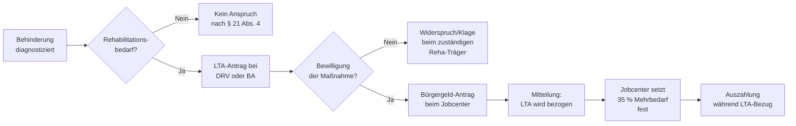

## Hintergrund

Der **Mehrbedarf bei Behinderung** nach § 21 Abs. 4 SGB II erkennt an, dass Bürgergeld-Beziehende, die an beruflichen Rehabilitationsmaßnahmen teilnehmen, zusätzliche Kosten tragen: Fahrten zu Maßnahmeorten, besondere Arbeitsmittel, höhere Eigenanteile für Hilfsmittel sowie der allgemeine Mehraufwand durch behinderungsbedingte Anforderungen im Alltag übersteigen systematisch den Normalbedarf.

Die Vorläuferregelung findet sich im *Bundessozialhilfegesetz (BSHG)*, das bis Ende 2004 galt. Mit dem Inkrafttreten von SGB II am 1. Januar 2005 wurde die Regelung inhaltlich übernommen. Eine Parallelvorschrift für Personen, die nicht im SGB-II-System sind, enthält § 30 Abs. 1 SGB XII.

**Wichtige Abgrenzung:** Der § 21 Abs. 4 SGB II knüpft nicht an den bloßen Besitz eines Schwerbehindertenausweises an, sondern ausschließlich daran, dass konkrete Leistungen zur Teilhabe am Arbeitsleben oder vergleichbare Hilfen **tatsächlich bezogen werden**. Wer einen Grad der Behinderung (GdB) hat, aber keine solchen Maßnahmen erhält, hat über diese Vorschrift keinen Anspruch.

## Voraussetzungen

§ 21 Abs. 4 SGB II nennt drei alternative Auslöser, von denen einer erfüllt sein muss:

| Auslöser | Beschreibung |
| --- | --- |
| **Leistungen zur Teilhabe am Arbeitsleben (LTA)** nach § 49 SGB IX | Berufliche Reha: Umschulung, Weiterbildung, Förderung einer Ausbildung, Gründungszuschuss für Selbstständigkeit als Reha-Maßnahme |
| **Sonstige Hilfen** zur Erlangung eines geeigneten Arbeitsplatzes | Arbeitsplatzausstattung, technische Arbeitshilfen, Hilfen zur Kommunikation |
| **Hilfen zur Förderung der Verständigung** nach § 82 SGB IX | Gebärdensprachdolmetscher, Schriftdolmetscher und ähnliche Kommunikationshilfen im Arbeitskontext |

In der Praxis ist der häufigste Fall der Erhalt von **LTA-Maßnahmen**, die von der Deutschen Rentenversicherung (DRV) oder der Bundesagentur für Arbeit (BA) getragen werden. Während die Durchführung der Maßnahme läuft, bleibt der Bürgergeld-Anspruch bestehen — der Mehrbedarf kommt für genau diesen Zeitraum hinzu.

**Nicht erfasst** von § 21 Abs. 4 sind rein medizinische Reha-Maßnahmen (→ SGB V oder § 44 SGB IX) oder stationäre Einrichtungsleistungen der Eingliederungshilfe im SGB IX.

## Berechnung

Der Mehrbedarf beträgt **35 % des maßgebenden Regelbedarfs** nach § 20 SGB II. Bezugsgröße ist stets die **Regelbedarfsstufe 1** (alleinstehende Erwachsene), unabhängig davon, ob die Person in einer Bedarfsgemeinschaft lebt.

| Jahr | Regelbedarfsstufe 1 | 35 % Mehrbedarf |
| ---: | ---: | ---: |
| 2024 | 563 € | 197,05 € |
| 2025 | 563 € | 197,05 € |

(Die Regelbedarfsstufe 1 wurde für 2025 unverändert bei 563 € belassen.)

**Gesamtdeckel:** § 21 Abs. 8 SGB II begrenzt die Summe aller Mehrbedarfe auf 100 % des maßgebenden Regelbedarfs (563 €). Wer also bereits andere Mehrbedarfe bezieht — etwa den Alleinerziehenden-Mehrbedarf (§ 21 Abs. 3) oder den Schwangerschafts-Mehrbedarf (§ 21 Abs. 2) — kann in seltenen Konstellationen an diesen Deckel stoßen. In der Praxis bleibt der 35-%-Mehrbedarf aber meist unterhalb der Grenze.

## Antragsweg

Der Mehrbedarf ist Teil des regulären **Bürgergeld-Antrags** — er wird nicht separat beantragt. Entscheidend ist jedoch, dass das Jobcenter von der LTA-Bewilligung Kenntnis erlangt:

1. In vielen Fällen informieren DRV oder BA das Jobcenter automatisch (Reha-Träger-Koordination nach §§ 14–16 SGB IX).
2. Betroffene sollten den Bewilligungsbescheid der LTA-Maßnahme **aktiv beim Jobcenter einreichen**, um Bearbeitungsverzögerungen zu vermeiden.
3. Bei befristeten Maßnahmen endet der Mehrbedarf mit der Maßnahme; eine Verlängerung erfordert einen neuen Bescheid des Reha-Trägers.

**Wichtig bei Maßnahmenende:** Wenn die LTA-Maßnahme regulär endet und kein Übergangsgeld (§ 45 SGB IX) mehr gezahlt wird, entfällt auch der Mehrbedarf. Das Jobcenter sollte dies im Rahmen des laufenden Bewilligungsbescheids anpassen.

## Verhältnis zu anderen Leistungen

- **Übergangsgeld (§ 45 ff. SGB IX):** Während einer LTA-Maßnahme erhalten sozialversicherungspflichtig Beschäftigte oft Übergangsgeld vom Reha-Träger. Wer stattdessen im Bürgergeld-Bezug bleibt (weil das Übergangsgeld niedriger ausfällt oder kein Anspruch besteht), erhält den Mehrbedarf nach § 21 Abs. 4 SGB II. Übergangsgeld und Bürgergeld-Mehrbedarf nach § 21 Abs. 4 schließen sich nicht grundsätzlich aus, aber das Übergangsgeld wird als Einkommen auf das Bürgergeld angerechnet.
- **Eingliederungshilfe (SGB IX):** Seit dem Bundesteilhabegesetz (BTHG, vollständig ab 2020) ist die Eingliederungshilfe im SGB IX geregelt. Personen, die Eingliederungshilfe-Leistungen zur Teilhabe am Arbeitsleben erhalten und gleichzeitig Bürgergeld beziehen, können über § 21 Abs. 4 den Mehrbedarf erhalten.
- **Grundsicherung im Alter und bei Erwerbsminderung (§§ 41 ff. SGB XII):** Wer dauerhaft voll erwerbsgemindert ist, erhält statt Bürgergeld Grundsicherung nach SGB XII. Für diese Gruppe gilt § 30 Abs. 1 SGB XII — ein Mehrbedarf von bis zu 17 % für Schwerbehinderte mit bestimmten Merkzeichen, der anders konzipiert ist als § 21 Abs. 4 SGB II.
- **Andere Mehrbedarfe (§ 21 SGB II):** Der Behinderungs-Mehrbedarf kann mit dem Alleinerziehenden-Mehrbedarf, dem Schwangerschafts-Mehrbedarf, dem Mehrbedarf für dezentrale Warmwasserbereitung und dem Ernährungs-Mehrbedarf kombiniert werden, sofern der Gesamtdeckel (100 % des Regelbedarfs) nicht überschritten wird.
- **Nachteilsausgleiche (SGB IX / BKGG):** Der Schwerbehindertenausweis löst neben dem hier behandelten Mehrbedarf diverse weitere Nachteilsausgleiche aus (Steuerfreibeträge, KFZ-Steuerbefreiung, Parkausweise). Diese sind nicht an den Bürgergeld-Bezug geknüpft und unabhängig von § 21 Abs. 4 SGB II.
- **Bürgergeld-Regelbedarf (§ 20 SGB II):** Der Mehrbedarf wird zum Regelbedarf addiert und gemeinsam im Bewilligungsbescheid ausgewiesen. Er erhöht nicht die Bedarfe für Unterkunft und Heizung (§ 22 SGB II).

## Nichtinanspruchnahme

Der Mehrbedarf nach § 21 Abs. 4 SGB II ist strukturell weniger von Nichtinanspruchnahme betroffen als viele andere Sozialleistungen, weil er an einen aktiven Bewilligungsvorgang (LTA-Bewilligung) geknüpft ist. Dennoch entstehen Lücken:

- **Koordinationsversagen:** Wenn der Reha-Träger (DRV oder BA) die LTA bewilligt, informiert er das Jobcenter nicht immer automatisch. Betroffene stehen zwischen zwei Behörden und müssen proaktiv handeln.
- **Zeitliche Lücken:** Zwischen Antrag auf LTA und tatsächlichem Maßnahmenbeginn vergehen oft mehrere Monate. In dieser Phase können Leistungslücken entstehen, wenn unklar ist, ob der Mehrbedarf schon ab Antragstellung oder erst ab Maßnahmebeginn gilt (maßgeblich ist in der Regel der Beginn des Bezugs der LTA-Leistungen).
- **Unkenntnis der Kombination:** Betroffene, die z. B. nur Wohngeld oder Kinderzuschlag beziehen, wissen oft nicht, dass für die Phase ihrer LTA-Maßnahme auch Bürgergeld mit Mehrbedarf in Betracht käme, wenn ihr Einkommen abzüglich LTA-Maßnahmenkosten die Grenze unterschreitet.
- **Fehlerhafte Beendigung:** Bei Ende der Maßnahme wird der Mehrbedarf nicht immer rückwirkend korrekt angepasst; Überzahlungen oder zu frühe Streichungen entstehen durch die aufwändige Koordination zwischen Maßnahmenträger und Jobcenter.
