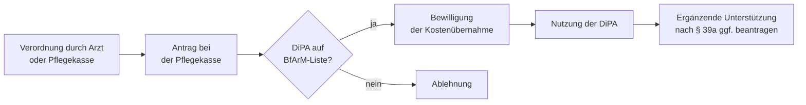

## Was sind digitale Pflegeanwendungen?

**Digitale Pflegeanwendungen (DiPA)** sind geprüfte Apps und Softwarelösungen, die den Pflegealltag aktiv unterstützen — etwa durch Medikamentenerinnerungen, angeleitete Übungen oder erleichterte Kommunikation zwischen Pflegebedürftigen, Angehörigen und professionellen Pflegepersonen. Sie sind beim **Bundesinstitut für Arzneimittel und Medizinprodukte (BfArM)** gelistet und müssen dort ein Zulassungsverfahren durchlaufen, bevor die Pflegekasse sie bezuschusst.

Die Rechtsgrundlage verteilt sich auf drei Paragrafen des SGB XI:

| Paragraf | Regelungsinhalt |
| --- | --- |
| § 40a SGB XI | Anspruch dem Grunde nach — welche DiPAs gefördert werden |
| § 40b SGB XI | Höhe und Modalitäten der Kostenübernahme |
| § 39a SGB XI | Ergänzende Unterstützungsleistungen bei der Nutzung |

## Anspruchsvoraussetzungen

Anspruch haben Pflegebedürftige mit einem anerkannten **Pflegegrad (1–5)**, die Mitglied in der sozialen oder privaten Pflegeversicherung sind. Die DiPA muss auf der BfArM-Liste stehen und durch einen Arzt oder die Pflegekasse verordnet worden sein — ähnlich dem Verfahren bei Hilfsmitteln.

## Leistungsumfang und Kosten

Die Pflegekasse übernimmt nach § 40b die Kosten für die DiPA selbst — in der Regel laufende **Abogebühren** oder einmalige Kaufpreise für die zugelassene Anwendung. Die Bewilligung erfolgt befristet und wird bei fortbestehendem Bedarf verlängert.

Nicht alle Pflegebedürftigen können digitale Anwendungen ohne Hilfe nutzen. Deshalb gibt es nach **§ 39a** einen eigenständigen Anspruch auf **ergänzende Unterstützung**: qualifizierte Personen oder Dienste helfen bei Einrichtung, Erklärung der Funktionen und begleitender Nutzung. Ohne diese Begleitmaßnahme würde die DiPA-Förderung für ältere oder kognitiv eingeschränkte Pflegebedürftige häufig ins Leere laufen.

## Antragsweg

Der Antrag wird direkt bei der zuständigen Pflegekasse gestellt. Unterlagen: ärztliche Verordnung oder Pflegekassenempfehlung sowie Nachweis des Pflegegrads.

## Einordnung und Hinweise

DiPAs nach § 40a SGB XI sind seit **2021** eine eigenständige Leistungskategorie und spiegeln die zunehmende Digitalisierung im Pflege- und Gesundheitswesen wider. Das BfArM-Verzeichnis wächst stetig; ein Blick auf die aktuelle Liste lohnt sich vor dem Antrag.

Wichtig: § 39a und § 40b sind **keine Doppelförderung**, sondern greifen komplementär ineinander — der eine Paragraf finanziert die Software, der andere die menschliche Unterstützung bei deren Nutzung. Wer Anspruch auf eine DiPA hat, sollte beide Leistungen gemeinsam prüfen lassen.
