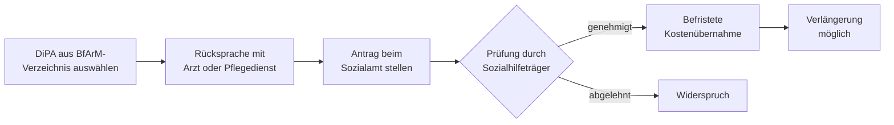

## Was sind Digitale Pflegeanwendungen?

**Digitale Pflegeanwendungen (DiPA)** sind zertifizierte Software-Anwendungen — meist Smartphone- oder Tablet-Apps — die speziell für die Pflege und Unterstützung pflegebedürftiger Menschen entwickelt wurden. Sie werden vom **Bundesinstitut für Arzneimittel und Medizinprodukte (BfArM)** nach einem strukturierten Prüfverfahren zugelassen und im öffentlichen DiPA-Verzeichnis geführt.

Typische Einsatzgebiete:

- Kognitives Training und Gedächtnisübungen bei Demenz
- Digitale Erinnerungssysteme zur Tagesstrukturierung
- Sturzprävention durch sensorgestützte Bewegungsanalyse
- Kommunikationshilfen bei Sprach- oder Mobilitätseinschränkungen
- Koordinations- und Dokumentationshilfen für pflegende Angehörige

## Sozialhilfe-Entsprechung zum SGB XI

§ 64j SGB XII und § 64k SGB XII sind die Sozialhilfe-Pendants zu § 40a und § 39a SGB XI: Die anerkannten DiPAs sind dieselben — der Unterschied liegt allein im **Finanzierungsträger**. Statt der Pflegekasse übernimmt das **Sozialamt** (Sozialhilfeträger) die Kosten.

§ 40a SGB XI ist **vorrangig**. § 64j greift nur, wenn keine oder unzureichende Pflegeversicherungsleistungen bestehen. Eine Doppelabrechnung ist ausgeschlossen.

## Anspruchsvoraussetzungen

Die Leistung richtet sich an pflegebedürftige Menschen im Sozialhilfebezug:

| Personengruppe | Erläuterung |
| --- | --- |
| Ohne gesetzliche Pflegeversicherung | z. B. bestimmte Personenkreise ohne Krankenversicherungspflicht |
| Mit ergänzender Hilfe zur Pflege | wenn SGB-XI-Leistungen nicht ausreichen und Sozialhilfe aufstockt |

Grundvoraussetzung ist ein anerkannter Pflegebedarf im Rahmen der **Hilfe zur Pflege** (7. Kapitel SGB XII).

## Leistungshöhe

Der monatliche Höchstbetrag entspricht dem der Pflegeversicherung:

| Leistung | Betrag |
| --- | ---: |
| DiPA-Kostenübernahme (§ 64j) | bis **50 €/Monat** je Anwendung |
| Ergänzende Nutzungsunterstützung (§ 64k) | nach tatsächlichem Bedarf |

§ 64k stellt sicher, dass auch die **technische Begleitung** — Einrichtung, Erklärung, laufende Unterstützung — finanziert werden kann. Dies ist besonders wichtig für ältere oder kognitiv eingeschränkte Pflegebedürftige, die digitale Anwendungen ohne Hilfe nicht nutzen könnten.

## Antragstellung

1. Eine geeignete DiPA im öffentlichen **BfArM-Verzeichnis** auswählen
2. Ärztliche Empfehlung oder Rücksprache mit dem Pflegedienst einholen
3. Antrag auf Kostenübernahme beim **zuständigen Sozialamt** stellen — mit Nachweis der Pflegebedürftigkeit und der gewählten Anwendung
4. Bei Bedarf gleichzeitig Unterstützung nach § 64k beantragen

Die Genehmigung erfolgt in der Regel befristet; eine Verlängerung ist bei weiter bestehendem Pflegebedarf möglich.
