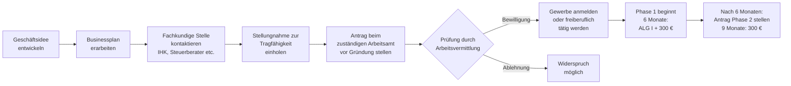

## Hintergrund

Der **Gründungszuschuss** nach § 93 SGB III ist die zentrale Förderleistung der Bundesagentur für Arbeit für Arbeitslose, die sich selbstständig machen wollen. Er verbindet zwei Ziele: den Lebensunterhalt des Gründers in der kritischen Anfangsphase sichern und eine Mindestabsicherung im Sozialversicherungssystem ermöglichen.

Das Instrument hat eine bewegte Geschichte. Als **Überbrückungsgeld** (§ 57 SGB III a. F.) und **Ich-AG** (steuerrechtliches Konstrukt) existierten bis 2006 zwei konkurrierende Fördermodelle nebeneinander. 2006 wurden sie zum Gründungszuschuss zusammengeführt. Die einschneidendste Reform kam 2012: Seither ist der Gründungszuschuss eine **Ermessensleistung** — das Arbeitsamt *kann* ihn gewähren, muss es aber nicht. Vorher gab es einen Rechtsanspruch. Diese Umstellung führte zu einem erheblichen Einbruch der Förderzahlen:

| Zeitraum | Bewilligungen p. a. (ca.) |
| --- | ---: |
| 2011 (vor Reform) | ~150.000 |
| 2013 (nach Reform) | ~35.000 |
| ab 2015–2023 | 25.000–50.000 |

Die IAB-Forschung zeigt, dass Empfänger des Gründungszuschusses langfristig bessere Erwerbsintegration erreichen als andere ALG-I-Empfänger — auch wenn Mitnahmeeffekte existieren (Gründungen, die auch ohne Förderung stattgefunden hätten).

## Anspruchsvoraussetzungen

### Grundvoraussetzungen

1. **Bezug von Arbeitslosengeld I** zum Zeitpunkt der Gründung — Bürgergeld (ALG II / SGB II) reicht nicht aus
2. **Restanspruch von mindestens 150 Tagen ALG I** bei Aufnahme der Selbstständigkeit
3. **Tragfähige Geschäftsidee** — nachgewiesen durch Stellungnahme einer fachkundigen Stelle
4. **Persönliche Eignung** — die Vermittlungsfachkraft der BA beurteilt, ob der Antragsteller für Selbstständigkeit geeignet erscheint (Ermessensentscheidung)

### Fachkundige Stelle

Ein zentrales Element der Prüfung ist die **Stellungnahme einer fachkundigen Stelle** (§ 93 Abs. 2 SGB III). Als fachkundig gelten:
- Industrie- und Handelskammern (IHK)
- Handwerkskammern
- Berufsverbände und Fachverbände
- Steuerberatungs- und Wirtschaftsprüfungskanzleien
- Kreditinstitute

Die Stellungnahme bewertet, ob die Geschäftsidee wirtschaftlich tragfähig ist — basierend auf einem Businessplan, der Kapitalbedarfsplanung, Umsatz- und Liquiditätsprognosen enthält. Die Qualität des Businessplans ist entscheidend für die Bewilligung.

### Ermessen der Arbeitsvermittlung

Da der Gründungszuschuss seit 2012 Ermessensleistung ist, hat die Arbeitsvermittlung einen erheblichen Entscheidungsspielraum. Faktoren, die die Entscheidung positiv beeinflussen:
- Branchenkenntnis und Berufserfahrung im angestrebten Feld
- Bereits bestehende Kundenkontakte oder Aufträge
- Eigenkapital oder Sicherheiten
- Überzeugende Prognosen im Businessplan

## Höhe und Dauer

Der Gründungszuschuss besteht aus zwei Phasen:

### Phase 1 – Pflichtleistung (6 Monate)

Wird der Zuschuss gewährt, umfasst Phase 1:
- **ALG-I-Betrag** in voller Höhe des zuletzt bezogenen Arbeitslosengelds
- **Pauschale von 300 €/Monat** für die soziale Absicherung

Der Betrag in Phase 1 ist individuell — er entspricht dem persönlichen ALG-I-Anspruch. Bei einem früheren Bruttolohn von 3.000 €/Monat wäre das etwa 60 % × (Nettolohn aus 3.000 €) ≈ 1.200–1.400 € + 300 € = ca. **1.500–1.700 €/Monat**.

### Phase 2 – Ermessensleistung (optional, 9 Monate)

Nach den sechs Monaten kann eine **zweite Phase** von weiteren 9 Monaten bewilligt werden:
- **Nur 300 €/Monat** (keine weitere ALG-I-Zahlung)
- Erfordert eine erneute Antragstellung und Nachweis der Weiterführung der selbstständigen Tätigkeit

Phase 2 setzt voraus, dass die Gründung gut läuft und intensiver Unternehmensaufbau betrieben wird. Ein aktueller Kontoauszug, ggf. erste Steuerbescheide oder Betriebswirtschaftliche Auswertungen (BWA) können verlangt werden.

### Sozialversicherung während der Förderung

Die 300 € Pauschale decken **nicht automatisch** die Sozialversicherungsbeiträge. Selbstständige müssen sich selbst:
- **krankenversichern** (freiwillig gesetzlich oder privat; Mindestbeitrag GKV 2024: ~230 €/Monat)
- **rentenversichern** — optional freiwillig in der GRV oder über private Vorsorge
- **berufsgenossenschaftlich** absichern (je nach Branche)

Die 300 € sind als Zuschuss zu diesen Kosten gedacht — reichen aber je nach Krankenversicherung kaum aus.

## Antragsweg

**Wichtig: Antrag vor Gründung stellen.** Der Gründungszuschuss muss **vor** Aufnahme der selbstständigen Tätigkeit beantragt werden. Eine rückwirkende Bewilligung ist nicht möglich. Wer erst gründet und dann beantragt, hat keinen Anspruch.

**Zeitdruck:** Da mindestens 150 Tage Restanspruch auf ALG I bestehen müssen, muss die Gründung relativ früh in der Arbeitslosigkeit geplant werden. Wer die Phase abwartet und zu spät gründet, verliert den Anspruch.

## Abgrenzung zu verwandten Leistungen

| Leistung | Verhältnis |
| --- | --- |
| **ALG I (§ 136 SGB III)** | Wird in Phase 1 vollständig weitergezahlt; endet mit Gründung des Gewerbes — der Gründungszuschuss tritt an die Stelle |
| **Einstiegsgeld (§ 16b SGB II)** | Pendant für Bürgergeld-Empfänger; geringerer Umfang, andere Voraussetzungen |
| **KfW-Gründerkredite** | Fremdkapital; kann parallel zum Gründungszuschuss genutzt werden |
| **EXIST-Gründerstipendium** | BMWi-Programm für technologieorientierte Hochschulgründungen; nicht mit Gründungszuschuss kombinierbar |
| **Überbrückungshilfe (COVID)** | Pandemiespezifisch; historisch relevant, nicht mehr aktiv |
| **Beratungsförderung (BAFA)** | Zuschüsse für Gründungsberatung; ergänzend nutzbar |

## Praktische Hinweise

**Businessplan ist entscheidend:** Die fachkundige Stelle und die Arbeitsvermittlung bewerten primär, ob das Vorhaben realistisch ist. Ein professionell aufbereiteter Businessplan mit Marktanalyse, Finanzplan und realistischen Umsatzprognosen erhöht die Bewilligungswahrscheinlichkeit erheblich. Viele IHKs bieten kostenlose Businessplan-Beratung an.

**Mitnahmeeffekte:** Studien des IAB (Institut für Arbeitsmarkt- und Berufsforschung) zeigen, dass ein erheblicher Teil der Gründungen auch ohne Förderung stattgefunden hätte. Die Arbeitsvermittlung soll genau das prüfen — ein Vorhaben, das offensichtlich ohne Förderung realisierbar wäre, soll abgelehnt werden. In der Praxis ist diese Abgrenzung schwierig.

**Krankenversicherung planen:** Selbstständige, die aus dem ALG I heraus gründen, können in der gesetzlichen Krankenversicherung bleiben (freiwillige Mitgliedschaft). Der Mindestbeitrag liegt 2024 bei ca. 233 €/Monat (Mindestbemessungsgrundlage für Selbstständige). Phase 1 kann den Beitrag gerade abdecken; in Phase 2 (nur 300 €) bleibt wenig Spielraum.

**Steuerliche Dimension:** Die Zahlungen des Gründungszuschusses sind **steuerfrei** (§ 3 Nr. 2 EStG), unterliegen aber dem **Progressionsvorbehalt** (§ 32b EStG). Das bedeutet: Andere steuerpflichtige Einnahmen aus der Selbstständigkeit werden mit dem höheren Steuersatz belastet, der sich ergibt, wenn man den Gründungszuschuss zum Einkommen hinzurechnet.

**Widerspruch bei Ablehnung:** Da die Bewilligung im Ermessen der BA liegt, ist eine Ablehnung nicht so leicht angreifbar wie bei Rechtsanspruchsleistungen. Dennoch lohnt Widerspruch, wenn die Ablehnung auf falschen Tatsachen beruht oder das Ermessen erkennbar nicht ausgeübt wurde. Sozialgerichte prüfen, ob das Ermessen ordnungsgemäß ausgeübt wurde.

**Kombination mit anderen Förderprogrammen:** Der Gründungszuschuss schließt andere Förderprogramme nicht aus. KfW-Gründerkredite, Landesförderprogramme und Beratungsförderung (BAFA Förderung unternehmerischen Know-hows) können parallel genutzt werden.
